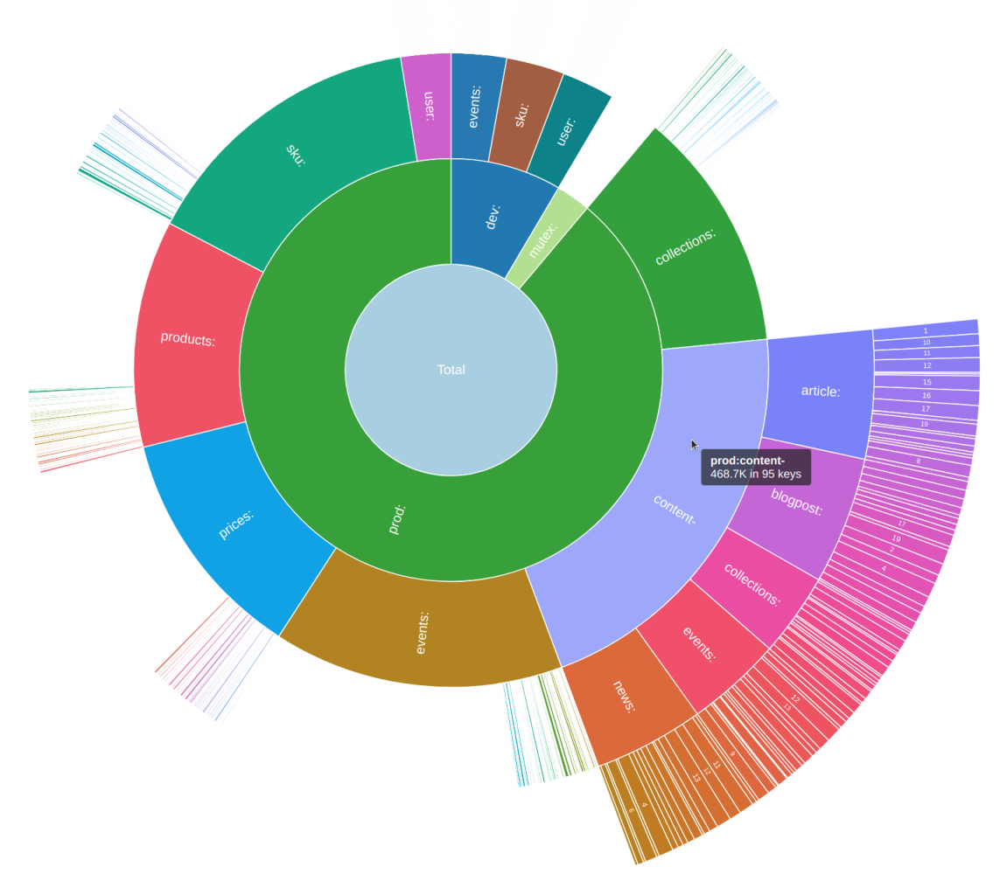

# Go语言爱好者周刊：第 113 期

这里记录每周值得分享的 Go 语言相关内容，周日发布。

本周刊开源（GitHub：[polaris1119/golangweekly](https://github.com/polaris1119/golangweekly)），欢迎投稿，推荐或自荐文章/软件/资源等，请[提交 issue](https://github.com/polaris1119/golangweekly/issues) 。

鉴于一些人可能没法坚持把英文文章看完，因此，周刊中会尽可能推荐优质的中文文章。优秀的英文文章，我们的 GCTT 组织会进行翻译。

题图：中秋快乐。来自网络

## 刊首语

中秋节假期，大家好好过节，不出题目让大家闹心了~

节日快乐！

## 资讯

1、[GoRelease 0.179.0 发布](https://github.com/goreleaser/goreleaser/releases/tag/v0.179.0)

尽可能快速、轻松地交付 Go 二进制文件。

2、[doc comment 可能要改](https://github.com/golang/go/discussions/48305#thread-subscription-status)

Go 核心团队发起的关于修订 doc comment 格式的讨论。

3、[Go 官方关于泛型的讨论](https://github.com/golang/go/discussions/48287)

如何利用泛型更新标准库 API。

4、[Go 社区行为准则](https://go.dev/blog/conduct-2021)

官方出品。

5、[好消息！Facebook 的 Go ORM：ent 移动到了 Linux 基金会](https://mp.weixin.qq.com/s/EiDGs7RlO1lG5mkX6M4-fQ)

ent 最初由 Facebook 创建并于 2019 年开源的 Go 实体框架，现已加入 Linux基金会。

## 文章

1、[Gin 框架绑定 JSON 参数使用 jsoniter](https://mp.weixin.qq.com/s/8aORG-cd_a4nIHOLUYi6Ew)

Gin 框架中，处理 JSON 格式的参数绑定时，默认采用的标准包 encoding/json，然而标准包不能满足我们的一些要求，比如兼容字符串整型、PHP 空数组、时间格式等。

2、[Go Module：私有不合规库怎么解决引用问题](https://mp.weixin.qq.com/s/Q28LwtYfU7KH_Zy0VbHvOA)

朋友真实遇到的问题。

3、[ORM 还是 非 ORM？](https://mp.weixin.qq.com/s/IJ4oxnG0HekI_5jXHqzEhg)

利用 Gorm 和 非 ORM 编写同一个简单的应用程序。

4、[如何将Docker镜像从1.43G瘦身到22.4MB](https://mp.weixin.qq.com/s/S8V-CcdtiHNnQR8i69ZxjA)

如果你正在做Web开发相关工作，那么你可能已经知道容器化的概念，以及知道它强大的功能等等。

5、[gotraining并发编程之Channel篇](https://mp.weixin.qq.com/s/YJAJJErj0aRx6poriVQ-3A)

一篇译文。

6、[一个实验带你真正搞懂 Go 结构体方法指针和值的区别](https://juejin.cn/post/7007438001181556773)

Go struct 定义方法时使用指针还是值的区别就是在方法内修改属性值时，用值定义的方法所做的修改只限于方法内，而指针则没有这个局限。

## 开源项目

1、[scriggo](https://github.com/open2b/scriggo)

号称世界上最强大的模板引擎和 Go 嵌入式解释器。

2、[go-sse](https://github.com/tmaxmax/go-sse)

功能齐全、符合规范的 HTML5 服务器发送事件库。

3、[milvus](https://github.com/milvus-io/milvus)

一个开放源码的矢量数据库，用于嵌入相似性搜索和人工智能应用程序。

4、[graphql-go](https://github.com/graph-gophers/graphql-go)

注重易用性的 GraphQL 服务器。

5、[go-multikeypair](https://github.com/proofzero/go-multikeypair)

一个以多种格式为灵感的 Go 模块，可以操作多种类型的键盘。

6、[asm](https://github.com/segmentio/asm)

一组用于 Go 的优化汇编语言包。

7、[ssceng](https://github.com/yuriizinets/ssceng)

具有类似于前端的组件体验的后端 html 模板渲染引擎。

8、[jroh](https://github.com/go-tk/jroh)

Go json-rpc 实现方案。

## 资源&&工具

1、[通过 Gio 构建 GUI](https://jonegil.github.io/gui-with-gio/)

系列教程。不过是英文的。

2、[wormhole-gui](https://github.com/Jacalz/wormhole-gui)

可在设备之间轻松加密共享文件、文件夹和文本的跨平台程序。基于 Fyne 构建。

3、[go-pry](https://github.com/d4l3k/go-pry)

Go 的交互式 REPL 工具。

4、[openapi generator](https://entgo.io/blog/2021/09/10/openapi-generator/)

使用 ent 生成 openapi 规范。

5、[marin3r](https://github.com/3scale-ops/marin3r)

轻量级、基于 CRD 的 Kubernetes 的 envoy 控制平面。

6、[dbtest](https://github.com/RussellLuo/dbtest)

简化 Go 语言 DB 测试的工具。

7、[goproxy](https://github.com/adonovan/goproxy)

goproxy 的参考实现。

8、[webcall](https://github.com/mehrvarz/webcall)

接收来自网络上任何人的电话或者自己搭建一个电话服务器。

9、[redis-inventory](https://github.com/obukhov/redis-inventory)

CLI 工具，用于以分层方式查看按键的 Redis 内存使用情况。

## 订阅

这个周刊每周日发布，同步更新在[Go语言中文网](https://studygolang.com/go/weekly)和[微信公众号](https://weixin.sogou.com/weixin?query=Go%E8%AF%AD%E8%A8%80%E4%B8%AD%E6%96%87%E7%BD%91)。

微信搜索"Go语言中文网"或者扫描二维码，即可订阅。

