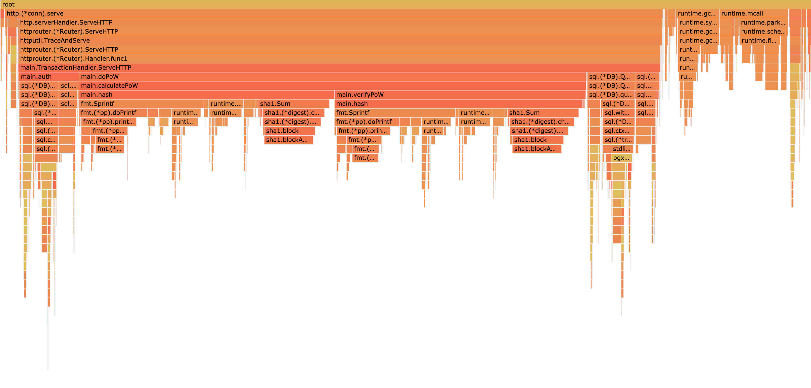

# Go语言爱好者周刊：第 113 期

这里记录每周值得分享的 Go 语言相关内容，周日发布。

本周刊开源（GitHub：[polaris1119/golangweekly](https://github.com/polaris1119/golangweekly)），欢迎投稿，推荐或自荐文章/软件/资源等，请[提交 issue](https://github.com/polaris1119/golangweekly/issues) 。

鉴于一些人可能没法坚持把英文文章看完，因此，周刊中会尽可能推荐优质的中文文章。优秀的英文文章，我们的 GCTT 组织会进行翻译。



题图：火焰图

## 刊首语

以下代码输出什么？

```go
package main

import "fmt"

func main() {

	slice := []int{0, 1, 2, 3}
	m := make(map[int]*int)

	for key, val := range slice {
		m[key] = &val
	}

	fmt.Println(*m[2])
}
```

A：2；B：3；C：3：D：0

## 资讯

1、[Go1.18 将原生支持 fuzzing](https://github.com/golang/go/commit/6e81f78c0f1653ea140e6c8d008700ddad1fa0a5)

相关代码已经合入 master。

2、[tinygo 0.20.0 发布](https://github.com/tinygo-org/tinygo/releases/tag/v0.20.0)

增加对 Go1.17 的支持。

3、[Echo 4.6 发布](https://github.com/labstack/echo)

增加了新的 [request logger middleware](https://github.com/labstack/echo/blob/master/middleware/request_logger.go)。

4、[Bleve 2.2.0 发布](https://github.com/blevesearch/bleve)

Go 实现的全文本搜索和索引库。

5、[rqlite 6.6.0 发布](https://github.com/rqlite/rqlite)

基于 SQLite 的轻量级分布式关系数据库。

6、[标准库 API 如何更好的支持泛型？](https://github.com/golang/go/discussions/48287)

官方发起的讨论。

## 文章

1、[Go Fiber 框架系列教程 01: 和 Express 对比学习](https://mp.weixin.qq.com/s/AUdKsBpqwOU5wJPyAP0fgw)

Fiber 框架起步晚，但受关注度增长迅速。

2、[国外Go社区吵起来了](https://mp.weixin.qq.com/s/2_jjNBwaj5rBD5acNjArwg)

go-kit 作者被禁言。

3、[真能折腾：Rust实现一个Go脚本语言](https://mp.weixin.qq.com/s/phflNPhpkGZpms2sFTXO5A)

在 GitHub 发现一个项目：goscript，这个项目挺有意思。

4、[Go每日一库之 Cobra：著名的命令行库](https://mp.weixin.qq.com/s/dRIyZXBaqylwzMxL54S29w)

使用很多的一个库。

5、[推荐一个 Go GUI 实战项目](https://mp.weixin.qq.com/s/gkWwNovhppWBOc35Buo7Qw)

fyne 现在关注度挺高的，不过界面感觉有点丑。

6、[Go 微服务框架对比：Go Micro, Go Kit, Gizmo, Kite](https://mp.weixin.qq.com/s/KQ_qWBrW9MY0a3IL_Bv2kw)

你喜欢哪个框架？

7、[Golang vs Python：选哪个？](https://mp.weixin.qq.com/s/So1eY2IJn7D_RLCeCaQ5kA)

好吧，两者都要~

8、[Go实战：Vue.js + Golang 组合打造应用](https://mp.weixin.qq.com/s/RMTQIvjWOxQXuzKPTfHfbg)

这个组合挺好。

9、[图解 Go 常量](https://mp.weixin.qq.com/s/cW5wNt2L-l8oxKOjPCMg0A)

Go 的类型常量和非类型常量是两个必须要了解的关键概念。

10、[Docker 参考架构：设计可扩展、可移植的 Docker 容器网络](https://mp.weixin.qq.com/s/oQaHPNgt-_814MaCmAhgsQ)

本文给出一些兼顾应用的需求与物理网络条件约束的 Docker 网络设计方法。

11、[思考服务雪崩 case](https://mp.weixin.qq.com/s/JisP5_Xg3YWpZdzXgAc0_g)

有哪些情况呢？

12、[聊一聊Go中面向包的设计](https://mp.weixin.qq.com/s/zPHooITRTLNJDcbH2uPsUw)

国外培训的一个教程。

## 开源项目

1、[gobreaker](https://github.com/sony/gobreaker)

索尼出品的 Circuit Breaker。

2、[btree](https://github.com/amit-davidson/btree)

Go 的 B 树实现。

3、[nice](https://github.com/SuperPaintman/nice)

高度可定制和轻量级的 Go CLI 应用框架。

4、[lumber](https://github.com/gleich/lumber)

一个简单、优雅、特性丰富的日志库。

5、[emitter](https://github.com/emitter-io/emitter)

高性能、分布式、低延迟的发布订阅平台。

## 资源&&工具

1、[go-test-trace](https://github.com/rakyll/go-test-trace)

有跟踪功能的 go test。

2、[ffmpeg-to-webrtc](https://github.com/ashellunts/ffmpeg-to-webrtc)

ffmpeg-to-webrtc 演示了如何使用 Go 实现的 pion 将视频从 ffmpeg 发送到您的浏览器。

3、[garble](https://github.com/burrowers/garble)

混淆 Go 构建。

4、[pprofutils](https://github.com/felixge/pprofutils)

用于 pprof 文件的“瑞士军刀”。

5、[Go 播客第 198 期](https://changelog.com/gotime/198)

Go 工具链团队访谈。

## 订阅

这个周刊每周日发布，同步更新在[Go语言中文网](https://studygolang.com/go/weekly)和[微信公众号](https://weixin.sogou.com/weixin?query=Go%E8%AF%AD%E8%A8%80%E4%B8%AD%E6%96%87%E7%BD%91)。

微信搜索"Go语言中文网"或者扫描二维码，即可订阅。


