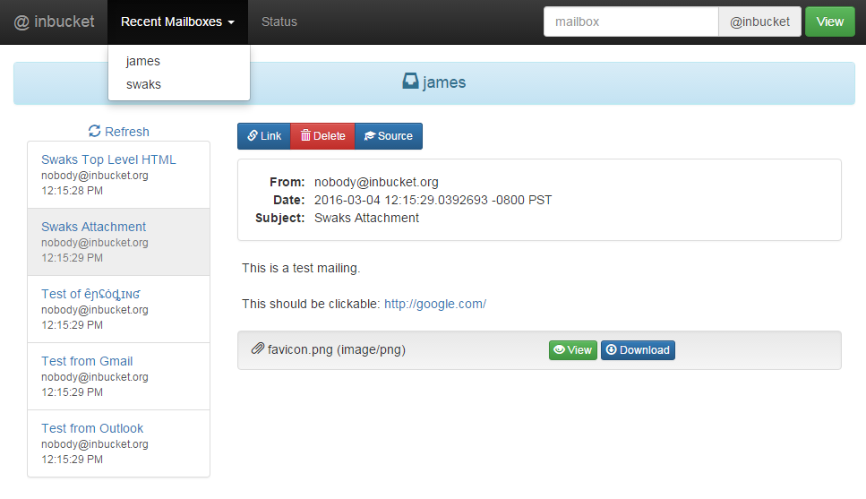

# Go语言爱好者周刊：第 115 期

这里记录每周值得分享的 Go 语言相关内容，周日发布。

本周刊开源（GitHub：[polaris1119/golangweekly](https://github.com/polaris1119/golangweekly)），欢迎投稿，推荐或自荐文章/软件/资源等，请[提交 issue](https://github.com/polaris1119/golangweekly/issues) 。

鉴于一些人可能没法坚持把英文文章看完，因此，周刊中会尽可能推荐优质的中文文章。优秀的英文文章，我们的 GCTT 组织会进行翻译。

题图：来自网络

## 刊首语

上周国庆停更了一期。国庆过的好吗？

## 资讯

1、[Go1.17.2 发布](https://mp.weixin.qq.com/s/9JNyhwZ6Ki8vXdhFBjna_g)

关于 WASM 模块的安全问题修复。

2、[Ebiten v2.2.0 发布](https://ebiten.org/blog/v2.2.0.html)

macOS 中原生全屏支持，新的矢量图形 API 等。

3、[Inbucket 3.0 发布](https://github.com/inbucket/inbucket)

一个内置 SMTP、POP3 等的 Webmail 服务器。

## 文章

1、[这门国产语言终于要发布 1.0 版本了](https://mp.weixin.qq.com/s/DoBvbSmZyPLNTZyVqHeFew)

Go+ 1.0 要发布了

2、[Go: test 不为人知的一面](https://mp.weixin.qq.com/s/KUzKpHb3Nyd17m7UQAPZvA)

Go 被用得最频繁的命令我想应该是 go test。然而，这个命令一些有趣的细节和用法可能你还不知道哟。

3、[GoLand 2021.3 EAP 有哪些新功能？](https://mp.weixin.qq.com/s/muFr4vMuShHznJ1JTVLu0A)

GoLand 2021.3 是 2021 系列版本的最后一个版本。

4、[何时使用 Rust 和何时使用 Go？](https://mp.weixin.qq.com/s/Tg6oriDl1vpVkc3JEZDTaA)

随着 Rust 的发展和一些 Gopher 关注 Rust，有人提出疑问：Rust 会侵蚀 Go 的市场？本文就一起看看，什么时候适合使用 Go，什么时候适合使用 Rust？

5、[在 iOS 和 Android 上运行 Go Code](https://mp.weixin.qq.com/s/Gb0QnKufXVBtv1xSrSZmSQ)

在本教程中，我们将构建一个简单的 Go 软件包，你可以从 iOS 应用程序（Swift）和 Android 应用程序（Kotlin）运行该软件包。

6、[五款免费又好用的Docker容器GUI工具](https://mp.weixin.qq.com/s/16Roq0aKqArnGPFcqaE2zQ)

几个不错的工具。

7、[假期结束，推荐 2 本 manning 出的 Go 图书](https://mp.weixin.qq.com/s/PXPOgf8KvtwVzs8kbxD_Hg)

manning 最近有 2 本 Go 相关图书，推荐给大家。

8、[Go泛型系列：提前掌握Go泛型的基本使用](https://mp.weixin.qq.com/s/bI6RMDVNr4VahRQlZ86tng)

泛型，是 Go 语言多年来最令人兴奋和根本性的变化之一。没有泛型，很多人以此「鄙视」Go 语言。

## 开源项目

1、[bunrouter](https://github.com/uptrace/bunrouter)

快速灵活的 HTTP 路由。

2、[ratelimiter](https://github.com/Narasimha1997/ratelimiter)

一个并发的 rate limiter 库。

3、[go-stash](https://github.com/tal-tech/go-stash)

logstash 的替代品，性能是它的 5 倍。

4、[spicedb](https://github.com/authzed/spicedb)

一个受 Google Zanzibar 启发的数据库，用于存储、计算和验证应用程序的权限。

## 资源&&工具

1、[sh](https://github.com/mvdan/sh)

一个支持 Bash 的 Shell 解析器、格式化器。

2、[unusual_generics](https://github.com/xakep666/unusual_generics)

泛型使用场景收集。

3、[massh](https://github.com/DiscoRiver/massh)

通过 SSH 方式运行 Linux 分布式 Shell 命令。

4、[noctx](https://github.com/sonatard/noctx)

发现没有 Context.Context 的 HTTP 请求。

5、[chore](https://github.com/AhmadWaleed/chore)

一个优雅而简单的工具，用于在远程服务器上执行普通任务。

6、[dicomgraphics](https://github.com/fynelabs/dicomgraphics)

Go 实现的开源 DICOM 图形查看器和实用程序。

7、[go-test-trace](https://github.com/rakyll/go-test-trace)

可以生成分布式跟踪数据的 go test。

8、[devspace](https://github.com/loft-sh/devspace)

用在 Kubernetes 上的 docker-compose。

9、[k3sup](https://github.com/alexellis/k3sup)

通过 SSH 用 k3s 快速引导启动 Kubernetes。

10、[FSweeper](https://github.com/reugn/fsweeper)

简单的文件管理自动化工具。

## 订阅

这个周刊每周日发布，同步更新在[Go语言中文网](https://studygolang.com/go/weekly)和[微信公众号](https://weixin.sogou.com/weixin?query=Go%E8%AF%AD%E8%A8%80%E4%B8%AD%E6%96%87%E7%BD%91)。

微信搜索"Go语言中文网"或者扫描二维码，即可订阅。

