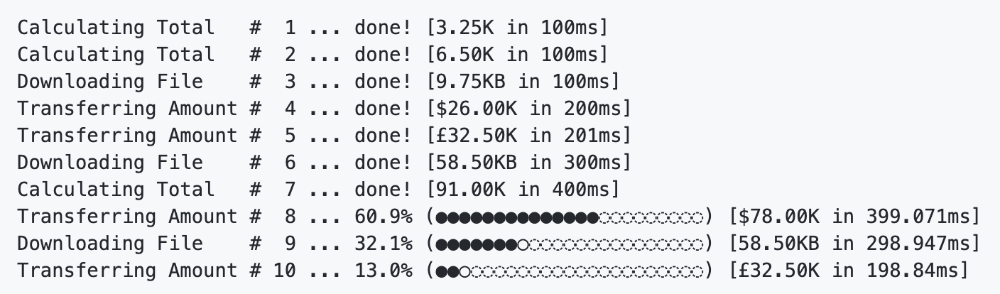

# Go语言爱好者周刊：第 117 期

这里记录每周值得分享的 Go 语言相关内容，周日发布。

本周刊开源（GitHub：[polaris1119/golangweekly](https://github.com/polaris1119/golangweekly)），欢迎投稿，推荐或自荐文章/软件/资源等，请[提交 issue](https://github.com/polaris1119/golangweekly/issues) 。

鉴于一些人可能没法坚持把英文文章看完，因此，周刊中会尽可能推荐优质的中文文章。优秀的英文文章，我们的 GCTT 组织会进行翻译。


题图：Go招聘 网站上线

## 刊首语

上周末有事情停更了一期，没想到有人发现了：


而且记得国庆那周末也没更新。坚持更新了 100 多期，阅读人数没开始多了，以为停更一期，没人会记得。这有人记得，我就更有动力更新了！

今天来一道 Go101 的题目：

```go
package main

import "fmt"

func main() {
	x := []byte{}
	fmt.Printf("%#v %T\n", x, x)
}
```

A：[]byte{} []byte；B：[]byte{} []uint8；C：[]uint8{} []byte；D：[]uin8{} []uint8

## 资讯

1、[Go 官方 2021 年 Go 开发者调查开始](https://mp.weixin.qq.com/s/Ll57MZeXHR3p7Is8_NlZZw)

期待大家的参与。

2、[uuid 4.1.0 发布](https://github.com/gofrs/uuid)

UUID 的 纯 Go 实现。

3、[roadrunner 2.5 发布](https://github.com/spiral/roadrunner)

用 Go 编写的高性能 PHP 应用程序服务器，负载均衡器和流程管理器。

4、[MacDriver 0.2 发布](https://github.com/progrium/macdriver)

用于使用 Apple/Mac API 和 Frameworks 的工具包。

5、[micro 3.6.0 发布](https://github.com/micro/micro)

云原生微服务开发平台。

6、[slug 1.11.0 发布](https://github.com/gosimple/slug)

URL 友好型 slugify，支持多种语言。

## 文章

1、[通过 Gio 构建 Go GUI 程序](https://mp.weixin.qq.com/s/X0QvpHpnS_i4p_JGTxYFVA)

Go GUI 框架 Gio 教程。

[定位并修复 Go 中的内存泄露](https://mp.weixin.qq.com/s/zcQxmqN0LT9L0qQsp2nypg)

本文案例来自谷歌云的代码，探讨如何找到并修复 Go 中的内存泄露。

3、[不要写破坏性的 Go 库](https://mp.weixin.qq.com/s/opscI_MMHo1Y7LkYdUcdcQ)

写 Go 库应该避免的问题。

4、[Go: 通过例子学习 Map 的设计](https://mp.weixin.qq.com/s/YwsemMCuPmeqeWBTIe3PWQ)

一共三篇，这里访问 [第二篇](https://mp.weixin.qq.com/s/wilXpQwFNeuF2f8b-eeARg) 和 [第三篇](https://mp.weixin.qq.com/s/wilXpQwFNeuF2f8b-eeARg)。

5、[Go：20 年代的人工智能和数据科学编程语言](https://mp.weixin.qq.com/s/3qdoueXdIowF2Z_np1V4GA)

AI 和数据科学领域，一直是 Python 的天下。国内七牛云搞了一个 Go+，想要进入数据科学领域。有人认为，Go 可能会在 AI 和数据科学领域占据一席之地。看看他怎么说的。

6、[Go 中的 WASM 很棒：全网最全示例教程](https://mp.weixin.qq.com/s/BQrgjmpA9XWPSLmJ4LK_yw)

WASM 的概念，这几年还是挺火的，新的语言，比如 Rust、Go、Swift 等，都对 WASM 提供支持。相比之下，Go 语言的简单性，使得对 WASM 的支持，使用起来也较简单。本文是目前公开资料中为数不多较完整的教程，希望能对你有帮助。

7、[Golang 中不要犯这 5 个错误](https://mp.weixin.qq.com/s/tR9YMetxyqnKQ2sruJS2JQ)

本文总结了 5 个常见的错误，你检验下自己犯过没有？！这些是我写 Go 时所犯的错误，希望对你有帮助！

8、[你期望 Go 1.18 中泛型是什么样子？](https://mp.weixin.qq.com/s/IXAICcCaydU0hAx0YDPO4w)

Go 官方负责人 Russ Cox 的邮件。

9、[Golang <-time.After() 在计时器过期前不会被垃圾回收](https://mp.weixin.qq.com/s/HtvJMGWmGnToplaz54pUaw)

很常见的问题。

10、[你应该如何去选择Go router？](https://mp.weixin.qq.com/s/RnRkS8stazKlMN6aFAdtwA)

众多 Router 如何选呢？

11、[Go 这样设置版本号：我们的项目也可以](https://mp.weixin.qq.com/s/jPbiihVb0b9EMdSMySTkgQ)

本文通过学习 Go 语言源码的处理方式来掌握它，并应用于自己的项目中。

12、[反驳：Rust 是 Go 应该成为的样子？](https://mp.weixin.qq.com/s/KEOVv1jGZ4uOB_tJ7VnfsQ)

这篇文章的讨论揭示了对这两种语言、它们解决的问题以及它们所针对的软件开发范式的严重误解。

## 开源项目

1、[go-pretty](https://github.com/jedib0t/go-pretty)

在终端输出漂亮的表格、列表、进度条等。



2、[panicparse](https://github.com/maruel/panicparse)

Panic 堆栈跟踪解析器和调试工具。

3、[sqlhooks](https://github.com/qustavo/sqlhooks)

将 hook 附加到任何 database/sql 驱动程序。

4、[ksuid](https://github.com/segmentio/ksuid)

K-Sortable 全局唯一ID。

5、[otp](https://github.com/pquerna/otp)

基于时间的一次性密码 Go 算法库。

6、[percpu](https://github.com/cespare/percpu)

Go 的尽力 CPU 本地分片值包。

## 资源&&工具

1、[blunder](https://github.com/algerbrex/blunder)

与 UCI 兼容的国际象棋引擎。

2、[crawley](https://github.com/s0rg/crawley)

Unix 风格的 Go Web 爬虫工具。

3、[dskit](https://github.com/grafana/dskit)

分布式系统 Go 工具包。

4、[gofire](https://github.com/1pkg/gofire)

Go 的命令行接口生成工具。

5、[Go 播客第 201 期](https://changelog.com/gotime/201)

Go 与 eBPF。

6、[harp](https://github.com/elastic/harp)

密钥管理工具链。

7、[pterm](https://github.com/pterm/pterm)

用于美化控制台输出，100% 跨平台兼容。

## 订阅

这个周刊每周日发布，同步更新在[Go语言中文网](https://studygolang.com/go/weekly)和[微信公众号](https://weixin.sogou.com/weixin?query=Go%E8%AF%AD%E8%A8%80%E4%B8%AD%E6%96%87%E7%BD%91)。

微信搜索"Go语言中文网"或者扫描二维码，即可订阅。


