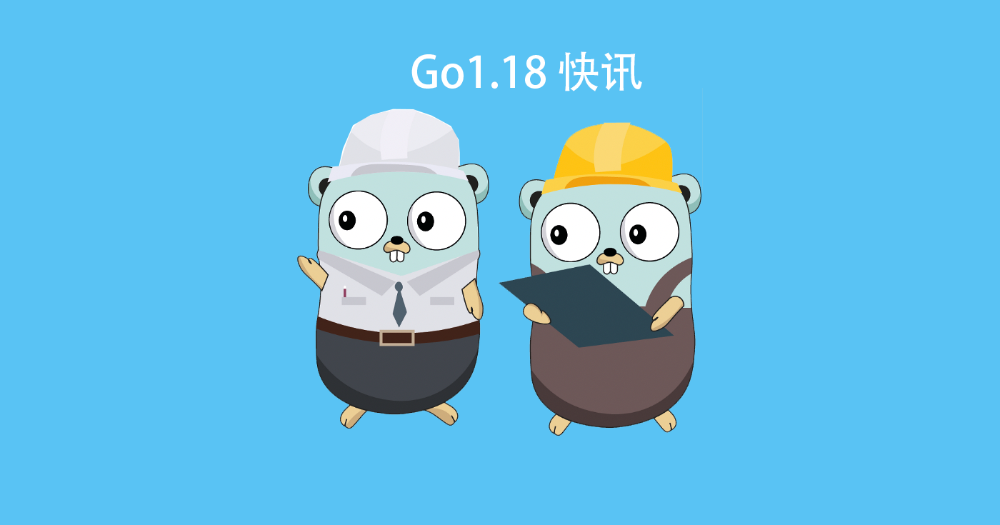
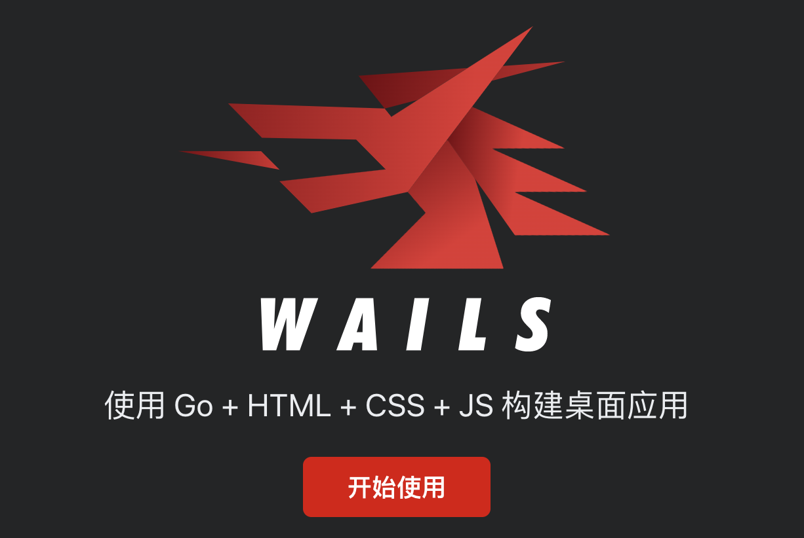

# Go语言爱好者周刊：第 119 期

这里记录每周值得分享的 Go 语言相关内容，周日发布。

本周刊开源（GitHub：[polaris1119/golangweekly](https://github.com/polaris1119/golangweekly)），欢迎投稿，推荐或自荐文章/软件/资源等，请[提交 issue](https://github.com/polaris1119/golangweekly/issues) 。

鉴于一些人可能没法坚持把英文文章看完，因此，周刊中会尽可能推荐优质的中文文章。优秀的英文文章，我们的 GCTT 组织会进行翻译。



题图：本期写了几篇 Go1.18 快讯。

## 刊首语

上期是一道关于 defer 的题目：

```go
package main

import (
	"fmt"
)

func main() {
	f := func() { fmt.Print("A") }
	defer f()
	f = func() { fmt.Print("B") }
	defer f()
}
```

A：AA；B：AB；C：BA；D：BB

正确答案 C。答题正确率 61%。

本期是一道简单的题目，因为群里有人问类似的知识点。

```go
package main

import (
  "fmt"
)

type integer int

func (i integer) String() string {
  return "hello"
}

func main() {
  fmt.Println(integer(5))
}
```

A：5；B：hello；C：编译错误；D：运行错误

## 资讯

1、[Wails v2 发布](https://wails.io/zh-Hans/)

构建桌面应用。



2、[promptui 0.9 发布](https://github.com/manifoldco/promptui)

命令行应用程序的交互式提示库。包括一些基于终端的优雅控件，例如密码输入，项目选择和确认提示。

3、[Pigo 1.4.5 发布](https://github.com/esimov/pigo)

Pigo 是基于像素强度比较的物体检测纸张的纯 Go 脸部检测库，对人脸识别有兴趣的可以研究下。

4、[历史上的今天：Go 语言以开源方式向全球发布](https://mp.weixin.qq.com/s/v0kI9eLvR6RNl_cES8xq-w)

2009 年 11 月 10 日，Google 宣布发布 Go 语言。官方博文翻译文章：[Go 12岁了！](https://mp.weixin.qq.com/s/jbKInhJ3IBym29tIQdgvPw)。

## 文章

1、[Go1.18 快讯：废弃了这个 API](https://mp.weixin.qq.com/s/HQOobDUQi3p0hZEHp7XcvA)

strings.Title 废弃了。

2、[Go1.18 快讯：新增的 Cut 函数太方便了](https://mp.weixin.qq.com/s/SPu0uOcQR8utrsRkoCrP-w)

在编程中，字符串使用是最频繁的。Go 语言对字符串相关的操作也提供了大量的 API。

3、[Go1.18 快讯：Module 工作区模式，太棒了](https://mp.weixin.qq.com/s/S3I919YZb-bgaEnHgKq7fg)

最新的命令是 go work。

4、[Go：多错误管理](https://mp.weixin.qq.com/s/Ro5uk47KJhwnD0h6nEF7NA)

Go 提供了很不错的包可以让多个错误的处理变得简单：来看看如何合并由单个 goroutine 生成的多个 error。

5、[在 Go 中对依赖图进行排序](https://mp.weixin.qq.com/s/42fDp-ri1CcEVNQLyp8KQQ)

软件工程中遇到的许多重要问题可以归结为几个简单的问题。

6、[Go 中优化字符串的比较操作](https://mp.weixin.qq.com/s/oR7KbNPISkl_-lKStrn-Nw)

优化下 Go 程序中的字符串比较可以减少程序的响应时间，以及增强它的可扩展性。

7、[Go并发编程一年回顾(2021)](https://colobu.com/2021/11/09/the-state-of-go-sync-2021/)

2021 年也快结束了，Go 1.18 的特性已经冻结。

8、[Java 和 Go 在并发实现中的区别](https://mp.weixin.qq.com/s/M2HNWjpzYGoxXOvl0nivIg)

两者有什么不一样？

## 开源项目

1、[gorse](https://github.com/zhenghaoz/gorse)

基于协同过滤的推荐系统包。

2、[go-geofence](https://github.com/circa10a/go-geofence)

用 Go 判断 IP 距离你是否很近。

3、[LuaHelper](https://github.com/Tencent/LuaHelper)

Go 实现的 Lua 语言服务协议插件。

## 资源&&工具

1、[nmage](https://github.com/bloeys/nmage)

出于娱乐，使用 Go 构建一个 3D 游戏引擎。

2、[dstp](https://github.com/ycd/dstp)

对的站点运行常见的网络测试。

3、[duplicacy](https://github.com/gilbertchen/duplicacy)

新一代的云备份工具。

4、[datree](https://github.com/datreeio/datree)

防止 Kubernetes 的错误配置进入生产领域。

## 订阅

这个周刊每周日发布，同步更新在[Go语言中文网](https://studygolang.com/go/weekly)和[微信公众号](https://weixin.sogou.com/weixin?query=Go%E8%AF%AD%E8%A8%80%E4%B8%AD%E6%96%87%E7%BD%91)。

微信搜索"Go语言中文网"或者扫描二维码，即可订阅。


