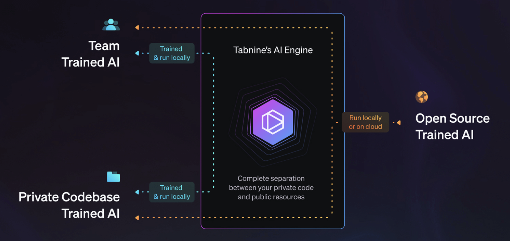
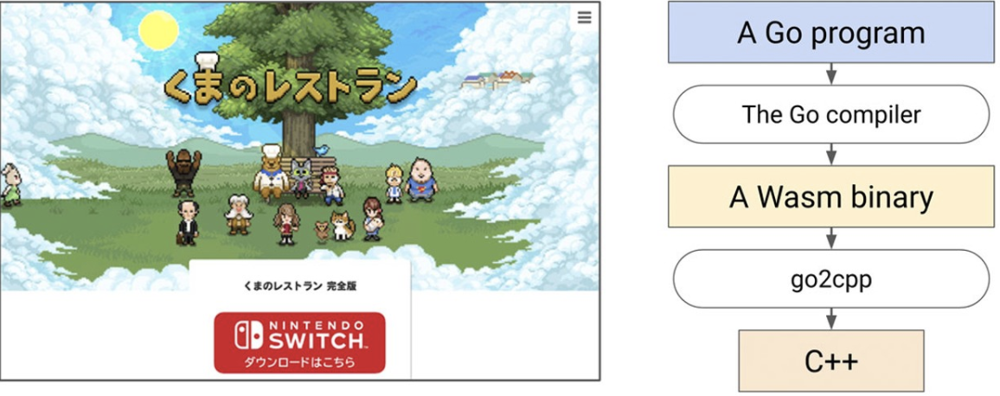

# Go语言爱好者周刊：第 120 期

这里记录每周值得分享的 Go 语言相关内容，周日发布。

本周刊开源（GitHub：[polaris1119/golangweekly](https://github.com/polaris1119/golangweekly)），欢迎投稿，推荐或自荐文章/软件/资源等，请[提交 issue](https://github.com/polaris1119/golangweekly/issues) 。

鉴于一些人可能没法坚持把英文文章看完，因此，周刊中会尽可能推荐优质的中文文章。优秀的英文文章，我们的 GCTT 组织会进行翻译。



题图：Tabine，智能 AI 插件

## 刊首语

上期是一道简单的题目，正确率还挺高：73%，正确答案是 B。

```go
package main

import (
  "fmt"
)

type integer int

func (i integer) String() string {
  return "hello"
}

func main() {
  fmt.Println(integer(5))
}
```

A：5；B：hello；C：编译错误；D：运行错误

本期是一道关于不定参数的题目：

```go
package main

import (
	"fmt"
)

func f(a ...int) {
	fmt.Printf("%#v\n", a)
}

func main() {
	f()
}
```

A：[]int{}；B：[]int(nil)；C：panic；D：编译错误

## 资讯

1、[GoReleaser v1.0.0 发布](https://carlosbecker.com/posts/goreleaser-v1/)

用于发布 Go 二进制文件的工具。

2、[ddosify 0.6 发布](https://github.com/ddosify/ddosify)

Go 实现的高性能压测工具。

3、[Istio 1.12发布](https://istio.io/latest/news/releases/1.12.x/announcing-1.12/)

这是 Istio 在 2021 年发布的最后一个版本，也是本年度发布的第四个版本。

## 文章

1、[为什么说 Go 是 DevOps 专业人士的第一首选？](https://mp.weixin.qq.com/s/p1S1W37jQfCNzY4XBfI3lA)

Golang 是当今最受欢迎的编程语言之一，现在就让我们来看看它在 DevOps 空间中能够做什么？

2、[Gin 框架绑定 JSON 参数使用 jsoniter](https://mp.weixin.qq.com/s/nf9OYpN3f8HMDj_xkdCzdw)

Gin 框架中，处理 JSON 格式的参数绑定时，默认采用的标准包 encoding/json，然而标准包不能满足我们的一些要求，比如兼容字符串整型、PHP 空数组、时间格式等。

3、[Golang中常见的option设计探讨](https://mp.weixin.qq.com/s/mzI8-KoRBhH-fGdfcyqI-w)

相信大家平时也常听说函数式选项模式，本文详细讨论。

4、[Go：建议你使用专门的构造函数](https://mp.weixin.qq.com/s/zFwZpNmV20d1Cf7gNQsxfg)

Go 语言并非完全的面向对象语言，只是有部分面向对象特性。其中，没有实际意义的构造函数，但对类似构造函数有自己的一些约定成俗的规则。本文讲解为什么在 Go 中，建议你尽量使用专门的构造函数。

5、[使用 Go 内置模板构建丰富的 CLI 应用程序](https://mp.weixin.qq.com/s/-QKkvFVDJ9xqocBOduAVmw)

今天介绍如何通过 text/template 构建富文本 CLI 程序。

6、[通过 100 行代码入门 Go](https://mp.weixin.qq.com/s/NqYbeL6_wzv7BlmQTD0Mug)

本文适合 Go 新手或想学习 Go 的朋友，通过 100 行代码学习 Go 知识。

7、[Go泛型系列：Go1.18 类型约束那些事](https://mp.weixin.qq.com/s/FFxNpRVgs-v9cIKWCLeN4Q)

本文介绍更多约束相关内容。

## 开源项目

1、[Tetra3d](https://github.com/SolarLune/Tetra3d)

Tetra3D 是一款 3D 软件渲染器，使用 Go 和 Ebiten 编写，用于游戏。

2、[limiter](https://github.com/ulule/limiter)

Limit Rate 中间件，支持 HTTP、FastHTTP 和 Gin。

3、[hybridcache](https://github.com/cshum/hybridcache)

多级缓存库。

4、[meshery](https://github.com/meshery/meshery)

Go 实现的服务网格控制平面。

5、[pREST](https://github.com/prest/prest)

低代码，简化和加速开发即时，实时，高性能的任何 Postgres 应用程序。

## 资源&&工具

1、[为任天堂 Switch 开发 Go 游戏](https://docs.google.com/presentation/d/e/2PACX-1vTMRSmuWjhpOx3DIgetfi72jcOGvlqPU5z0Nps24YN6dxaBbu4dWm0FXS2f--D4G2b1aAvTmfqNA2IG/pub?start=false&loop=false&delayms=3000&slide=id.p)

英文 PPT。



2、[caffeine](https://github.com/rehacktive/caffeine)

一个非常基本的 JSON 数据 REST 服务——对于原型设计和 MVP 来说已经足够了！

3、[avo](https://github.com/mmcloughlin/avo)

生成 x86 汇编。

4、[pet](https://github.com/knqyf263/pet)

简单的命令行代码段管理。

## 订阅

这个周刊每周日发布，同步更新在[Go语言中文网](https://studygolang.com/go/weekly)和[微信公众号](https://weixin.sogou.com/weixin?query=Go%E8%AF%AD%E8%A8%80%E4%B8%AD%E6%96%87%E7%BD%91)。

微信搜索"Go语言中文网"或者扫描二维码，即可订阅。


