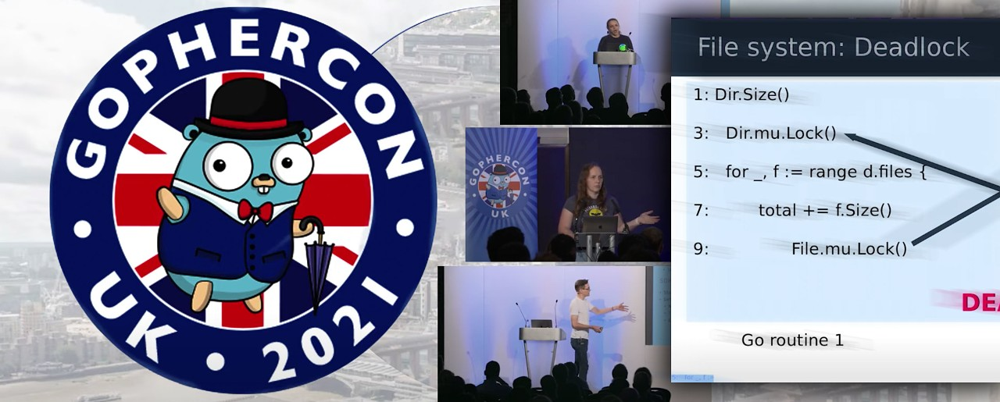
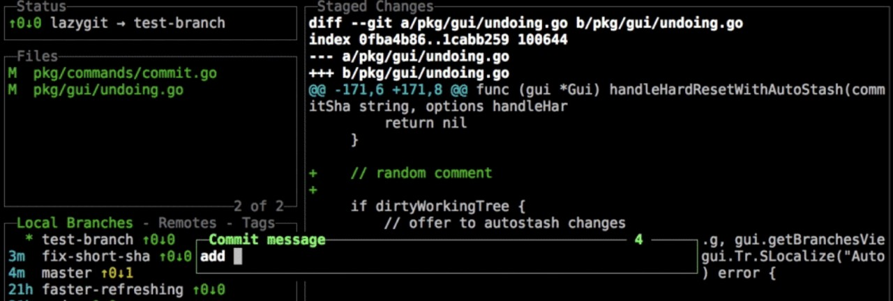

# Go语言爱好者周刊：第 122 期

这里记录每周值得分享的 Go 语言相关内容，周日发布。

本周刊开源（GitHub：[polaris1119/golangweekly](https://github.com/polaris1119/golangweekly)），欢迎投稿，推荐或自荐文章/软件/资源等，请[提交 issue](https://github.com/polaris1119/golangweekly/issues) 。

鉴于一些人可能没法坚持把英文文章看完，因此，周刊中会尽可能推荐优质的中文文章。优秀的英文文章，我们的 GCTT 组织会进行翻译。



题图：GopherCon UK 2021

## 刊首语

本期是一道关于 array 的题目：

```go
package main

import (
	"fmt"
)

func main() {
	v := [...]int{1: 2, 3: 4}
	fmt.Println(len(v))
}
```

A：2；B：编译失败；C：3；D：4

## 资讯

1、[Go1.17.4 和 Go1.16.11 发布](https://mp.weixin.qq.com/s/5XM_YLe5Q6sz7G_zBtH-Sg)

这是小版本，修复了一些 bug。

2、[GoLand 2021.3 发布](https://mp.weixin.qq.com/s/NFPv4OKMAgHeD_NXVX0kgg)

2021 年最后一个正式版本，更新特性不少。

3、[Caire 1.4 发布](https://github.com/esimov/caire)

内容感知图像大小调整库。

## 文章

1、[Go：用 kqueue 实现一个简单的 TCP Server](https://mp.weixin.qq.com/s/LbaWZCZzlHsxcpc8FHrKGQ)

这篇文章主要分为以下几部分讲解。首先，我们会先从理论出发设计我们的 TCP Server。然后，我们会去实现它的必要的模块。最后我们会对整个过程进行总结以及思考。

2、[Go 服务中 HTTP 请求的生命周期](https://mp.weixin.qq.com/s/8j-hzmxs9NlaPDptldHJDg)

这篇博文通过一个 Go 服务来探讨一个典型 HTTP 请求的路由，涉及路由，中间件以及比如并发之类的相关问题。

3、[深入剖析 Go Pprof 标签](https://mp.weixin.qq.com/s/HfH3y3ik884nshLKnQW0Ew)

Polar Signals 提供的持续分析工具可以和任何格式的 pprof 分析适配，Go 深度集成了 pprof 甚至支持了它的标签特性。

4、[Go：七步制作精简镜像](https://mp.weixin.qq.com/s/c3-6AOFwOMRuG9ubT8eq0A)

镜像精简之道。

5、[在 Go 中使用 dockertest 进行集成测试](https://mp.weixin.qq.com/s/-nytxEAtHn9mDCq2IhmEoQ)

进行集成测试（或系统测试）通常意味着让数据库填充数据，像 redis、elasticsearch 等，通常，我们的软件与之交互的任何基础设施都可以工作。

6、[Go 企业应用案例分享：Go 用于支付和奖励系统](https://mp.weixin.qq.com/s/XkWCAlNpXqalOIfIAhUdlQ)

今天分享 Go 在企业中的应用案例，该案例是美国运通公司（Express）。

7、[2022 年 11 大 GoLand 插件](https://mp.weixin.qq.com/s/EfAihOWYMJ8yfCAz_HN_rg)

当我开始使用新的 IDE 时，我不会寻找插件。为什么？因为我很少知道它们的存在。如果你和我一样，此列表将为你提供一个很好的起点，可以找到 GoLand 插件以改善你的编码体验。

8、[选择 Go API 框架时要考虑的 4 件事](https://mp.weixin.qq.com/s/bgK6P9TgCX-osZncxsrK9Q)

用 Go 编写 API 服务，许多语言新手问的第一件事是：“我应该使用哪个框架？”。

9、[Go编程模式：详解函数式选项模式](https://mp.weixin.qq.com/s/B-HZu1oZGseaOuNUznjJFA)

Go 不是完全面向对象语言，有一些面向对象模式不太适合它。但经过这些年的发展，Go 有自己的一些模式。今天介绍一个常见的模式：函数式选项模式（Functional Options Pattern）。

10、[Go1.18 快讯：新的 IP 包](https://mp.weixin.qq.com/s/c-J82hBp-RzyF8VRtmriFg)

Go 1.18 标准库新增了一个包：net/netip，大部分人可能用不上这个包，但这个包的设计思路以及和现有标准库 IP 的比较值得学习。

11、[Go 1.18 中的 any 是什么？](https://mp.weixin.qq.com/s/uhcnnrnkqUsFOcZHILETLA)

Go 1.18 因为泛型引入 any，这实际上是 interface{} 的别名。

## 开源项目

1、[geodist](https://github.com/jftuga/geodist)

计算两个地理点之间的距离。

2、[FerretDB](https://github.com/FerretDB/FerretDB)

MongoDB 的替代品。之前叫 MangoDB，容易被人理解为碰瓷。

3、[iso9660](https://github.com/kdomanski/iso9660)

读写 ISO 文件的库。

4、[zinc](https://github.com/prabhatsharma/zinc)

全文搜索引擎，可作为 elasticsearch 的替代品。

5、[hedgedhttp](https://github.com/cristalhq/hedgedhttp)

可减少长尾延迟的 http client 端。

6、[CasaOS](https://github.com/IceWhaleTech/CasaOS)

一个 Go 实现的简单、易用、优雅的开源家庭云系统。

## 资源&&工具

1、[GopherCon UK 2021](https://www.youtube.com/playlist?list=PLDWZ5uzn69ex0U5MmbKWorsTuVBgUePxw#gophercon2021uk)

视频放出。

2、[Go Time 第 208 期](https://changelog.com/gotime/208)

Go 开源 12 周年了！谈谈这一切是如何开始的。

3、[grimd](https://github.com/looterz/grimd)

一个快速的 DNS 代理。

4、[lazygit](https://github.com/jesseduffield/lazygit)

git 命令的简单 UI 终端。



5、[GoLab 2021 大会视频全集](https://www.youtube.com/watch?v=2FzW6QLrm2s&list=PLGN1AjiJJv0noFge_-nKu95N5Zd1nHpur)

油管视频。

## 订阅

这个周刊每周日发布，同步更新在[Go语言中文网](https://studygolang.com/go/weekly)和[微信公众号](https://weixin.sogou.com/weixin?query=Go%E8%AF%AD%E8%A8%80%E4%B8%AD%E6%96%87%E7%BD%91)。

微信搜索"Go语言中文网"或者扫描二维码，即可订阅。


