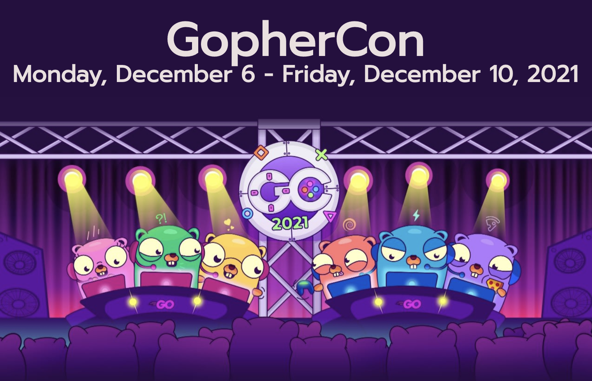

# Go语言爱好者周刊：第 123 期

这里记录每周值得分享的 Go 语言相关内容，周日发布。

本周刊开源（GitHub：[polaris1119/golangweekly](https://github.com/polaris1119/golangweekly)），欢迎投稿，推荐或自荐文章/软件/资源等，请[提交 issue](https://github.com/polaris1119/golangweekly/issues) 。

鉴于一些人可能没法坚持把英文文章看完，因此，周刊中会尽可能推荐优质的中文文章。优秀的英文文章，我们的 GCTT 组织会进行翻译。



题图：GopherCon 2021 

## 刊首语

上期是一道关于 array 的题目，答题正确率 51%。

```go
package main

import (
	"fmt"
)

func main() {
	v := [...]int{1: 2, 3: 4}
	fmt.Println(len(v))
}
```

A：2；B：编译失败；C：3；D：4

正确答案是 D。要注意，除了 map，array(slice) 初始化时也是可以指定索引的。该题有一个索引 3，根据数组的特点，必然有小于 3 的所有也存在，上题中，v 的值是：[0, 2, 0, 4]。

本期是一道小题目：

```go
package main

import "fmt"

func main() {
	var i float64 = 3 / 2
	fmt.Print(i)
}
```

A：1；B：1.5；C：编译错误；D：1.49

## 资讯

1、[Go 1.17.5 和 Go 1.16.12 发布：安全更新](https://mp.weixin.qq.com/s/gguSdYRkrGH0yD9MwDX4Ew)

主要包含两个安全问题修复：net/http 和 syscall。

2、[Go playground 再增强](https://mp.weixin.qq.com/s/jOUMbeg6mjjiUdqx97dQFA)

go.dev/play 支持 tip 了。

3、[gnet 1.6 发布](https://github.com/panjf2000/gnet)

一个高性能、轻量级、非阻塞的事件驱动 Go 网络框架。

## 文章

1、[如何在 Go 中组织项目结构](https://mp.weixin.qq.com/s/W11VL3t29EB3Javd3_7q8w)

有许许多多可以组织项目的方式。

2、[Go：有了 sync 为什么还有 atomic？](https://mp.weixin.qq.com/s/n95eMdSW_Xrs9isnNbRnGA)

竞态条件如何处理？

3、[Go：通过 io.Writer 将 JPEG 转为 JFIF](https://mp.weixin.qq.com/s/8l5jWf8kJkoIOD_RR296fw)

Go 的标准库可让你对 JPEG 图像进行编码，但如何转为 JFIF。

4、[Go：不用标准库如何解压 zip 文件？](https://mp.weixin.qq.com/s/gfUfYfK79f8qOKMNl-l8og)

zip 文件很常见，通过该文可以更好的了解该格式文件。

5、[Go 在 Google：服务于软件工程的语言设计（翻译）](https://mp.weixin.qq.com/s/3F9WAcxuCNCs7aNn5gjnew)

Rob Pike在 2012 年 SPLASH 2012 会议上发表的演讲的修订文章。

6、[Go泛型系列：maps 包有什么？](https://mp.weixin.qq.com/s/QFr9c6kmChij3mmdyF8D6A)

本文介绍用于 map 相关操作的包，目前放在 golang.org/x/exp 包下。

## 开源项目

1、[oto](https://github.com/hajimehoshi/oto)

支持多平台的播放声音的低级库。

2、[id3v2](https://github.com/bogem/id3v2)

用于 Go 的 ID3 解码和编码库。

3、[flac](https://github.com/mewkiz/flac)

flac 包提供对 flac（免费无损音频编解码器）流的访问。

4、[at](https://github.com/sklinkert/at)

用于创建 trade 机器人的 Go 框架。

## 资源&&工具

1、[gotenberg](https://github.com/gotenberg/gotenberg)

Docker 支持的 PDF 文件无状态 API，<https://gotenberg.dev/>。

2、[plumber](https://github.com/batchcorp/plumber)

瑞士军刀 CLI 工具，用于与 Kafka、RabbitMQ 和其他消息传递系统交互。

3、[awesome-go-education](https://github.com/mehdihadeli/awesome-go-education)

Go 教育资源速查表。

4、[GopherCon 2021](https://www.youtube.com/watch?v=35eIxI_n5ZM)

两天视频，这是第二天的：<https://www.youtube.com/watch?v=Gcp2ACyCadA>。

5、[imagor](https://github.com/cshum/imagor)

用 Go 和 libvips 编写的高性能图像处理服务器。

## 订阅

这个周刊每周日发布，同步更新在[Go语言中文网](https://studygolang.com/go/weekly)和[微信公众号](https://weixin.sogou.com/weixin?query=Go%E8%AF%AD%E8%A8%80%E4%B8%AD%E6%96%87%E7%BD%91)。

微信搜索"Go语言中文网"或者扫描二维码，即可订阅。


