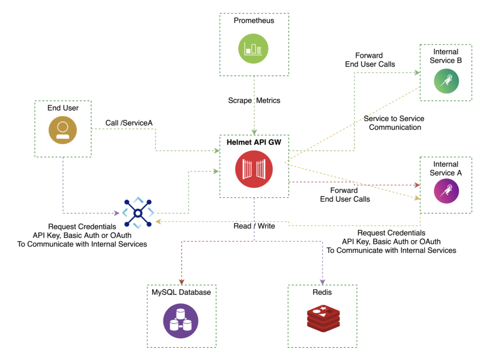

# Go语言爱好者周刊：第 124 期

这里记录每周值得分享的 Go 语言相关内容，周日发布。

本周刊开源（GitHub：[polaris1119/golangweekly](https://github.com/polaris1119/golangweekly)），欢迎投稿，推荐或自荐文章/软件/资源等，请[提交 issue](https://github.com/polaris1119/golangweekly/issues) 。

鉴于一些人可能没法坚持把英文文章看完，因此，周刊中会尽可能推荐优质的中文文章。优秀的英文文章，我们的 GCTT 组织会进行翻译。


题图：Go1.18 Beta1 发布

## 刊首语

上期的题目：

```go
package main

import "fmt"

func main() {
	var i float64 = 3 / 2
	fmt.Print(i)
}
```

A：1；B：1.5；C：编译错误；D：1.49

正确答案：A。关键在于 3/2 计算的结果，3、2 这是整型字面值常量。根据 Go 的规则，3/2 结果也是整型，因此是 1，最后会隐式转换为 float64。

本期提供一道关于 json 和 context 的题：

```go
package main

import (
	"context"
	"encoding/json"
	"fmt"
)

func main() {
	data, _ := json.Marshal(context.WithValue(context.Background(), "a", "b"))
	fmt.Println(string(data))
}
```

A：{}；B：{"a":"b"}；C：{"Context":0}；D：不确定

## 资讯

1、[Gorilla Toolkit 寻找新的维护者](https://github.com/gorilla/mux/issues/659)

有好些熟悉的库，比如 mux、schema、handlers、sessions 等。

2、[Go1.18 中 interface{} 替换为 any](https://github.com/golang/go/commit/2580d0e08d5e9f979b943758d3c49877fb2324cb)

执行类似 `gofmt -w -r 'interface{} -> any' src` 命令替换。

3、[immudb 1.2 发布](https://github.com/codenotary/immudb)

用于系统和应用程序的轻量级高速不可变数据库。

4、[go-mysql 1.4.0 发布](https://github.com/go-mysql-org/go-mysql)

纯 Go 实现的 MySQL 网络协议库。

5、[Bleve 2.3.0 发布](https://github.com/blevesearch/bleve)

Go 实现的全文本搜索和索引库。

6、[XLSX 3.2.4 发布](https://github.com/tealeg/xlsx)

用于读取和写入 XLSX（Excel）文件的库。

7、[Go1.18 Beta1 发布：泛型版真的来了](https://mp.weixin.qq.com/s/NblMBFTaYg6ZSVFX_cNeDA)

Go 发布了 Go1.18 Beta1 版本，Russ Cox 专门发布了一篇博文简单介绍：https://go.dev/blog/go1.18beta1。

## 文章

1、[Go网址导航](https://mp.weixin.qq.com/s/fcHy7lBjzGF_drB9kDrRPQ)

各种 Go 资源越来越多，但很多好资源，很多人并不知道，于是萌生了做一个「Go网址导航」，网址：https://hao.studygolang.com/，基于 studygolang 子域名构建，是自然而然的事情。

2、[终于有 Go 版的 Elasticsearch 了](https://mp.weixin.qq.com/s/oJG0XB2UcLpCBu3FCxzMPw)

企业内部搭建搜索引擎常用 Solr、Elasticsearch，它们都是使用 Java 实现的，底层依赖 Lucene，Java 相对来说占用较多内存。而今天要介绍的这个项目，目标就是作为 ES 的替代者，一个轻量级搜索引擎：Zinc。

3、[程序员瑞士军刀：各种结构的转换工具](https://mp.weixin.qq.com/s/Qomu3f1-FdExB7Jw6PUXQA)

有各种工具。

4、[Go 执行脚本命令源码分析](https://mp.weixin.qq.com/s/4YP9cvavSfgmhdaxM-9e7A)

本文是 Go 爱好者「LuciferMS」投稿。

5、[实战：如何使用 Go 从 HTML 生成 PDF 报告](https://mp.weixin.qq.com/s/fqk9Oe_8jkj8QUkQj5AefQ)

作为一名开发人员，我有时需要为我的应用程序创建 PDF 报告。

6、[我好像发现了一个 Go 的 Bug？](https://mp.weixin.qq.com/s/bkdBnLX5KEKtEE4gUJo2BA)

从重构说起。

## 开源项目

1、[MapReduce](https://github.com/BWbwchen/MapReduce)

Go 的 Map-Reduce 框架。

2、[miniredis](https://github.com/alicebob/miniredis)

纯 Go Redis 测试服务器，用于 Go 单元测试。

3、[netlink](https://github.com/mdlayher/netlink)

包 netlink 提供对 Linux netlink 套接字的低级访问。

4、[singleflight](https://github.com/marwan-at-work/singleflight)

支持泛型的 singleflight。

5、[Helmet](https://github.com/Spacewalkio/Helmet)

Go 实现的轻量级云原生 API 网关。



## 资源&&工具

1、[gofumpt](https://github.com/mvdan/gofumpt)

一个严格的 gofmt 工具。

2、[golang-base-project](https://github.com/uberswe/golang-base-project)

一个最小的 Go 项目，具有现成的用户身份验证功能。所有前端资产在每次页面加载时应小于 100 kB。

3、[nvm-windows](https://github.com/coreybutler/nvm-windows)

适用于 Windows 的node.js 版本管理实用程序，使用 Go 编写。

## 订阅

这个周刊每周日发布，同步更新在[Go语言中文网](https://studygolang.com/go/weekly)和[微信公众号](https://weixin.sogou.com/weixin?query=Go%E8%AF%AD%E8%A8%80%E4%B8%AD%E6%96%87%E7%BD%91)。

微信搜索"Go语言中文网"或者扫描二维码，即可订阅。


