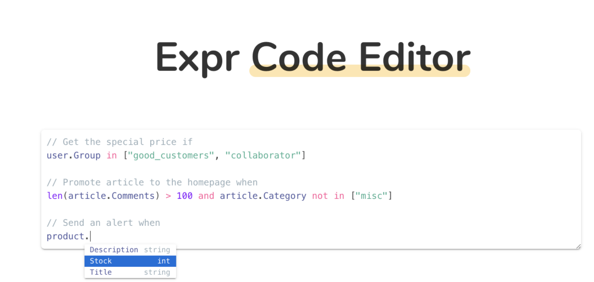

# Go语言爱好者周刊：第 125 期

这里记录每周值得分享的 Go 语言相关内容，周日发布。

本周刊开源（GitHub：[polaris1119/golangweekly](https://github.com/polaris1119/golangweekly)），欢迎投稿，推荐或自荐文章/软件/资源等，请[提交 issue](https://github.com/polaris1119/golangweekly/issues) 。

鉴于一些人可能没法坚持把英文文章看完，因此，周刊中会尽可能推荐优质的中文文章。优秀的英文文章，我们的 GCTT 组织会进行翻译。



题图：表达式语言

## 刊首语

不知不觉，这是 2021 年最后一期了。Go爱好者周刊已经持续 2 年半了，2022 年会继续和你陪伴。

上期提供一道关于 json 和 context 的题：

```go
package main

import (
	"context"
	"encoding/json"
	"fmt"
)

func main() {
	data, _ := json.Marshal(context.WithValue(context.Background(), "a", "b"))
	fmt.Println(string(data))
}
```

A：{}；B：{"a":"b"}；C：{"Context":0}；D：不确定

正确率 28%，正确答案：C。WithValue 底层是 valueCtx 结构体，其中 key、val 两个字段未导出，这里存放 "a" 和 "b"，同时还内嵌了 Context 接口。根据 Marshal 的规则，非导出的不会被序列化。而内嵌 Context 相当于导出了 Context 字段，而它的值是 context.Background()，即 `background = new(emptyCtx)`，emptyCtx 实际是 int 类型，因此选 C。

## 资讯

1、[Delve 1.8.0 发布](https://github.com/go-delve/delve/releases/tag/v1.8.0)

Go 语言调试器。

2、[GoLand 2022.1 路线图：全面支持泛型](https://mp.weixin.qq.com/s/WqoU_cfdFudO0B37ntnBdg)

官方宣布了 GoLand 2022.1 路线图，注意，本文特性不一定全部会在 GoLand 2022.1 中实现。

## 文章

1、[Go 泛型简明入门教程](https://mp.weixin.qq.com/s/_pJXLJ6W9BFZyWBud7agPQ)

有泛型的 Go 版本 1.18 已经发布了 Beta1 版本，之前陆陆续续介绍了泛型，但可能有些人还是对 Go 泛型没有完整的了解，因此有这份入门教程。

2、[Go 1.18 中的自引用接口，你看懂了吗？](https://mp.weixin.qq.com/s/r7W3WigooZ49GtmGaIBlPQ)

有些场景可能用得到。

3、[必看！6 步入门 Go](https://mp.weixin.qq.com/s/DRpmh41dGAfzSOMsvwy8wA)

一门语言的入门方式，每个人可能不一样，但基础的知识都是必须掌握的。这里整理了一个 Go 语言 6 步入门法，希望对你有帮助。

4、[发现一个很棒的 Go GitHub 项目](https://mp.weixin.qq.com/s/Zc0B8kgRH0dOit85MbGL0w)

这个项目是用于学习和实践 Go 及其相关技术的精彩文章和资源的精选列表。

5、[如何使用 WebAssembly 在浏览器中编译 Go 代码](https://mp.weixin.qq.com/s/AqEaYIRPSKjzZ1AE4cDtHA)

本文接会从 Go Wasm 是什么，怎么运行的，以及未来发展三个方面展开介绍。

7、[go-zero 分布式事务最佳实践](https://mp.weixin.qq.com/s/1hUhSRkWFqFnO6w1PasrGw)

go-zero 与 dtm 强强联合，推出了在 go-zero 中无缝接入 dtm 的极简方案，让分布式事务的使用从未如此简单。

8、[为什么你需要更小巧的容器？](https://mp.weixin.qq.com/s/qzM9FqDH92ZUVtcEjKwTSg)

这篇文章出人意料地登上了黑客新闻的头版，并在那里引发了一场富有成效的讨论。

9、[程序员瑞士军刀：各种结构的转换工具](https://mp.weixin.qq.com/s/Qomu3f1-FdExB7Jw6PUXQA)

上次推荐的 「Go网址导航」，其中收录了一项：转换器。

## 开源项目

1、[requests](https://github.com/carlmjohnson/requests)

HTTP 客户端库，还带有用于构建自定义 http 传输的工具，包括用于测试的请求记录器和重放器。

2、[py4go](https://github.com/tliron/py4go)

Go 和 Python 之间的紧密双向集成。

3、[btree](https://github.com/tidwall/btree)

B 树的 Go 高效实现，支持泛型。

4、[prolog](https://github.com/ichiban/prolog)

一种可嵌入 Go 的 prolog 脚本引擎。

5、[expr](https://github.com/antonmedv/expr)

Go 的表达式语言。

## 资源&&工具

1、[ssl-handshake](https://github.com/tuladhar/ssl-handshake)

用于测试 SSL 握手延迟的命令行工具。

2、[fq](https://github.com/wader/fq)

用于检查二进制数据的工具、语言和解码器。

3、[reviewdog](https://github.com/reviewdog/reviewdog)

Go 实现的可以与任何代码分析工具集成的自动代码审查工具。

4、[generic](https://github.com/zyedidia/generic)

一个用 Go 泛型实现的实验性数据结构集合。

5、[盘点那些提高生产力的 VS Code 插件](https://mp.weixin.qq.com/s/_A6tR2rYf97Y8leakf3nOA)

自从 VS Code 问世，流行度不断飙升，其他文本编辑器（非 IDE）的很多用户都转移到了 VS Code，越多用户，越多开发者参与构建生态。

6、[lal](https://github.com/q191201771/lal)

Go 直播流媒体网络传输服务。

## 订阅

这个周刊每周日发布，同步更新在[Go语言中文网](https://studygolang.com/go/weekly)和[微信公众号](https://weixin.sogou.com/weixin?query=Go%E8%AF%AD%E8%A8%80%E4%B8%AD%E6%96%87%E7%BD%91)。

微信搜索"Go语言中文网"或者扫描二维码，即可订阅。


