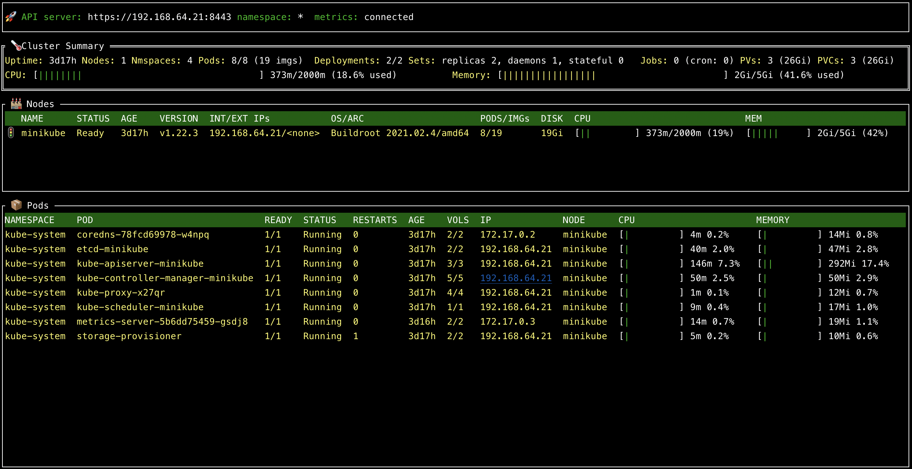

# Go语言爱好者周刊：第 126 期

这里记录每周值得分享的 Go 语言相关内容，周日发布。

本周刊开源（GitHub：[polaris1119/golangweekly](https://github.com/polaris1119/golangweekly)），欢迎投稿，推荐或自荐文章/软件/资源等，请[提交 issue](https://github.com/polaris1119/golangweekly/issues) 。

鉴于一些人可能没法坚持把英文文章看完，因此，周刊中会尽可能推荐优质的中文文章。优秀的英文文章，我们的 GCTT 组织会进行翻译。

题图：基于网络图片修改，元旦快乐！

## 刊首语

2022 年已开启，这是新年的第一期周刊，假期大家玩的开心吧！昨天对 Go 语言中文网进行了年度总结，貌似玩耍的人多，阅读的人比平时少了很多。[没看的可以看看](https://mp.weixin.qq.com/s/-NFjO_9Scqcfs4izxEo58Q)。

2022 年新年快乐！祝愿大家 Go 水平节节攀升！

## 资讯

1、[go charts 0.0.3 发布](https://www.oschina.net/news/176692/go-charts-0-0-3-released)

基于 go-chart 生成数据图表，无其它模块的依赖纯 golang 的实现，支持 svg 与 png 的输出。

2、[Go 1.18 新特性前瞻：原生支持 Fuzzing 测试](https://mp.weixin.qq.com/s/UqjSA2i3s1VoLFACt_EL2A)

有了对F uzzing 技术的原生支持后，我相信会有更多代码经过 Fuzzing 测试，未来不久 Go 社区的 Go 代码的安全水平将会得到整体提升。本文我们就来简单聊聊 Fuzzing 这个 Go 1.18 版本的新特性。

3、[Go1.18 泛型的好、坏亦或丑？](https://mp.weixin.qq.com/s/Xp7B3okOOcNedhNMM1pU3Q)

Go 泛型定了，有哪些好的使用场景，哪些不好的应用场景，亦或哪些使用看起来丑？本文聊聊这个问题。

4、[Go1.18 新特性：TryLock 是什么？需要它吗？](https://mp.weixin.qq.com/s/NGiBcw0Je-clQd0paAsI9Q)

算是妥协吗？

## 文章

1、[BPF 和 Go: Linux 中的现代内省形式](https://mp.weixin.qq.com/s/XjthFHWG6GMbrh1zyGpteg)

本文将向你介绍为什么我们需要像 BPF 这样的东西，并帮助你了解何时及如何使用它，以及它是如何帮助作为工程师的你改进你正在进行的项目的。

2、[Gopher 需要知道的几个结构体骚操作](https://mp.weixin.qq.com/s/A4m1xlFwh9pD0qy3p7ItSA)

我们知道 Go 没有继承的概念，接口结构体多使用组合，很多开源产品或是源代码都有大量的内嵌 (embeded field) 字段，用于特殊目的。

3、[Go 实现一个简单而强大的反向代理](https://mp.weixin.qq.com/s/nLwUS47e6ZL7Yi8kwLXzmg)

在本文中，我们将了解反向代理，它的应用场景以及如何在 Golang 中实现它。

4、[SSA：终于知道 Go 编译器偷摸做了哪些事](https://mp.weixin.qq.com/s/jGLmfqnt0e_twmv194pdZg)

在 Go 的源码和汇编码之间，其实编译器在你眼皮底下偷偷又做了不少事情，而 ssa 就是查看查看编译器优化行为的利器。

5、[Go：如何应对不断膨胀的接口](https://mp.weixin.qq.com/s/d7Hdpx31c69-l-ZLHygx7w)

难怪码农自嘲是 CRUD boy, 每天确实在不断的堆屎，在别人的屎山上缝缝补补。

6、[Golang AI 开发：通过将 AI 集成到你的应用程序](https://mp.weixin.qq.com/s/XaP97Z78iX0dg2-inMxj6Q)

了解使用 Golang 语言开发实现 AI 的应用程序如何使你的业务和开发过程受益。

7、[吐槽过后，我为什么要夸夸 Go 语言](https://mp.weixin.qq.com/s/4-KvOA7exMGLvq8S_TAlmg)

我想来好好地夸一夸 Go，因为虽然我经常吐槽它，但 Go 仍然是我使用过的最好的编程语言之一，而且我对这门语言充满了敬意。

8、[Go 中缓存相关的开源库](https://mp.weixin.qq.com/s/E8z58jNiZKeooT-ee18XOw)

这篇文章登上了 Golang 在 Reddit subreddit 板块的顶部，并在 Hacker News 首页排名到第二名。

9、[Go：最简单的服务响应时长优化方法，没有之一](https://mp.weixin.qq.com/s/IFwyg14raR4HJa5Y_pYMcw)

mapReduce 的源码我大概看了两个晚上，整体看下来比较累。

10、[2021 年你写了多少代码？这个 Go 工具帮你统计](https://mp.weixin.qq.com/s/qGaSYtFxm_H8v3twcdriZg)

scc，一个 Go 实现的工具。

11、[泛型版 singleflight：Go 中如何防止缓存击穿？](https://mp.weixin.qq.com/s/zwTErb_kiEEsurscYQ6eRw)

并发是 Go 的优势，但并发也需要很好的进行控制。

## 开源项目

1、[Beerus](https://github.com/yuyenews/Beerus)（网友投稿）

一个用 Go 开发的 Web 解决方案，包含一个 Web 框架，一个数据库操作框架，一个正在规划中的 RPC 框架，目前 Web 框架和数据库操作框架已经发布了第一个版本。

2、[kstone](https://github.com/tkestack/kstone)

腾讯开源的 etcd 一站式治理平台 Kstone。

3、[goga](https://github.com/tomcraven/goga)

遗传算法的 Go 实现。

4、[gvisor](https://github.com/google/gvisor)

容器的应用内核。

5、[gophernotes](https://github.com/gopherdata/gophernotes)

用于 Jupyter 笔记本和 nteract 的 Go 内核。

## 资源&&工具

1、[Go Time 第 197 期](https://changelog.com/gotime/197)

Go 技术书籍。

2、[ktop](https://github.com/vladimirvivien/ktop)

为你的 Kubernetes 集群提供一个类似 top 的工具。

3、[raft](http://thesecretlivesofdata.com/raft/)

动画图解 Raft 算法。

4、[GopherCon 2021](https://mp.weixin.qq.com/s/pR1HqR-ve1CRm0hAT9ud1g)

全套 PPT 开放下载。

## 订阅

这个周刊每周日发布，同步更新在[Go语言中文网](https://studygolang.com/go/weekly)和[微信公众号](https://weixin.sogou.com/weixin?query=Go%E8%AF%AD%E8%A8%80%E4%B8%AD%E6%96%87%E7%BD%91)。

微信搜索"Go语言中文网"或者扫描二维码，即可订阅。

