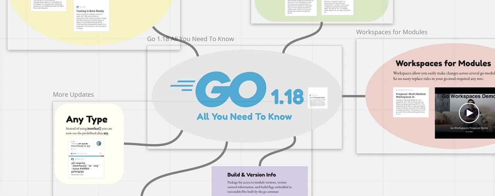
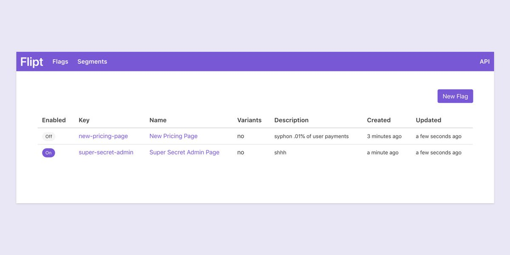

# Go语言爱好者周刊：第 127 期

这里记录每周值得分享的 Go 语言相关内容，周日发布。

本周刊开源（GitHub：[polaris1119/golangweekly](https://github.com/polaris1119/golangweekly)），欢迎投稿，推荐或自荐文章/软件/资源等，请[提交 issue](https://github.com/polaris1119/golangweekly/issues) 。

鉴于一些人可能没法坚持把英文文章看完，因此，周刊中会尽可能推荐优质的中文文章。优秀的英文文章，我们的 GCTT 组织会进行翻译。



题图：Go 1.18，All You Need To Know

## 刊首语

本期是一道关于 `|` 的题目，以下代码输出什么？

```go
package main

import (
	"fmt"
)

func main() {
	var a, b float64 = 1.0, 4.0
	fmt.Println(a | b)
}
```

A：5；B：+Inf；C：panic；D：不能编译

## 资讯

1、[Ginkgo 2.0 发布](https://github.com/onsi/ginkgo)

一个 BDD 测试框架。

2、[Excelize 2.5.0 发布](https://xuri.me/excelize/zh-hans/releases/v2.5.0.html)

Go 语言编写的用于操作 Office Excel 文档基础库，基于 ECMA-376，ISO/IEC 29500 国际标准。

3、[sonic 1.0 发布](https://github.com/bytedance/sonic)

字节开源的高性能 json 编解码库。

4、[afero 1.8 发布](https://github.com/spf13/afero)

Go 的文件系统抽象系统。

5、[delve 1.8 发布](https://github.com/go-delve/delve)

支持 Go1.18。

6、[rqlite 6.9.0 发布](https://github.com/rqlite/rqlite)

基于 SQLite 构建的分布式关系数据库。

7、[Go1.17.6 发布！网友：都 1.18Beta1，难道还降级？](https://mp.weixin.qq.com/s/prs19Y-G2m12r7sZk10NNw)

Go 的惯例：同时维护最近的两个主版本。等 Go1.18 正式发布，维护的两个主版本会是 1.18 和 1.17。

## 文章

1、[为 Java 开发者准备的 Go 教程 01：漫游了](https://mp.weixin.qq.com/s/SHbJhAHylbmmWZ0ccrk-Fw)

在正式工作之前，一直使用 Java，虽然这些年对 Java 的关注变少了，但很显然，Java 用户群体特别大。

2、[Go：10 个与众不同的特性](https://mp.weixin.qq.com/s/nzm7VaP47Cj2v0nz4GqBfQ)

Go 作为一门相对较新的语言，能够脱颖而出，肯定是多方面的原因。本文聊聊它不同于其他语言的 10 个特性。

3、[项目实战：使用 Fiber + Gorm 构建 REST API](https://mp.weixin.qq.com/s/RqUOLP-OG_wOpCzxVTAl6w)

今天这篇文章介绍如何使用 Fiber + Gorm 构建 REST API。

4、[如何使用 atomic 包减少锁冲突](https://mp.weixin.qq.com/s/F6EWMOETRisR0Jirzf6k0g)

Go 提供了 channel 或 mutex 等内存同步机制，有助于解决不同的问题。

5、[Rust vs. Go：两个团队成员都认为两者结合效果更好！](https://mp.weixin.qq.com/s/Tv8SKmsRcYbBjsO_9armlA)

本文将讨论 Rust 和 Go 的优缺点以及它们如何相互补充和支持，同时给出什么场景最适合哪门语言的建议。

6、[寻找 Go 库的网站你知道几个](https://mp.weixin.qq.com/s/RE8b6qj6DQ27a1x8_9nkhg)

想必大家找各个语言的库一般都会从 github 中搜索，或者从 awesome-language 的系列库中查找。这里介绍几个查找 Go 库的网站。

7、[2022 年 1月 TIOBE 编程语言排行榜出炉：Go 啥排名？](https://mp.weixin.qq.com/s/szTTRSxxAcy1iIyx8GXOYg)

Go 从第 14 位到第 13 位。

## 开源项目

1、[phalanx](https://github.com/mosuka/phalanx)

云原生分布式搜索引擎。

2、[garlicshare](https://github.com/R4yGM/garlicshare)

用 Go 编写的 Tor 网络上的私人和自我托管的文件共享服务。

3、[chconn](https://github.com/vahid-sohrabloo/chconn)

ClickHouse 的 Go driver。

4、[tink](https://github.com/google/tink)

Tink 是一个多语言、跨平台、开源的库，它提供了安全、易于正确使用且不易误用的加密 API。

5、[flipt](https://github.com/markphelps/flipt)

一个开源的、基于 prem 的功能标志解决方案。



## 资源&&工具

1、[油管视频](https://www.youtube.com/watch?v=o-4DeG6SoZA)

为什么 Go 是一种适合盲人和视力障碍者的语言？

2、[pagoda](https://github.com/mikestefanello/pagoda)

快速、简单的全栈式Web开发入门套件，采用 Go 语言。

3、[best-books](https://bitfieldconsulting.com/golang/best-books)

2022 年的最佳 Go 技术书籍。

4、[ebiten 实战](https://ebiten.org/blog/native_compiling_for_nintendo_switch.html)

将 Go 程序编译成任天堂 Switch 的本地二进制文件。

## 订阅

这个周刊每周日发布，同步更新在[Go语言中文网](https://studygolang.com/go/weekly)和[微信公众号](https://weixin.sogou.com/weixin?query=Go%E8%AF%AD%E8%A8%80%E4%B8%AD%E6%96%87%E7%BD%91)。

微信搜索"Go语言中文网"或者扫描二维码，即可订阅。


