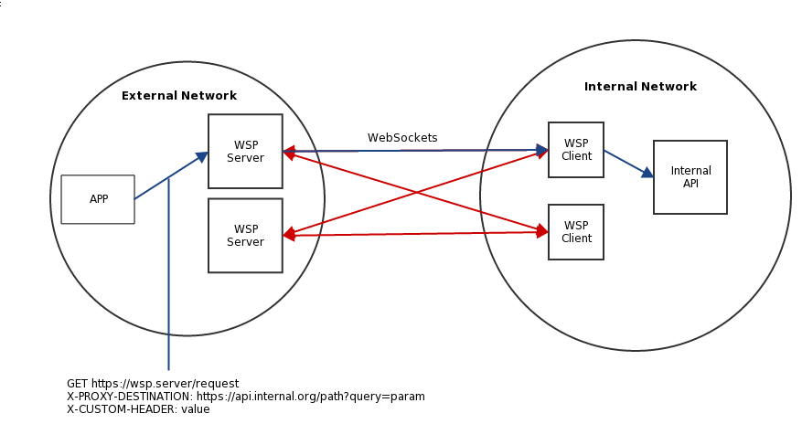

# Go语言爱好者周刊：第 130 期

这里记录每周值得分享的 Go 语言相关内容，周日发布。

本周刊开源（GitHub：[polaris1119/golangweekly](https://github.com/polaris1119/golangweekly)），欢迎投稿，推荐或自荐文章/软件/资源等，请[提交 issue](https://github.com/polaris1119/golangweekly/issues) 。

鉴于一些人可能没法坚持把英文文章看完，因此，周刊中会尽可能推荐优质的中文文章。优秀的英文文章，我们的 GCTT 组织会进行翻译。

题图：虎年吉祥

## 刊首语

牛年马上结束了！Go 爱好者周刊已经第 130 期了，感谢大家的支持，我们虎年再见！

## 资讯

1、[tinygo 0.22.0 发布](https://github.com/tinygo-org/tinygo/releases/tag/v0.22.0)

一个基于 LLVM 的、用于一些特定小场景的 Go 编译器，比如 WebAssembly、Microcontrollers 和 命令行工具等。

2、[GoLand 2022.1 EAP 发布](https://blog.jetbrains.com/go/2022/01/27/goland-2022-1-early-access-program-has-started/)

最大的特性就是支持泛型。

3、[GoReleaser](https://goreleaser.com/customization/aur/)

GoReleaser 现在可以支持基于 Arch Linux 的发行版使用的 AUR（Arch 用户存储库）。

4、[ebpf 0.8 发布](https://github.com/cilium/ebpf)

纯 Go 实现的 eBPF 库。

5、[milvus 2.0 发布](https://github.com/milvus-io/milvus)

一个开放源码的矢量数据库，用于嵌入相似性搜索和人工智能应用程序。

6、[GoLand 2021.3.3 发布](https://blog.jetbrains.com/go/2022/01/28/goland-2021-3-3-is-available/)

可以方便切换不同的 Go SDK。

## 文章

1、[推荐一本对实际工作很有用的 Go 新图书](https://mp.weixin.qq.com/s/pBqNKjt75Ml13TQ1E8k72w)

目前前 10 章可以免费在线阅读。

2、[惊！golang 竟然可以让人内心平静？！](https://mp.weixin.qq.com/s/YaZ-O3bzVMHfeoMQFCHiZw)

Go 语言中文网上有人发了一个帖子：golang 让我内心真正的平静了。

3、[终于来啦！2万个Go专属红包封面，送给你](https://mp.weixin.qq.com/s/fFrBIZLVmkjo_yyvmSJrhg)

上周六收到微信通知，感谢我的创作，送了我 20000 个红包封面（要知道，定制红包封面，原价 1 元/个）。

4、[10 款优雅的 Go 语言开发工具](https://mp.weixin.qq.com/s/PTDKZLJL6HIEP08BG2ekEw)

有些工具可能用的人越来越少，肯定也还有其他好用的工具没列出，欢迎补充！

5、[Go 通过 Map/Filter/ForEach 等流式 API 高效处理数据](https://mp.weixin.qq.com/s/t3INtSfFSmv-nsJqLmdPew)

自己实现一套。

6、[让 Go 的错误处理更加强大](https://mp.weixin.qq.com/s/LTZXAPvTHRTUcNH_v7ZSIg)

Go 所提供的默认的 errors 包有些不足。

7、[2022 年要考虑的 7 种 Docker 替代方案](https://mp.weixin.qq.com/s/_eYSHi4J-wsgzkNN9y3Bfw)

本文深入探讨了 Docker 七个替代品，其中包括一系列综合平台，如 Docker 以及可以作为 Docker 生态系统组件替代品的工具等。

8、[贝壳 Go 实现的 IM 群聊优化之路](https://mp.weixin.qq.com/s/51IP867iJJtcq7IDd_JQxQ)

群聊服务的优化。

9、[Go 使用场景和用 Go 的顶级公司](https://mp.weixin.qq.com/s/V6rBYB9EfzoJwhJ_M-7-9g)

本文涵盖了受益于 Go 编程语言的各个领域，盘点 Go 在行业领域的使用情况，并找到使用 Go 的顶级公司。

10、[你想在 Go 2 中看到什么？](https://mp.weixin.qq.com/s/_I6ffLOsYsX4Q-EE0UR1cA)

这篇文章强调了我认为 Go 仍有改进空间的一些领域。

## 开源项目

1、[rueidis](https://github.com/rueian/rueidis)

Golang Redis RESP3 客户端，支持客户端缓存和自动流水线。

2、[timediff](https://github.com/mergestat/timediff)

显示为人类可读的时间差，比如 3 minutes ago，有人刚刚提交了国际化的代码。如果需要中文支持，你也可以提交 PR。

3、[go-winio](https://github.com/microsoft/go-winio)

微软开源的 Go 版本的 Win32 IO 相关实用程序。

4、[thunder](https://github.com/samsarahq/thunder)

快速开发 GraphQL 服务的框架。

5、[godb](https://github.com/samonzeweb/godb)

Go SQL 查询生成器和结构映射器。

6、[teamgram-server](https://github.com/teamgram/teamgram-server)

用 Go 编写的开源 mtproto 服务器，带有兼容 telegram 的客户端。

## 资源&&工具

1、[go-binsize-treemap](https://github.com/nikolaydubina/go-binsize-treemap)

Go 二进制大小 treemap，生成 SVG 格式，依赖的包大小一目了然。

2、[wasm-maze-generator](https://github.com/deadpixi/wasm-maze-generator)

一个简单的 WASM 迷宫生成器。

3、[wsp](https://github.com/root-gg/wsp)

Websocket 上的 HTTP 隧道。

## 订阅

这个周刊每周日发布，同步更新在[Go语言中文网](https://studygolang.com/go/weekly)和[微信公众号](https://weixin.sogou.com/weixin?query=Go%E8%AF%AD%E8%A8%80%E4%B8%AD%E6%96%87%E7%BD%91)。

微信搜索"Go语言中文网"或者扫描二维码，即可订阅。

