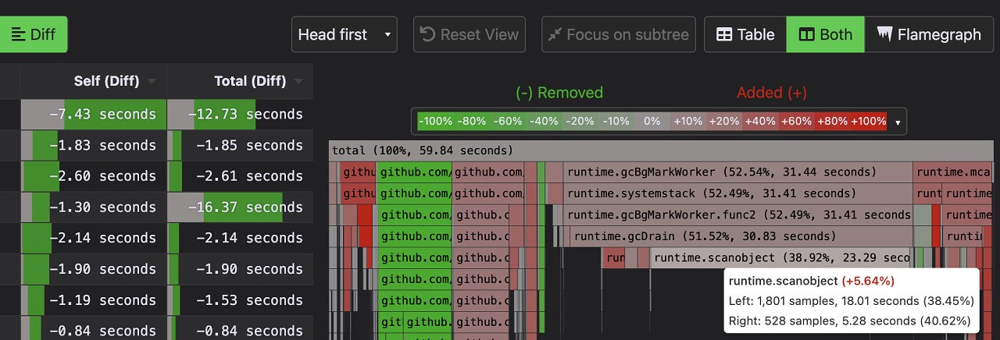

# Go语言爱好者周刊：第 133 期

这里记录每周值得分享的 Go 语言相关内容，周日发布。

本周刊开源（GitHub：[polaris1119/golangweekly](https://github.com/polaris1119/golangweekly)），欢迎投稿，推荐或自荐文章/软件/资源等，请[提交 issue](https://github.com/polaris1119/golangweekly/issues) 。

鉴于一些人可能没法坚持把英文文章看完，因此，周刊中会尽可能推荐优质的中文文章。优秀的英文文章，我们的 GCTT 组织会进行翻译。



题图：在线火焰图

## 刊首语

上期的题目，抽空专门写篇文章讲解。

看本期的一道题目。以下代码输出什么？

```go
package main

import (
	"fmt"
)

func main() {
	a := [5]int{1, 2, 3, 4, 5}
	t := a[3:4:4]
	fmt.Println(t[0])
}
```

A：1；B：3；C：4；D：编译错误

## 资讯

1、[GitLeaks 8.3 发布](https://github.com/zricethezav/gitleaks)

使用正则表达式和 entropy 扫描 git repo（或文件）以查找秘钥。

2、[kratos 2.2 发布](https://github.com/go-kratos/kratos)

B 站开源的 Go 微服务框架。

## 文章

1、[这个开源项目牛逼：牙医教你用450行Go代码写出一个编程语言](https://mp.weixin.qq.com/s/2_tVDqZWmc_ttOp9_MlVEQ)

如何更好地掌握 Go？Go 编译器到底是怎么实现的？

2、[如何哄女神欢心，这个Go开源项目说的一清二楚](https://mp.weixin.qq.com/s/UaACcQRZZBAA1u029g09wg)

一个 Go 语言构建的开源照片管理器 —— PhotoPrism。

3、[程序员技术选型：写Go还是Java？](https://mp.weixin.qq.com/s/Xw6QKXWqueQfiQp5c1QumQ)

本文作者根据自己的使用体验，详细对比了 Go 和 Java 的使用差异，给了开发者们一个中肯的选用参考。

4、[关于 Go 并发编程，你不得不知的“左膀右臂”——并发与通道！](https://mp.weixin.qq.com/s/Wwnnx9BLw5Z-ksgJYAe-Vw)

本文主要介绍 Goroutine 和 channel 的实现。

5、[Go GC 如何检测内存对象中是否包含指针](https://tonybai.com/2022/02/21/how-gc-detect-pointer-in-mem-obj/)

GC 只关心**指针**，只要被扫描到的内存对象中有指针，它就会“顺藤摸瓜”，把该内存对象所在的“关系网”摸个门儿清，而那些被孤立在这张“网”之外的内存对象就是要被“清扫”的对象。

## 开源项目

1、[systray](https://github.com/getlantern/systray)

用于在通知区域放置图标/菜单的跨平台库。

2、[podinfo](https://github.com/stefanprodan/podinfo)

用于 Kubernetes 的 Go 微服务模板。

3、[roaring](https://github.com/RoaringBitmap/roaring)

Go Roaring bitmaps 包。

4、[sturdy](https://github.com/sturdy-dev/sturdy)

Go 构建实时代码协作平台。

5、[gldap](https://github.com/jimlambrt/gldap)

使用 Go 构建 LDAP 服务。

6、[lem](https://github.com/akutz/lem)

一个用于断言预期逃逸分析结果和堆分配的 Go 测试框架。

7、[keploy](https://github.com/keploy/keploy)

将 API 调用自动转换为 testcase 的无代码测试框架。

## 资源&&工具

1、[flamegraph](https://flamegraph.com/)

交互式火焰图在线分享网站，还有在线生成火焰图：<https://playground.flamegraph.com/playground>。

2、[newser](https://github.com/lnenad/newser)

抓取资源并生成为 PDF。

3、[播客第 218 期](https://changelog.com/gotime/218)

Go 与 GraphQL。

4、[chameleon](https://github.com/life4/chameleon)

将 Markdown 文件转换为一个精美博客。

5、[keel](https://github.com/keel-hq/keel)

用于自动执行 Helm、DaemonSet、StatefulSet 和 deployment 更新的 k8s operator。

## 订阅

这个周刊每周日发布，同步更新在[Go语言中文网](https://studygolang.com/go/weekly)和[微信公众号](https://weixin.sogou.com/weixin?query=Go%E8%AF%AD%E8%A8%80%E4%B8%AD%E6%96%87%E7%BD%91)。

微信搜索"Go语言中文网"或者扫描二维码，即可订阅。


