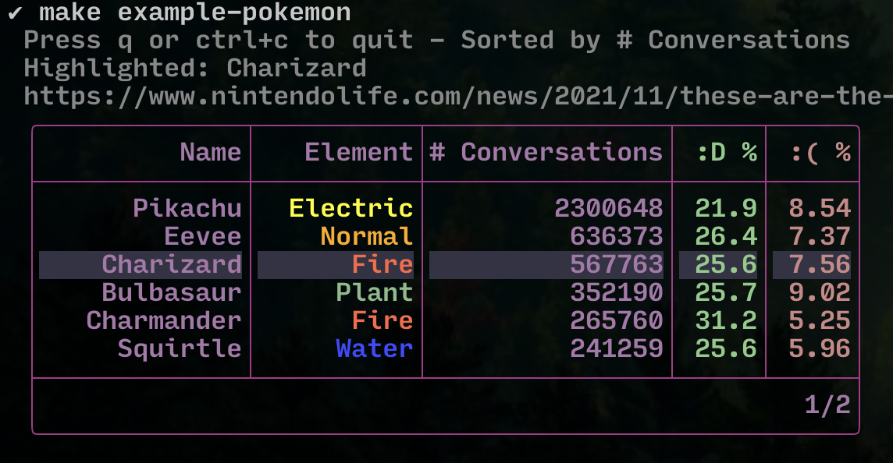

# Go语言爱好者周刊：第 134 期

这里记录每周值得分享的 Go 语言相关内容，周日发布。

本周刊开源（GitHub：[polaris1119/golangweekly](https://github.com/polaris1119/golangweekly)），欢迎投稿，推荐或自荐文章/软件/资源等，请[提交 issue](https://github.com/polaris1119/golangweekly/issues) 。

鉴于一些人可能没法坚持把英文文章看完，因此，周刊中会尽可能推荐优质的中文文章。优秀的英文文章，我们的 GCTT 组织会进行翻译。


题图：来自 golangweekly

## 刊首语

上期的题目比较简单，关于 slice 的。以下代码输出什么？

```go
package main

import (
	"fmt"
)

func main() {
	a := [5]int{1, 2, 3, 4, 5}
	t := a[3:4:4]
	fmt.Println(t[0])
}
```

A：1；B：3；C：4；D：编译错误

正确答案是 C：4。a[3:4:4] 得到一个 slice，从原数组的第 4 个元素（索引是 3）开始，因此 t[0] 是 4。需要需要掌握 reslice 的语法。

## 资讯

1、[Go GUI 开发者调查](https://fynelabs.com/2022/03/02/announcing-go-gui-developer-survey/)

对 GUI 开发感兴趣的可以参与下。由 Fyne 发起的。

2、[gopls v0.8.0 发布](https://github.com/golang/tools/releases/tag/gopls%2Fv0.8.0)

支持 Go 1.18，包括工作区、泛型、模糊测试等，不过 Go1.12 及之前就不再支持了。

3、[Go1.17.8 和 Go1.16.15 发布](https://mp.weixin.qq.com/s/uaNwWJHOqFdAz8tZ9ZjTww)

是安全更新。

4、[arenas proposal 的原型实现](https://go-review.googlesource.com/c/go/+/387975)

最近 arenas 受关注都很高。

5、[TiDB 5.4 发布](https://en.pingcap.com/blog/tidb-5-4-kicking-off-2022-with-faster-htap-ease-of-use-and-lower-cost/)

以更快的 HTAP、易用性和更低的成本开启 2022。

## 文章

1、[goutil/dump](https://studygolang.com/articles/35472)

打印漂亮易读的 Go 数据。

2、[Go：分布式高并发服务限流实现方案](https://mp.weixin.qq.com/s/GkEAVQ6AWGRadB4fEBlepg)

在高并发大流量系统中，由于并发大造成服务资源不足，负载过高，进而引发致一系列问题。

3、[网友惊呼！Go：完了，我成C++了](https://mp.weixin.qq.com/s/9ys5DYOllFgQGw2GXQDijQ)

Go 语言社区正在讨论名为「arena」的新提案。

4、[这个 Go 程序分析工具太帅了](https://mp.weixin.qq.com/s/63ghkqXgcAlnV583h110dA)

简单易用的持续分析 (Continuous profiling)服务器。

5、[聊聊 Go 应用输出日志的工程实践](https://tonybai.com/2022/03/05/go-logging-practice/)

日常学习 Go 语言时，日志不是不可或缺的，甚至是无需考虑的，但是一旦到真正的 Go 的工程实践中，输出日志便是我们绕不过去的、必须面对的问题。


、[Go 1.18 泛型的实现原理](https://github.com/golang/proposal/blob/master/design/generics-implementation-dictionaries-go1.18.md)

英文的。

## 开源项目

1、[juniper](https://github.com/bradenaw/juniper)

用泛型扩展 Go 标准库。

2、[bun](https://github.com/uptrace/bun)

适用于多个数据库的流畅 SQL 客户端。

3、[lo](https://github.com/samber/lo)

一个基于Go 1.18+ 泛型的 Lodash 风格的 Go 库（map, filter, contains, find…）。<https://lodash.com/> 是 JavaScript 的一个流行库。

4、[bubble-table](https://github.com/Evertras/bubble-table)

基于 Bubble Tea 框架的可定制、交互式表格组件。



5、[GoDLP](https://github.com/bytedance/godlp)

字节安全团队开源自研敏感信息保护方案。

## 资源&&工具

1、[pg_back](https://github.com/orgrim/pg_back)

简单的 PostgreSQL 备份工具。

2、[Go 播客第 219 期](https://changelog.com/gotime/219)

为什么要用 Go 创建一个不可变数据库（immudb）。

3、[graphql-go-tools](https://github.com/jensneuse/graphql-go-tools)

使用 Go 编写高性能 GraphQL 应用程序的工具。

4、[gost](https://github.com/ginuerzh/gost)

Go 语言实现的安全隧道。

## 订阅

这个周刊每周日发布，同步更新在[Go语言中文网](https://studygolang.com/go/weekly)和[微信公众号](https://weixin.sogou.com/weixin?query=Go%E8%AF%AD%E8%A8%80%E4%B8%AD%E6%96%87%E7%BD%91)。

微信搜索"Go语言中文网"或者扫描二维码，即可订阅。


