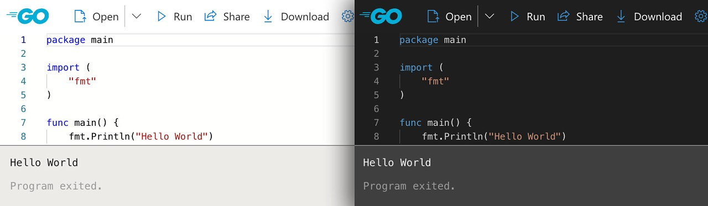

# Go语言爱好者周刊：第 135 期

这里记录每周值得分享的 Go 语言相关内容，周日发布。本周刊开源（GitHub：[polaris1119/golangweekly](https://github.com/polaris1119/golangweekly)），欢迎投稿，推荐或自荐文章/软件/资源等，请[提交 issue](https://github.com/polaris1119/golangweekly/issues) 。

鉴于一些人可能没法坚持把英文文章看完，因此，周刊中会尽可能推荐优质的中文文章。优秀的英文文章，我们的 GCTT 组织会进行翻译。



题图：goplay

## 刊首语

以下代码输出什么？

```go
package main

import "fmt"

func main() {
	fmt.Println(1 % 2.0)
	fmt.Println(int(1) % 2.0)
}
```

A：1 1；B：1.0 1.0；C：编译不通过；D：1.0 1

## 资讯

1、[Go1.18 应该快发布了](https://github.com/golang/go/issues?q=is%3Aopen+is%3Aissue+label%3Arelease-blocker+milestone%3AGo1.18)

待解决的问题不多了。

2、[httpx 1.2 发布](https://github.com/projectdiscovery/httpx)

一个快速且多功能的 HTTP 工具包，它旨在通过增加线程来保持结果的可靠性。

## 文章

1、[字节跳动 Go RPC 框架 Kitex 性能优化实践](https://studygolang.com/articles/35530)

Kitex 是节跳动框架组研发的下一代高性能、强可扩展性的 Go RPC 框架。

[Go 中 “omitempty” 的陷阱](https://mp.weixin.qq.com/s/WuCXo9yNWsRmb-n5jA_yWA)

熟悉 Golang 的朋友对于 json 和 struct 之间的转换一定不陌生。

[为什么你不应该接受有 race 的代码](https://mp.weixin.qq.com/s/0vz9uR8zIT64Gvv3qjTENQ)

在任何语言的并发编程场景中，都有 race 问题，现代语言为了解决 race 问题有两种思路，一种是像 rust 那样的通过所有权+Sync/Send 限制用户尽量无法写出带 race 的代码；一种是像 Go 这样，通过 race detector 在测试期间检查数据竞争问题。

4、[怎么选择 Go 文件读取方案](https://mp.weixin.qq.com/s/Z-19Yj8Je7Wb9bqvMR35Cg)

文件处理是一个常见的问题，同时 Go 又提供了非常多的文件读取方法，容易让人患选择困难症。

5、[除以零不会panic？](https://mp.weixin.qq.com/s/uG7KL0BEpzh1-BZs3dbZHA)

有常识的人都知道，在除法运算中不能除以零，而我们在实际的应用中面对大量的上下文，很有可能因为考虑不周就出现除以零的情况。

[Go中main函数的初始化优化-依赖注入](https://mp.weixin.qq.com/s/TSmHhvJw7rmn87bZzZAYhA)

本文介绍在 golang 中如何通过依赖注入(Dependency Inject，简称 DI)管理全局服务。

## 开源项目

1、[display](https://github.com/embeddedgo/display)

支持不同显示器的图形库。

2、[amqp091-go](https://github.com/rabbitmq/amqp091-go)

RabbitMQ 的 Go 客户端。

3、[dynamo](https://github.com/guregu/dynamo)

DynamoDB 的 Go 客户端。

4、[gocql](https://github.com/gocql/gocql)

Cassandra 的 Go 客户端。

5、[Oso](https://github.com/osohq/oso)

一个包含 batteries 的框架，用于在你的应用程序中建立授权。

## 资源&&工具

1、[termsvg](https://github.com/mrmarble/termsvg)

将 asciinema 文件转为 svg。

2、[tygo](https://github.com/gzuidhof/tygo)

从 Go 源码生成 Typescript 类型。

3、[dasel](https://github.com/TomWright/dasel)

从命令行查询和更新数据结构，支持  JSON, TOML, YAML, XML 和 CSV 等格式。

4、[fakegen](https://github.com/multiprocessio/fakegen)

生成 M 列的随机 schema，以填充 N 行数据。

5、[subfinder](https://github.com/projectdiscovery/subfinder)

一个子域发现工具，可以为网站发现有效的子域名。


6、[syft](https://github.com/anchore/syft/)

从容器镜像和文件系统生成软件物料清单(SBOM)的工具和库。

7、[opensca](https://github.com/XmirrorSecurity/OpenSCA-cli)

Go 实现的开源软件构成分析工具。

## 订阅

这个周刊每周日发布，同步更新在[Go语言中文网](https://studygolang.com/go/weekly)和[微信公众号](https://weixin.sogou.com/weixin?query=Go%E8%AF%AD%E8%A8%80%E4%B8%AD%E6%96%87%E7%BD%91)。

微信搜索"Go语言中文网"或者扫描二维码，即可订阅。


