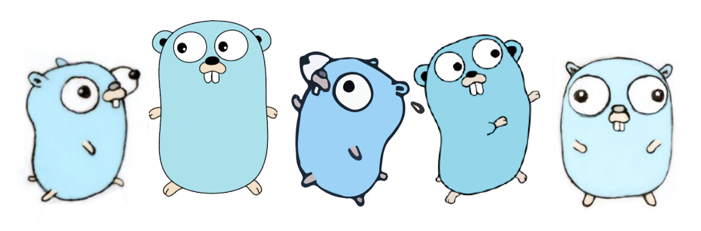

# Go语言爱好者周刊：第 137 期

这里记录每周值得分享的 Go 语言相关内容，周日发布。本周刊开源（GitHub：[polaris1119/golangweekly](https://github.com/polaris1119/golangweekly)），欢迎投稿，推荐或自荐文章/软件/资源等，请[提交 issue](https://github.com/polaris1119/golangweekly/issues) 。

鉴于一些人可能没法坚持把英文文章看完，因此，周刊中会尽可能推荐优质的中文文章。优秀的英文文章，我们的 GCTT 组织会进行翻译。



题图：Go 吉祥物，代表了简单！

## 刊首语

本期题目：以下代码输出什么？

```go
func main() {
  var m sync.Mutex
  fmt.Print("A, ")
  m.Lock()

  go func() {
    time.Sleep(200 * time.Millisecond)
    m.Unlock()
  }()

  m.Lock()
  fmt.Print("B ")
}
```

A：A，B；B：A，C：A，fatal error；D：fatal error...

正确答案：A，即正常输出 A，B。该题正确率 34%。

在 main goroutine 第二次请求 Lock 时，会堵塞。这样另一个 goroutine 会运行，释放锁。如果没有另一个 goroutine 释放锁，则会报 fatal error，所有的 goroutine 都处于 sleep 状态，死锁！

本期题目：以下代码输出什么？

```go
package main

import "fmt"

func main() {
	var a, b = 1.0, 2.0
	fmt.Println(a | b)
}
```

A：3；B：+Inf；C：true；D：编译错误

## 资讯

1、[GoLand 2022.1 Beta 发布](https://mp.weixin.qq.com/s/LIBHeuFnk5PGj8dpbAH6tQ)

支持 Go1.18，还有微服务。

2、[chromedp 0.8 发布](https://github.com/chromedp/chromedp)

Go 1.18 的支持。

3、[bloom 3.2 发布](https://github.com/bits-and-blooms/bloom)

Go 的 Bloom filters 实现。

## 文章

1、[Go 中类型转换的那些事](https://mp.weixin.qq.com/s/0-updq-YURiBzC7FxZj5pw)

使用最多的 strconv 包。

2、[在腾讯，Go首次超越C++成为最热门语言](https://mp.weixin.qq.com/s/G7eX4Z3QM0NGeQKFDsmM1A)

Go 要起飞？

3、[goutil/dump —— 打印漂亮且易于阅读的 Go 数据](https://mp.weixin.qq.com/s/fzcZOHDzBFXdtAaydhYJrA)

一个 golang 数据打印工具包，可以打印漂亮易读的 go slice、map、struct 数据。

4、[Go语言 JSON 与 Cache 库调研与选型](https://mp.weixin.qq.com/s/RP65tQRg35EcipdDxDrmDA)

有这方面需求的可以看看。

5、[如果你是一个Golang面试官，你会问哪些问题？](https://mp.weixin.qq.com/s/6h1aQ6epm4HuVseVj831QQ)

来自知乎。

## 开源项目

1、[lotusdb](https://github.com/flower-corp/lotusdb)

基于快速文件的键值存储库。

2、[xid](https://github.com/rs/xid)

全局唯一 ID 生成器，使用 MongoDB 对象 ID 的算法。

3、[pie](https://github.com/elliotchance/pie)

操作 slice 和 map 的方便库。

## 资源&&工具

1、[date-time-format-cheatsheet](https://gosamples.dev/date-time-format-cheatsheet/)

Go 中日期和时间 cheatsheet。

2、[leaktest](https://github.com/fortytw2/leaktest)

Goroutine 泄露检测。

3、[Data-Structures-and-Algorithms](https://github.com/paliimx/Data-Structures-and-Algorithms)

数据结构和算法的 Go 实现。

4、[syft](https://github.com/anchore/syft)

一个 CLI 工具和 Go 库，用于从容器映像和文件系统生成软件物料清单（SBOM）。

## 订阅

这个周刊每周日发布，同步更新在[Go语言中文网](https://studygolang.com/go/weekly)和[微信公众号](https://weixin.sogou.com/weixin?query=Go%E8%AF%AD%E8%A8%80%E4%B8%AD%E6%96%87%E7%BD%91)。

微信搜索"Go语言中文网"或者扫描二维码，即可订阅。


