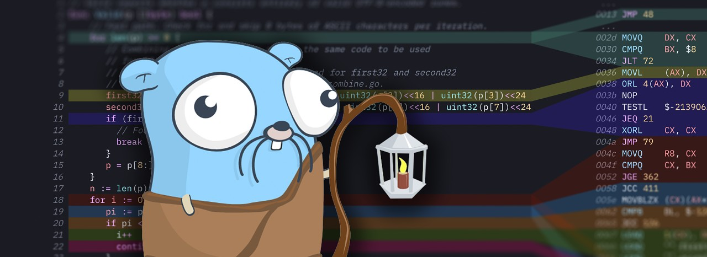
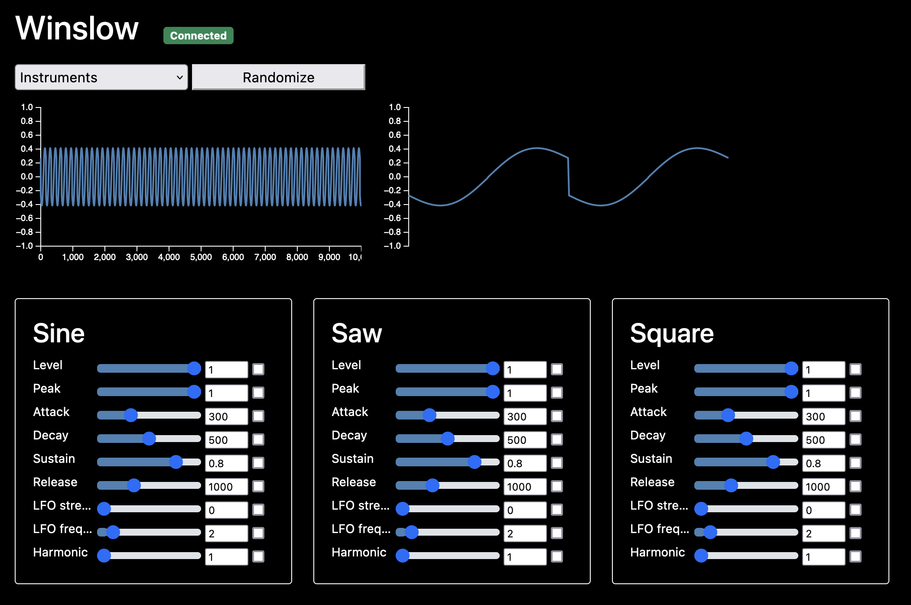

# Go语言爱好者周刊：第 138 期

这里记录每周值得分享的 Go 语言相关内容，周日发布。本周刊开源（GitHub：[polaris1119/golangweekly](https://github.com/polaris1119/golangweekly)），欢迎投稿，推荐或自荐文章/软件/资源等，请[提交 issue](https://github.com/polaris1119/golangweekly/issues) 。

鉴于一些人可能没法坚持把英文文章看完，因此，周刊中会尽可能推荐优质的中文文章。优秀的英文文章，我们的 GCTT 组织会进行翻译。



题图：来自 golangweekly

## 刊首语

上期题目：以下代码输出什么？

```go
package main

import "fmt"

func main() {
	var a, b = 1.0, 2.0
	fmt.Println(a | b)
}
```

A：3；B：+Inf；C：true；D：编译错误

正确答案：D，正确率 46%。float64 不支持 | 操作。

放假了，这次不出题目了！

## 资讯

1、[Ffuf 1.4.0 发布](https://github.com/ffuf/ffuf)

用 Go 编写的快速 Web 模糊器，用于模糊测试。支持对 HTTP 头域，POST 数据和 URL 的不同部分进行模糊测试。介绍文章：<https://hakin9.org/ffuf-a-fast-web-fuzzer-written-in-go/>。

2、[usql 0.10 发布](https://github.com/xo/usql)

数据库的通用 cli 工具，可以认为是数据库的瑞士军刀。

3、[grpc 1.45.1 发布](https://github.com/grpc/grpc/releases/tag/v1.45.1)

小版本更新。

## 文章

1、[golang本地缓存(bigcache/freecache/fastcache等)选型对比及原理总结](https://zhuanlan.zhihu.com/p/487455942)

本篇文章我们就来简单聊聊在 golang 做业务开发的过程中，本地缓存的一些可选的开源方案，分析它们的特点，以及内部的实现原理。

2、[2022 软件工程师状况报告：Go 最抢手](https://mp.weixin.qq.com/s/m_vgSi4kvZ9m-YZ3ndj7dg)

该报告的主要目的是希望能为软件工程师及开发者们提供见解和资源，以帮助促进他们的职业发展，同时也为雇主带来一些提高招聘效率和维持人才的策略。

3、[Facebook 开源 Go 实体框架 Ent 支持 TiDB](https://mp.weixin.qq.com/s/N2u2_PB6ddnYFjZtgAAgSA)

Facebook 开源的 Golang 实体框架 Ent 完成了对 TiDB 数据库的支持。

4、[构建 Go 应用 docker 镜像的十八种姿势](https://mp.weixin.qq.com/s/cOsoCD1_XhG4QpcRVtWgYg)

如何正确构建镜像。

5、[Go 工程化社区实践](https://mp.weixin.qq.com/s/vHkrgM8lfFQ6stCWH0tnTg)

Go 是一门注重工程的语言，本文分享 Go 工程化社区实践！

6、[Go 内存泄漏排查两例](https://mp.weixin.qq.com/s/bGnQnN84opogyeMRwIPSHA)

案例分享。

7、[Go单例实现—双重检测是否安全](https://mp.weixin.qq.com/s/dlvGj1W52KAUyV3hYJhxOA)

对于懒汉模式单例的实现，sync.Once 是更好的办法，简洁安全。

## 开源项目

1、[tableflip](https://github.com/cloudflare/tableflip)

Go 进程平滑重启库。

2、[ykmangoath](https://github.com/aripalo/ykmangoath)

另一个 ykman Go lib。

3、[GFuzz](https://github.com/system-pclub/GFuzz)

通过消息重排自动检测Go程序中的并发缺陷。网友 charlesxsh 推荐。

4、[gotrace](https://github.com/ysmood/gotrace)

监控 runtime stack 的库。作者 ysmood 自荐。

5、[gop](https://github.com/ysmood/got/tree/master/lib/gop)

一个用于打印复杂数据结构的库。作者 ysmood 自荐。

## 资源&&工具

1、[thanos](https://github.com/redneckbeard/thanos)

Ruby to Go Transpiler 原型。

2、[postlite](https://github.com/benbjohnson/postlite)

一个网络代理，允许通过 Postgres wire 协议访问远程 SQLite 数据库。

3、[fortio](https://github.com/fortio/fortio)

负载测试工具。

4、[WinslowSynth](https://github.com/rbren/WinslowSynth)

用 Go 制造有趣的声音。



5、[instl](https://github.com/installer/instl)

GitHub 项目安装器，跨平台的。

6、[termshark](https://github.com/gcla/termshark)

tshark 的终端 UI，受 Wireshark 启发。

## 订阅

这个周刊每周日发布，同步更新在[Go语言中文网](https://studygolang.com/go/weekly)和[微信公众号](https://weixin.sogou.com/weixin?query=Go%E8%AF%AD%E8%A8%80%E4%B8%AD%E6%96%87%E7%BD%91)。

微信搜索"Go语言中文网"或者扫描二维码，即可订阅。


