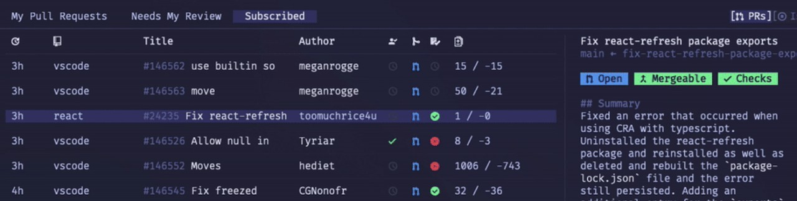

# Go语言爱好者周刊：第 139 期

这里记录每周值得分享的 Go 语言相关内容，周日发布。本周刊开源（GitHub：[polaris1119/golangweekly](https://github.com/polaris1119/golangweekly)），欢迎投稿，推荐或自荐文章/软件/资源等，请[提交 issue](https://github.com/polaris1119/golangweekly/issues) 。

鉴于一些人可能没法坚持把英文文章看完，因此，周刊中会尽可能推荐优质的中文文章。优秀的英文文章，我们的 GCTT 组织会进行翻译。



题图：gh-dash

## 刊首语

本期是网友「kvii」投递的一道题。以下程序是否会 panic：

```go
package main

import "C"

func main() {
	var ch chan struct{}
	<-ch
}
```

A：会；B：不会

## 资讯

1、[sqlc 1.13 发布](https://github.com/kyleconroy/sqlc)

将 SQL 查询语句编译为类型安全的 Go 源码。

2、[sqlboiler 4.9 发布](https://github.com/volatiletech/sqlboiler)

基于 Database Schema 生成 Go ORM。

3、[mongo-go-driver 1.9.0 发布](https://github.com/mongodb/mongo-go-driver)

MongoDB 官方的 Go 驱动。

4、[fasthttp 1.35.0 发布](https://github.com/valyala/fasthttp)

一个 HTTP 库。

5、[Ebiten 2.2.6 发布](https://github.com/hajimehoshi/ebiten)

简单的 2D 游戏库。

## 文章

1、[22.5%的黑客使用 Go 语言](https://mp.weixin.qq.com/s/oilvJnKDE5ZvXCotcx_IMA)

有32.5%的人使用了C语言、JavaScript，HTML/CSS占比是30%，C++是27.5%，Go是22.5%。

2、[Go是如何缓解供应链攻击的](https://mp.weixin.qq.com/s/Zn7ee8Mos4aSgBcHvXRDBg)

文章中提到的点是每个 Gopher 都应该知道的必备知识。

3、[史上最强 Go 代码自测方法，没有之一！](https://mp.weixin.qq.com/s/XBW-x8GvUNwJOm92XaYw_A)

Go 1.18 的新特性：go fuzzing 的使用。

4、[Go HTTP服务优雅关闭中出现的小插曲](https://mp.weixin.qq.com/s/HY82uS2eYzt7cHqvdHKF-Q)

实际工作中遇到的问题。

## 开源项目

1、[djinn](https://github.com/djinn-ci/djinn)

使用 Go 开发的 Djinn CI 平台。

2、[mimir](https://github.com/grafana/mimir)

Grafana Labs 发布的高性能开源时序数据库。

## 资源&&工具

1、[gh-dash](https://github.com/dlvhdr/gh-dash)

gh cli 扩展，显示 dashboard。

2、[PacketStreamer](https://github.com/deepfence/PacketStreamer)

用于云原生环境的分布式 tcpdump。

3、[gobgp](https://github.com/osrg/gobgp)

BGP 的 Go 实现。

4、[Go Generics 101电子书发布](https://go101.org/generics/101.html#index)

Go101 大佬的又一力作。

5、[static-go-playground](https://github.com/Yeicor/static-go-playground/)

以静态网站形式部署的、直接在浏览器中使用Go编译器的全部功能的go playground。

6、[Golang学习资源大全](https://github.com/LearnGolang/LearnGolang)  作者自荐

本项目是记录自己在学习Go语言的过程中遇到的一些优秀内容，包括优秀的学习资源或优秀的项目代码等。

## 订阅

这个周刊每周日发布，同步更新在[Go语言中文网](https://studygolang.com/go/weekly)和[微信公众号](https://weixin.sogou.com/weixin?query=Go%E8%AF%AD%E8%A8%80%E4%B8%AD%E6%96%87%E7%BD%91)。

微信搜索"Go语言中文网"或者扫描二维码，即可订阅。


