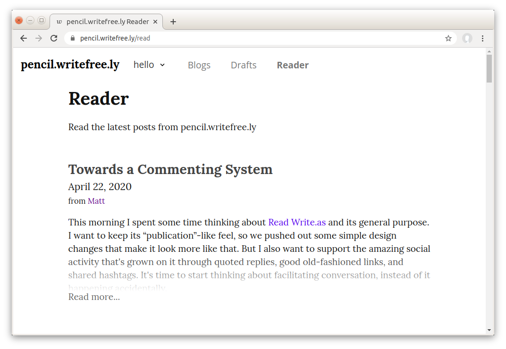

# Go语言爱好者周刊：第 140 期

这里记录每周值得分享的 Go 语言相关内容，周日发布。本周刊开源（GitHub：[polaris1119/golangweekly](https://github.com/polaris1119/golangweekly)），欢迎投稿，推荐或自荐文章/软件/资源等，请[提交 issue](https://github.com/polaris1119/golangweekly/issues) 。

鉴于一些人可能没法坚持把英文文章看完，因此，周刊中会尽可能推荐优质的中文文章。优秀的英文文章，我们的 GCTT 组织会进行翻译。


题图：开源推荐系统

## 刊首语

上期题目解析。

以下程序是否会 panic：

```go
package main

import "C"

func main() {
	var ch chan struct{}
	<-ch
}
```

A：会；B：不会

正确答案是 B（不会）。如果把第 3 行注释，会 panic。原因是 cgo 会使死锁检查失效。

## 资讯

1、[Go1.18.1 发布](https://mp.weixin.qq.com/s/1w0EEQw6gjcFdSz7FYPWBQ)

安全更新版本。

2、[GoLand 2022.1 发布](https://mp.weixin.qq.com/s/UnhzJKLeeFxm_HptOFQqxg)

全面支持 Go1.18。

3、[Excelize 2.6.0 正式发布](https://xuri.me/excelize/zh-hans/releases/v2.6.0.html)

Go 语言编写的用于操作 Office Excel 文档基础库，基于 ECMA-376，ISO/IEC 29500 国际标准。

## 文章

1、[Go：并发 IO 优化](https://mp.weixin.qq.com/s/-1oNA_UhXUcJCnz95MqZFQ)

有的时候我们会遇到并发 IO 的情况，例如，并发爬虫下载网络上的图片。如果并发度过高或者下载的内容过大，会导致网络 IO 耗时急剧上升。这时候就需要优化一下每次网络IO 的耗时。

2、[Go 验证 TCP SYN 超时重传机制](https://mp.weixin.qq.com/s/5ZDNQ8dRfVUK9EUr-iC5RA)

http 或 tcp 调用时的 dial tcp (ip):(port): connect: connection timed out 错误是 SYN 的超时重传机制引起的。如果遇到这种错误，一方面需要考虑 server 可以处理请求的 QPS，另一方面也要检查 client 端重传相关参数的设置。

3、[从真实事故出发：golang 内存问题排查指北](https://mp.weixin.qq.com/s/HdSIC93HMbqvbQisCr186Q)

字节跳动文章分享。

4、[Go 工程化规范设计](https://mp.weixin.qq.com/s/1cy0vbiU5MZNVazvOsMf5Q)

很全，包含了编码类和非编码类。

5、[gRPC 客户端长连接机制实现及 keepalive 分析](https://mp.weixin.qq.com/s/U6WMwrowutsvfvrYLz0wOQ)

这篇文章分析如何实现客户端保活（keepalive）逻辑。

## 开源项目

1、[gorse](https://github.com/gorse-io/gorse)

开源的推荐系统，Go 语言实现。

2、[goleveldb](https://github.com/syndtr/goleveldb)

LevelDB 的 Go 实现。

3、[disgo](https://github.com/disgoorg/disgo)

一个现代的 Discord API 包装。

4、[writefreely](https://github.com/writefreely/writefreely)

一个干净、基于 Markdown 的发布平台，专为作家设计。一起写作，建立一个社区。



## 资源&&工具

1、[depth](https://github.com/KyleBanks/depth)

用于检索和可视化 Go 源代码依赖树的工具。

2、[copygen](https://github.com/switchupcb/copygen)

将值从一个类型复制到另一个类型，并将字段从一个结构复制到另一个结构，无反射拷贝。

3、[doko](https://github.com/abdfnx/doko)

操作 Docker，基于 TUI 实现。

## 订阅

这个周刊每周日发布，同步更新在[Go语言中文网](https://studygolang.com/go/weekly)和[微信公众号](https://weixin.sogou.com/weixin?query=Go%E8%AF%AD%E8%A8%80%E4%B8%AD%E6%96%87%E7%BD%91)。

微信搜索"Go语言中文网"或者扫描二维码，即可订阅。


