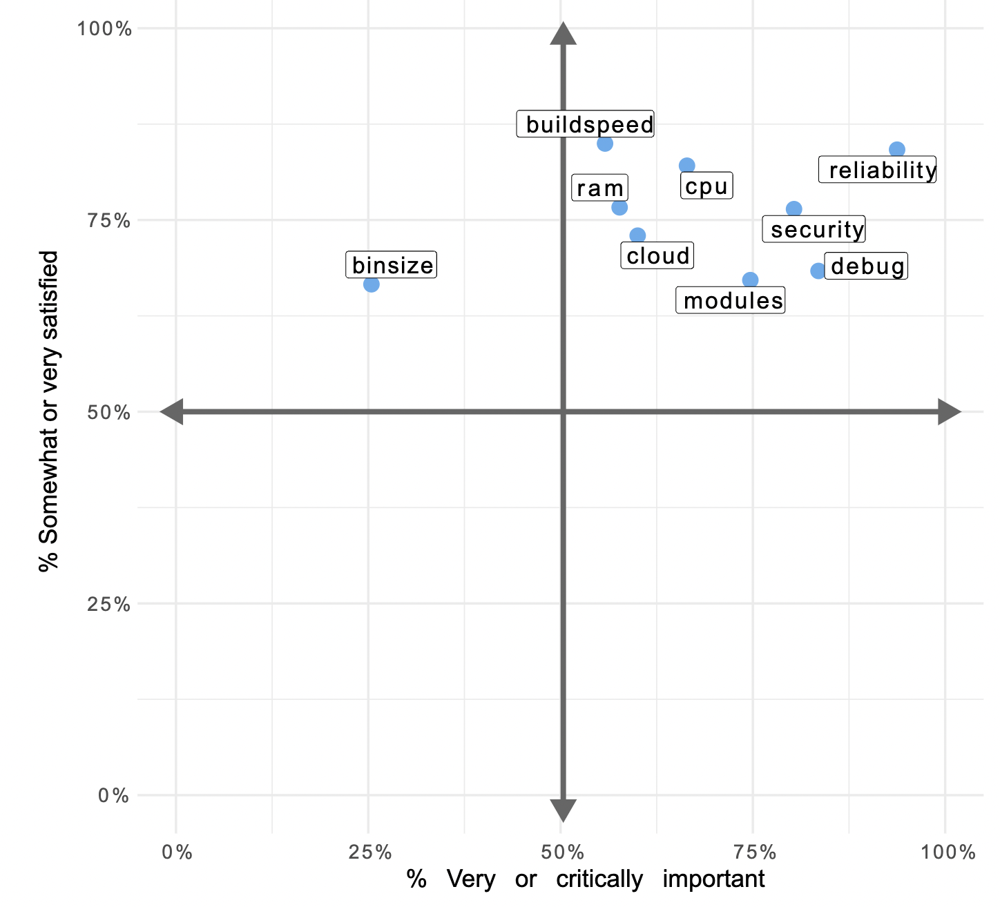

# Go语言爱好者周刊：第 141 期

这里记录每周值得分享的 Go 语言相关内容，周日发布。本周刊开源（GitHub：[polaris1119/golangweekly](https://github.com/polaris1119/golangweekly)），欢迎投稿，推荐或自荐文章/软件/资源等，请[提交 issue](https://github.com/polaris1119/golangweekly/issues) 。

鉴于一些人可能没法坚持把英文文章看完，因此，周刊中会尽可能推荐优质的中文文章。优秀的英文文章，我们的 GCTT 组织会进行翻译。



题图：来自 2021 Go 开发者调查结果

## 刊首语

本期题目是一道关于函数的。以下代码输出什么？

```go
package main

import "fmt"

func main() {
	fmt.Println(func() {} == func() {})
}
```

A：true；B：false；C：编译错误

## 资讯

1、[2021 Go 官方调查报告重磅发布：92%的开发者对 Go 满意](https://mp.weixin.qq.com/s/wKjbuwRsY-FtRsXko0AVPg)

本次调查了 11840  名开发者，这是 6 年以来，参与该项调查人数最多的一次。本次调查对 Go 开发者画像、技术工具、开发者评价等方面进行了全面的调查，带你深入了解 Go 语言现状。

2、[Go 限制 Committer 群体？](https://mp.weixin.qq.com/s/GHcC-kT_27B4-gwsD0yT7g)

有关 Go 编程语言的每项改动都需经由 2 名谷歌员工审查以后（以前为 1 名），才可以面向用户发布

3、[triangle 2.0 发布](https://github.com/esimov/triangle)

使用 Delaunay 三角测量将图像转换为艺术风格。

4、[readline 1.5 发布](https://github.com/chzyer/readline)

GNU-Readline 类库的实现。

5、[harmonica 0.2.0 发布](https://github.com/charmbracelet/harmonica)

一个简单，高效的动画库。

## 文章

1、[使用 Go 泛型的最佳时机](https://mp.weixin.qq.com/s/kJJDb0r8XA7Ed-YxOFs4rg)

近期一篇主题为 Go 泛型导致代码运行速度变慢的文章引起了广泛讨论。因为 Go 开发者对“泛型”这项特性期盼已久，但最后却发现有所落差。

2、[Go：进程内优雅管理多个服务](https://mp.weixin.qq.com/s/Kx-GBthh5oVSSkbZUWGULw)

把 API gateway 和 RPC service 放在同一个进程内可不可以？

3、[24 个常见的 Docker 疑难杂症处理技巧](https://mp.weixin.qq.com/s/R58f7fac2F3MP0TLV36vyQ)

这里主要是为了记录在使用 Docker 的时候遇到的问题及其处理解决方法。

4、[每个 gopher 都需要了解的 Go AST](https://mp.weixin.qq.com/s/Jm7NvVVNYPrYqs31g-bINA)

实际工作遇到的需求，想到 Go AST。

5、[Go：为什么泛型使你的程序变慢](https://mp.weixin.qq.com/s/yuaDFN5kGF9GSApV5q-YzA)

强烈推荐大家读完，可以很好的理解泛型实现。

6、[Go 将在下个版本支持新型排序算法：pdqsort](https://mp.weixin.qq.com/s/dfP9mHZsANxcDlymNTimhA)

Go 仓库的最新 commit 中介绍了 pdqsort 的相关功能描述。

## 开源项目

1、[encore](https://github.com/encoredev/encore)

Go 后端开发引擎。

2、[MovieGo](https://github.com/mowshon/moviego)

一个用于视频编辑的 Go 库。

3、[api-firewall](https://github.com/wallarm/api-firewall)

通过 OpenAPI 规范进行请求和响应验证的快速轻量级 API 代理防火墙。

## 资源&&工具

1、[Fp-go](https://github.com/repeale/fp-go)

由 Go 1.18+ 泛型驱动的函数式编程辅助工具集合。

2、[go-orm-benchmarks](https://github.com/efectn/go-orm-benchmarks)

10+ Go ORM 包性能基准测试。

3、[fx](https://github.com/antonmedv/fx)

JSON 终端查看器。

4、[debiman](https://github.com/Debian/debiman)

Debian 的 man 文档静态网站生成器。

## 订阅

这个周刊每周日发布，同步更新在[Go语言中文网](https://studygolang.com/go/weekly)和[微信公众号](https://weixin.sogou.com/weixin?query=Go%E8%AF%AD%E8%A8%80%E4%B8%AD%E6%96%87%E7%BD%91)。

微信搜索"Go语言中文网"或者扫描二维码，即可订阅。


