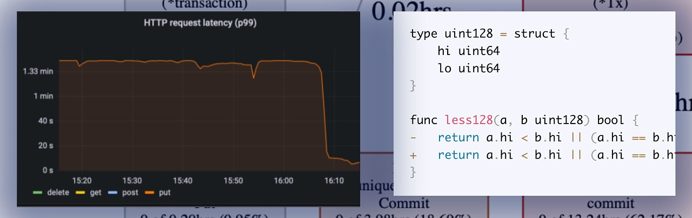

# Go语言爱好者周刊：第 144 期

这里记录每周值得分享的 Go 语言相关内容，周日发布。本周刊开源（GitHub：[polaris1119/golangweekly](https://github.com/polaris1119/golangweekly)），欢迎投稿，推荐或自荐文章/软件/资源等，请[提交 issue](https://github.com/polaris1119/golangweekly/issues) 。

鉴于一些人可能没法坚持把英文文章看完，因此，周刊中会尽可能推荐优质的中文文章。优秀的英文文章，我们的 GCTT 组织会进行翻译。



题图：来自 <https://segment.com/blog/changing-one-character-improved-app-performance/>

## 刊首语

本期的题目，你能做对吗？以下代码输出什么？

```go
package main

import "fmt"

func main() {
	ints := make([]int, 1)
	ints = append(ints, 2)
	fmt.Println(ints[0])
}
```

A：0；B：2；C：运行错误

## 资讯

1、[Go1.18.2 和 Go1.17.10 发布](https://mp.weixin.qq.com/s/zh76l_bIria6ohiaHuwoYg)

这是两个小版本更新，主要更新 Linux 系统的一个安全问题。

2、[GoLand 2022.1.1 发布](https://blog.jetbrains.com/go/2022/05/13/goland-2022-1-1-is-out-with-syntax-highlighting-and-navigation-for-go-work-generics-related-inspections-and-more/)

包括 go.work 的语法高亮和跳转，已经泛型相关的检查。

3、[rosedb 1.0 发布](https://github.com/flower-corp/rosedb)

高性能的 NoSQL 数据库。

4、[Fx 24.0 发布](https://github.com/antonmedv/fx)

终端 JSON 查看器。

5、[FerretDB 0.2 发布](https://github.com/FerretDB/FerretDB)

MongoDB 的替代品。之前叫 MangoDB，容易被人理解为碰瓷。

6、[rqlite 7.4.0 发布](https://github.com/rqlite/rqlite)

基于 SQLite 分布式关系数据库。

7、[sh 3.5 发布](https://github.com/mvdan/sh)

一个支持 Bash 的 Shell 解析器、格式化器。

8、[TIOBE 5 月编程语言排行榜：Go 排第几了？](https://mp.weixin.qq.com/s/51zDsT-yiSpN6g-qLJIlnA)

技术迭代的速度越来越快，这一点在每月更新一次的编程语言排行榜榜单中体现得尤为明显。最新的 TIOBE 5 月编程语言榜单出炉，不妨一起来看一下又有哪些新的趋势。

## 文章

1、[Go创始人联袂重磅发表文章深度剖析Go的设计决策](https://mp.weixin.qq.com/s/ktO0tKxyWE_M_7VURfcOeA)

本文是近期 Go 几位创始人发表在 ACM 上的（Russ Cox, Robert Griesemer, Rob Pike, Ian Lance Taylor, Ken Thompson），详细剖析了 Go 的一些核心设计决策，推荐收藏阅读！本文是译文，译者：崔婧雯。

2、[继 Python 之后，Go 也顺利在浏览器上运行](https://mp.weixin.qq.com/s/9fy9a_056Tl0GExIdn9lZA)

https://goscript.dev 网站支持在浏览器端直接运行 Go 代码，这是一个 Go playground，底层采用 Goscript，通过 WASM 实现。

3、[简单易懂的 Go 泛型使用和实现原理介绍](https://mp.weixin.qq.com/s/5a0_Gl0LeLfs32UnE0T1Pw)

本文是对泛型的基本思想及其在 Go 中的实现的一个比较容易理解的介绍，同时也是对围绕泛型的各种性能讨论的简单总结。

4、[深入Go代码覆盖率使用、场景与原理](https://mp.weixin.qq.com/s/D9gHNAyGdXNLloetr7bR3g)

一般我们会使用代码覆盖率来判断代码书写的质量，识别无效代码。

5、[使用 go run 来管理工具依赖](https://mp.weixin.qq.com/s/TQB5n06VYPy0iA8x5me8bA)

当你在开发一个项目时，通常都会有一些咱们开发人员依赖的工具。开发、测试、构建或部署过程中运行的工具。

## 开源项目

1、[weron](https://github.com/pojntfx/weron)

基于 WebRTC 的 Overlay networks。

2、[bud](https://github.com/livebud/bud)

一个全栈 Web 框架。

## 资源&&工具

1、[go-concurrency-guide（英文）](https://github.com/luk4z7/go-concurrency-guide)

Go 并发实践笔记。

2、[octosql](https://github.com/cube2222/octosql)

OctoSQL 是一个查询工具，允许你使用 SQL 连接、分析和转换来自多个数据库和文件格式的数据。

3、[Go 播客第 228 期](https://changelog.com/gotime/228)

聊聊 Go 编写的高性能 PHP 应用服务器。

4、[fast-skiplist](https://github.com/sean-public/fast-skiplist)

快速的、线程安全的跳表实现。

5、[docconv](https://github.com/sajari/docconv)

将 PDF、DOC、DOCX、XML、HTML、RTF 等格式转为文本格式。

## 订阅

这个周刊每周日发布，同步更新在[Go语言中文网](https://studygolang.com/go/weekly)和[微信公众号](https://weixin.sogou.com/weixin?query=Go%E8%AF%AD%E8%A8%80%E4%B8%AD%E6%96%87%E7%BD%91)。

微信搜索"Go语言中文网"或者扫描二维码，即可订阅。


