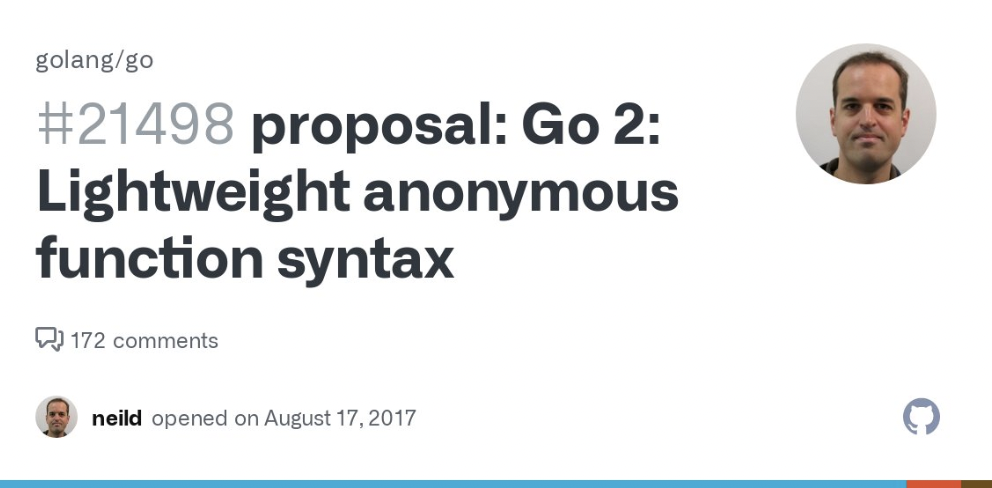

# Go语言爱好者周刊：第 145 期

这里记录每周值得分享的 Go 语言相关内容，周日发布。本周刊开源（GitHub：[polaris1119/golangweekly](https://github.com/polaris1119/golangweekly)），欢迎投稿，推荐或自荐文章/软件/资源等，请[提交 issue](https://github.com/polaris1119/golangweekly/issues) 。

鉴于一些人可能没法坚持把英文文章看完，因此，周刊中会尽可能推荐优质的中文文章。优秀的英文文章，我们的 GCTT 组织会进行翻译。



题图：箭头函数，看会不会采纳

## 刊首语

上期的题目比较简单，主要注意 `ints := make([]int, 1)` 创建的是一个长度为 1 的 slice，第一个元素是 int 的默认值。

看本期的题目。以下代码输出什么？

```go
package main

import "fmt"

func main() {
	type pos [2]int
	a := pos{4, 5}
	b := pos{4, 5}
	fmt.Println(a == b)
}
```

A：true；B：false；C：编译错误

## 资讯

1、[roaring 1.1 发布](https://github.com/RoaringBitmap/roaring)

位图数据结构的 Go 实现。

2、[cli 2.7 发布](https://github.com/urfave/cli)

一个快速构建 Go CLI 应用程序的库

3、[ffuf 1.5.0 发布](https://github.com/ffuf/ffuf)

快速的网络模拟器。

## 文章

1、[go test 如何禁用缓存？教你3种找答案的方法](https://mp.weixin.qq.com/s/RY6o9ae9L8JEXsBVbtxeug)

本文介绍几种方法，对你解决其他问题可能也会有帮助。

2、[Go：关键字与预定义标识符](https://mp.weixin.qq.com/s/tr6JwRV93IJtSXdRB6xAOQ)

语法是一门编程语言的基础，而关键字又是语法的基础，我们通过这些关键字构建出一个个应用程序。

3、[详解 gRPC 客户端长连接机制实现](https://mp.weixin.qq.com/s/LBqsUyC3N-IgxSLUq6-mbg)

这篇文章就来分析下如何实现这样的客户端保活（keepalive）逻辑。

4、[腾讯妹子图解Golang内存分配和垃圾回收](https://mp.weixin.qq.com/s/iAy9ReQhnmCYUFvwYroGPA)

从内存分配到垃圾回收。

5、[golang源码分析：断路器 sony/gobreaker](https://mp.weixin.qq.com/s/FrT9sfMdYC41UDjRCKV77g)

本文从源码级别分析一款断路器。

6、[哇，超详细解析 Go 语言 Context（附图）](https://mp.weixin.qq.com/s/V3q7MFCJ8etA3jGa6gH2yw)

今天分享一篇从源码的角度详细分析 Context 包的文章。

## 开源项目

1、[wazero](https://github.com/tetratelabs/wazero)

零依赖的 WebAssembly 运行时。

2、[cardrank](https://github.com/cardrank/cardrank)

处理扑克牌的库。

3、[test](https://github.com/shoenig/test)

基于泛型的测试库。

4、[broker](https://github.com/go-god/broker)

broker 接口，支持 kafka、redis 等。作者自荐。

## 资源&&工具

1、[sneller](https://github.com/SnellerInc/sneller)

用于 JSON 的矢量化 SQL 引擎。

2、[rrip](https://github.com/mahesh-hegde/rrip)

Reddit 图片批量下载工具。

3、[Go 播客第 230 期](https://changelog.com/gotime/230)

重访 Caddy Server。

4、[openmock](https://github.com/checkr/openmock)

支持多种服务 mock 的工具。

5、[Go 教程](https://www.karanpratapsingh.com/courses/go)

免费在线 Go 教程。

6、[reviewdog](https://github.com/reviewdog/reviewdog)

与任何代码分析工具都可集成的自动代码 Review 工具，不受编程语言限制。

7、[Go 播客第 229 期](https://changelog.com/gotime/229)

当 Go 项目变得庞大和混乱时该怎么做。

## 订阅

这个周刊每周日发布，同步更新在[Go语言中文网](https://studygolang.com/go/weekly)和[微信公众号](https://weixin.sogou.com/weixin?query=Go%E8%AF%AD%E8%A8%80%E4%B8%AD%E6%96%87%E7%BD%91)。

微信搜索"Go语言中文网"或者扫描二维码，即可订阅。


