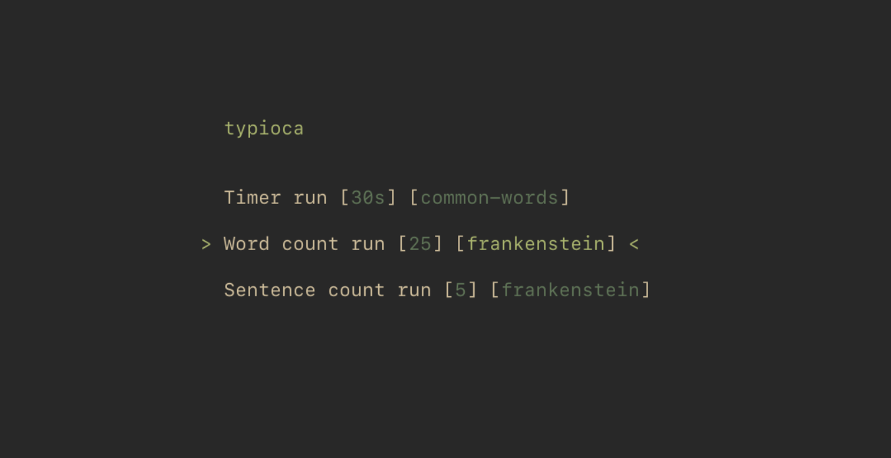

# Go语言爱好者周刊：第 146 期

这里记录每周值得分享的 Go 语言相关内容，周日发布。本周刊开源（GitHub：[polaris1119/golangweekly](https://github.com/polaris1119/golangweekly)），欢迎投稿，推荐或自荐文章/软件/资源等，请[提交 issue](https://github.com/polaris1119/golangweekly/issues) 。

鉴于一些人可能没法坚持把英文文章看完，因此，周刊中会尽可能推荐优质的中文文章。优秀的英文文章，我们的 GCTT 组织会进行翻译。



题图：Go 打字速度测试仪

## 刊首语

上期的题目主要考察数组的比较。

```go
package main

import "fmt"

func main() {
	type pos [2]int
	a := pos{4, 5}
	b := pos{4, 5}
	fmt.Println(a == b)
}
```

A：true；B：false；C：编译错误

数组是值类型，长度相等，每个元素也相等，数组就相等。所以，正确答案是 A。该题正确率 45%，还是不高。

看本期的题目。以下代码输什么？

```go
package main

import (
	"fmt"
)

func main() {
	var nums1 []interface{}
	nums2 := []int{1, 3, 4}
	nums3 := append(nums1, nums2)
	fmt.Println(len(nums3))
}
```

A：3；B：1；C：4；D：编译失败

## 资讯

1、[sonic 1.3 发布](https://github.com/bytedance/sonic)

字节开源的高性能 json 编解码库。

2、[kratos 2.3 发布](https://github.com/go-kratos/kratos)

B 站开源的 Go 微服务框架。

3、[immudb 1.3.0](https://github.com/codenotary/immudb/releases/tag/v1.3.0)

用于系统和应用程序的轻量级高速不可变数据库。

4、[traefik 2.7.0 发布](https://github.com/traefik/traefik/releases/tag/v2.7.0)

云原生应用代理。

5、[oak 4.0.0 发布](https://github.com/oakmound/oak/releases/tag/v4.0.0)

2D 游戏引擎。

6、[fiber 2.34.0 发布](https://github.com/gofiber/fiber/releases/tag/v2.34.0)

一种 Express 风格的、基于 fasthttp 的 HTTP web 框架。

7、[gocache 3.0 发布](https://github.com/eko/gocache)

完整的 Go 缓存库，为你带来多种管理缓存的方式。

8、[ebpf 0.9 发布](https://github.com/cilium/ebpf)

纯 Go 实现的 eBPF 库。

## 文章

1、[Go 引入箭头函数，你支持吗？](https://mp.weixin.qq.com/s/0q9z2cLcKmxZDfAdNohInA)

提案讨论地址：https://github.com/golang/go/issues/21498 。

2、[牛逼了！Go已主导后端开发，已有330万开发者](https://mp.weixin.qq.com/s/2okEsOShrF-KawXRzE6nlg)

开发者调查分析公司 SlashData 发布了一份题为“第 22 届开发者国家状况”的报告。

3、[太赞了！Go语言最全优化技巧总结，必须收藏](https://mp.weixin.qq.com/s/IG4HRjU-pOeaKBZ1ZRSiSQ)

本文总结了在维护go基础库过程中，用到或者见到的一些性能优化技巧，现将一些理解梳理撰写成文，和大家探讨。

4、[真好！这本 Go 图书的泛型章节，免费下载了](https://mp.weixin.qq.com/s/kZMaPfw0gsExFZzwvESC0g)

发现一本书：《Learning Go: An Idiomatic Approach to Real-World Go Programming》，是去年（2021）4 月份初版的，好评率挺高的。

5、[Go 泛型那些事：能做什么，不能做什么，如何改变惯用模式](https://mp.weixin.qq.com/s/Vqhit3pscBouh7dCpnVyZA)

前两天分享了《Learning Go》最后一章作者重写的 PDF，今天有 gopher 翻译成了中文，经过译者授权发布。

6、[Go 开源项目推荐：一个简单的 Go 练手项目](https://mp.weixin.qq.com/s/GGr4PYi5atJ4344S_Fu9_g)

Go 语言中文网微信群时不时有人问，有没有练手项目推荐。实话说，公众号陆续推荐过不少，但大家更擅长及时问，而不是找找。今天看到一个开源项目，值得学习了 Go 语言，但没有实战过的人练练手。

7、[自动发现 Go 项目 Bug 的神器](https://mp.weixin.qq.com/s/VcX6MGx39rz3q0DcwH783A)

Go1.18 新特性中有一个神器：Fuzzing，对于发现 Go 项目中的 Bug 很有帮助。本文通过一个具体的例子来介绍它的基本使用，希望你能掌握并应用。

## 开源项目

1、[nibbles](https://github.com/gophun/nibbles)

Go 实现的贪吃蛇游戏。

2、[typioca](https://github.com/bloznelis/typioca)

Go 实现的打字速度测试仪。

3、[concurrent-map](https://github.com/orcaman/concurrent-map)

相比标准库的 sync.Map，该库试用范围更广。目前支持泛型。

4、[go-mssqldb](https://github.com/microsoft/go-mssqldb)

微软 fork 版 SQL Server Driver。

5、[dxsvalue](https://github.com/suiyunonghen/dxsvalue)

网友自荐。从 JSON、MsgPack 等格式编解码。

## 资源&&工具

1、[god](https://github.com/pioz/god)

部署和管理 Go 服务的工具。

2、[sish](https://github.com/antoniomika/sish)

类似 ngrok 的工具。

## 订阅

这个周刊每周日发布，同步更新在[Go语言中文网](https://studygolang.com/go/weekly)和[微信公众号](https://weixin.sogou.com/weixin?query=Go%E8%AF%AD%E8%A8%80%E4%B8%AD%E6%96%87%E7%BD%91)。

微信搜索"Go语言中文网"或者扫描二维码，即可订阅。


