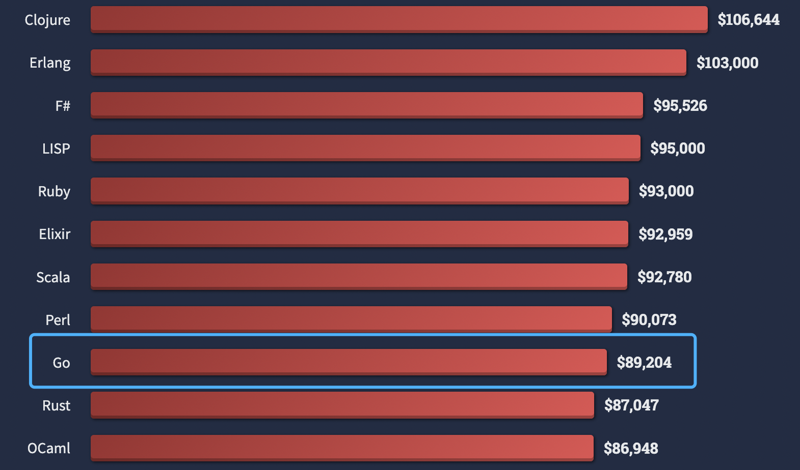

# Go语言爱好者周刊：第 150 期

这里记录每周值得分享的 Go 语言相关内容，周日发布。本周刊开源（GitHub：[polaris1119/golangweekly](https://github.com/polaris1119/golangweekly)），欢迎投稿，推荐或自荐文章/软件/资源等，请[提交 issue](https://github.com/polaris1119/golangweekly/issues) 。

鉴于一些人可能没法坚持把英文文章看完，因此，周刊中会尽可能推荐优质的中文文章。优秀的英文文章，我们的 GCTT 组织会进行翻译。



题图：各大语言收入排行，来自 StackOverflow 最新调研

## 刊首语

上期题目又是惨不忍睹，正确率 31%。以下代码输出什么？

```go
package main

import "fmt"

func main() {
	var p [100]int
	var m interface{} = [...]int{99: 0}
	fmt.Println(p == m)
}
```

A：true；B：false；C：panic；D：编译失败

正确答案：A。

网友「上弦月」的解释挺到位的，直接引用；

> A value x of non-interface type X and a value t of interface type T are comparable when values of type X are comparable and X implements T. They are equal if t's dynamic type is identical to X and t's dynamic value is equal to x. ——以上内容来自 https://go.dev/ref/spec#Operators 
>
> 个人理解：
>
> 1. interface类型变量与非interface类型变量判等时，首先要求非interface类型实现了接口，否则编译不通过（本题接口方法集为空，我们认为所有类型都实现了该接口）
> 2. 满足上一条的前提下，interface类型变量的动态类型、值均与非interface类型变量相同时，两个变量判等结果为true，结合array判等规则，答案为true
>  
> 我看到题目的时候，感觉答案要么是true、要么是编译不过。试了一下发现能比较，然后去翻文档，发现了上面提到的第一个知识点，又是涨知识的一天。

本期来一道简单的题目。以下代码输出什么？

```go
package main

import "fmt"

func main() {
	fmt.Println(09)
}
```

A：09；B：9；C：11；D：编译不通过

## 资讯

1、[render 1.5 发布](https://github.com/unrolled/render)

轻松 Render JSON，XML，二进制数据和 HTML 模板响应。

2、[cobra 1.5.0 发布](https://github.com/spf13/cobra/releases/tag/v1.5.0)

一个构建现代 CLI APP 的框架。

3、[benthos 4.3 发布](https://github.com/benthosdev/benthos)

流处理。

4、[panicparse 2.3 发布](https://github.com/maruel/panicparse)

Panic 堆栈跟踪解析器和调试工具。

5、[phonenumbers 1.1 发布](https://github.com/nyaruka/phonenumbers)

Google 电话号码解析库的 Go 移植版。

6、[clash 1.11 发布](https://github.com/Dreamacro/clash)

Go 中基于规则的隧道。

## 文章

1、[拒绝千篇一律，这套Go错误处理的完整解决方案值得一看！](https://mp.weixin.qq.com/s/qbaHETgPOlU4JvMuihQY3Q)

在使用Go开发的后台服务中，对于错误处理，一直以来都有多种不同的方案，本文探讨并提出一种从服务内到服务外的一个统一的传递、返回和回溯的完整方案，抛砖引玉，希望与大家一起讨论分享。

2、[Golang可重入锁的实现](https://mp.weixin.qq.com/s/xD0LwoFCyw4oYEOJNtFasw)

项目中遇到了可重入锁的需求和实现，具体记录下。

3、[Go 每日一库：gomonkey 是什么？](https://mp.weixin.qq.com/s/3HRHjDUSnExdb6njMtaXXw)

一款 Go 语言 的打桩框架，目标是让用户在单元测试中低成本的完成打桩，从而将精力聚焦于业务功能的开发。

4、[惊！这道题正确率竟然只有 22%：答案详解](https://mp.weixin.qq.com/s/xEiXN2JT-RHVMHlYl0hVjQ)

第 148 期周刊的题目解析。

5、[等等， 怎么使用 SetMemoryLimit?](https://colobu.com/2022/06/20/how-to-use-SetMemoryLimit/)

这是 Go1.19 将实现的功能。

## 开源项目

1、[h3-go](https://github.com/uber/h3-go)

层次空间索引系统。

2、[critical](https://github.com/skx/critical/)

TCL 解析器。

3、[hertz](https://github.com/cloudwego/hertz)

一个 Golang 微服务 HTTP 框架。

4、[gambas](https://github.com/jpoly1219/gambas)

Go 的数据分析工具，类似 Python 中的 pandas。

5、[ksql](https://github.com/VinGarcia/ksql)

简单、强大的 SQL 库。这里是一篇介绍文章：<https://betterprogramming.pub/golang-sql-problems-with-existing-libraries-145a037261b8>。

## 资源&&工具

1、[viddy](https://github.com/sachaos/viddy)

一个现代的 watch 命令。

2、[tproxy](https://github.com/kevwan/tproxy)

分析 TCP 连接的工具

3、[100 天学 Go 系列文章](https://dev.to/mr_destructive/series/17548)

英文的。

4、[K8S 指南](https://github.com/mikeroyal/Kubernetes-Guide)

GitHub 开源。

## 订阅

这个周刊每周日发布，同步更新在[Go语言中文网](https://studygolang.com/go/weekly)和[微信公众号](https://weixin.sogou.com/weixin?query=Go%E8%AF%AD%E8%A8%80%E4%B8%AD%E6%96%87%E7%BD%91)。

微信搜索"Go语言中文网"或者扫描二维码，即可订阅。


