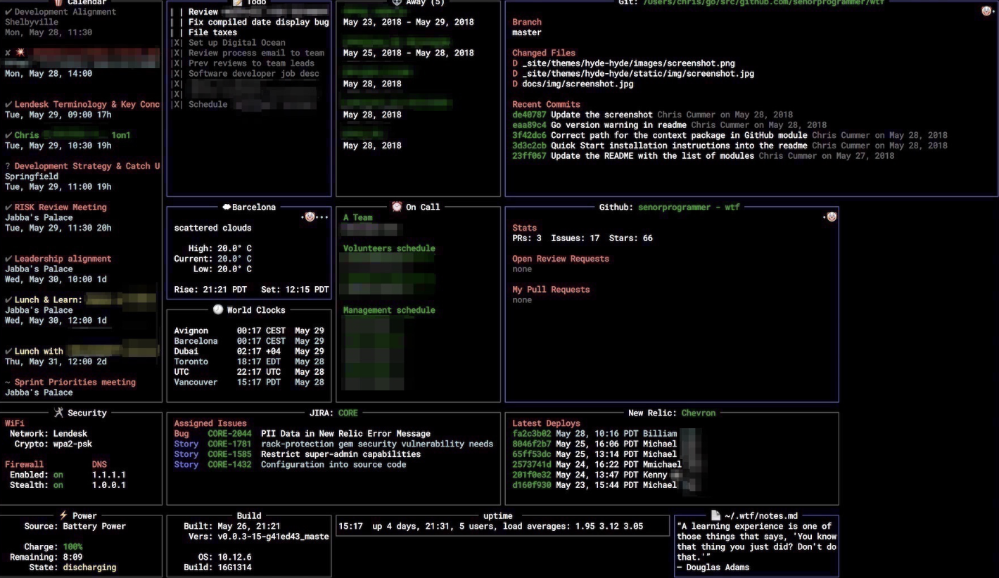

# Go语言爱好者周刊：第 156 期

这里记录每周值得分享的 Go 语言相关内容，周日发布。本周刊开源（GitHub：[polaris1119/golangweekly](https://github.com/polaris1119/golangweekly)），欢迎投稿，推荐或自荐文章/软件/资源等，请[提交 issue](https://github.com/polaris1119/golangweekly/issues) 。

鉴于一些人可能没法坚持把英文文章看完，因此，周刊中会尽可能推荐优质的中文文章。优秀的英文文章，我们的 GCTT 组织会进行翻译。



题图：终端的个人看板 <https://github.com/wtfutil/wtf>

## 刊首语

看本期的一道题目。以下代码输出什么？

```go
package main

import (
	"fmt"
	"net/url"
)

// 其中 url.Values 的定义：type Values map[string][]string
type Query struct {
	url.Values
}

func main() {
	q := Query{}
	q.Values["name"] = []string{"polarisxu"}
	fmt.Println(q.Get("name"))
}
```

A：panic；B：编译错误；C：polarisxu

## 资讯

1、[Consul 1.13 正式发布，包括这些重大更新](https://mp.weixin.qq.com/s/BefNjuMIeCweHsl7G9pZVw)

此版本增强了 Consul 中的许多功能，同时添加了 Consul on Kubernetes CNI 插件和集群对等测试版等新功能。

2、[Prometheus 2.38 发布](https://www.oschina.net/news/207092/prometheus-2-38-released)

一个系统和服务监控系统。它以给定的时间间隔从配置的目标收集指标，评估规则表达式，显示结果，并在观察到指定条件时触发警报。

3、[Grafana 9.1 正式发布](https://www.oschina.net/news/206953/grafana-9-1-released)

此版本进行了多项改进，重点关注 Grafana 的可用性、性能和安全性。

## 文章

1、[Go：五分钟给你的 gRPC 服务加上 HTTP 接口](https://mp.weixin.qq.com/s/UVzQ2rY7fm0m-I_ba6jk_w)

你有这样的需求吗？

2、[作为Gopher，你知道Go的注释即文档应该怎么写吗？](https://mp.weixin.qq.com/s/nAeZIEyKkhE6_kId_yRS-g)

Go一直奉行“注释即文档”的概念，在代码中针对各种public内容进行注释之后，这些注释也就是对应内容的文档，这称为GoDoc。那么作为gopher，你知道GoDoc应该怎么写吗？

3、[gomonkey用户如何对泛型打桩](https://mp.weixin.qq.com/s/MneDD7tcUApSyKrZiw7GGg)

泛型已经来了，怎么用 gomonkey？

4、[Go：服务发现原理分析与源码解读](https://mp.weixin.qq.com/s/CPi_sPaTUR1JYl7NEybFhQ)

业务功能和高并发下的服务优化。

5、[来了！Go的2个黑魔法技巧](https://mp.weixin.qq.com/s/8HNZQrQ2oqMB2fAYbmH2Ow)

最近，在写Go代码的时候，我发现了其特别有意思的两个奇技淫巧或者黑魔法，若使用得好可以提升性能，用得不好就会招来恶魔，嘿嘿，于是写下这篇文章和大家分享一下。

## 开源项目

1、[stl4go](https://github.com/chen3feng/stl4go)

本库包含 Go 语言实现的范型容器和算法库，就像 C++ 中的 STL。

2、[dbus](https://github.com/godbus/dbus)

dbus 是一个简单的库，为 D-Bus 消息总线系统实现本地 Go 客户端绑定。

3、[go-merkletree](https://github.com/txaty/go-merkletree)

高性能的 Merkle Tree Go 实现。

4、[skiplist](https://github.com/MauriceGit/skiplist)

跳表的 Go 实现。

5、[trie](https://github.com/s0rg/trie)

泛型版前缀树的 Go 实现。

6、[GoQueue](https://github.com/realTristan/GoQueue)

灵活的队列系统。

## 资源&&工具

1、[go-base](https://github.com/dhax/go-base)

Go Restful API 样板。

2、[restic](https://github.com/restic/restic)

快速、安全、高效的备份程序。

3、[pdf-diff](https://github.com/serhack/pdf-diff)

PDF diff 工具。

4、[serve-dir](https://github.com/maruel/serve-dir)

类似 `python -m SimpleHTTPServer`，但速度更快。

5、[tsk](https://github.com/kakengloh/tsk)

轻量级的终端任务管理器。

## 订阅

这个周刊每周日发布，同步更新在[Go语言中文网](https://studygolang.com/go/weekly)和[微信公众号](https://weixin.sogou.com/weixin?query=Go%E8%AF%AD%E8%A8%80%E4%B8%AD%E6%96%87%E7%BD%91)。

微信搜索"Go语言中文网"或者扫描二维码，即可订阅。


