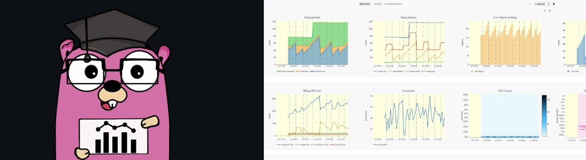

# Go语言爱好者周刊：第 159 期

这里记录每周值得分享的 Go 语言相关内容，周日发布。本周刊开源（GitHub：[polaris1119/golangweekly](https://github.com/polaris1119/golangweekly)），欢迎投稿，推荐或自荐文章/软件/资源等，请[提交 issue](https://github.com/polaris1119/golangweekly/issues) 。

鉴于一些人可能没法坚持把英文文章看完，因此，周刊中会尽可能推荐优质的中文文章。优秀的英文文章，我们的 GCTT 组织会进行翻译。



题图：可视化 Go Runtime 指标

## 刊首语

上期题目正确率 43%，一起看下。以下代码输出什么？

```go
package main

import "fmt"

func main() {
	var s fmt.Stringer
	s = "s"
	fmt.Println(s)
}
```

A：s；B：编译错误；C：运行时 panic

正确答案：B。因为 字符串类型没有实现 fmt.Stringer 接口，所以编译错误。

本期题目来自 Go101。以下代码输出什么？

```go
package main

func main() {
  m := make(map[int]int, 3)
  x := len(m)
  m[1] = m[1]
  y := len(m)
  println(x, y)
}
```

A：3 3；B：3 4；C：0 0；D：0 1

## 资讯

1、[Go 1.19.1 发布了：看看要不要升级！！！](https://mp.weixin.qq.com/s/Zt-3pYQwV1JSssCpd2bvdQ)

安全更新和一些 bug 修复。

2、[结构化日志讨论](https://github.com/golang/go/discussions/54763)

官方关于结构化日志的讨论。

3、[lipgloss 0.6 发布](https://github.com/charmbracelet/lipgloss)

漂亮的终端布局的风格定义。

4、[Echo v4.9 发布](https://github.com/labstack/echo/releases/tag/v4.8.0)

高性能的 REST 框架。

5、[mpb v8.0 发布](https://github.com/vbauerster/mpb)

在终端为 Go 命令行应用程序显示进度条。

6、[scany 1.2 发布](https://github.com/georgysavva/scany)

Go 实现的用于将数据从数据库扫描到 Go 结构的库。

7、[FastHTTP 1.40 发布](https://github.com/valyala/fasthttp)

Go 快速的 HTTP 包。为高性能而调优。 热路径中的零内存分配。 比 net/http 快 10 倍。有兴趣可以研究为什么能做到快这么多。

8、[weaviate 1.15 发布](https://github.com/semi-technologies/weaviate)

 云原生、模块化、实时矢量搜索引擎。

## 文章

1、[从Go语言角度剖析关于计算机位的问题](https://mp.weixin.qq.com/s/lGyR1jqS4G3rnFygOL5sXg)

本文主要是理解计算机内存的本质,1字节=8位,1位=一个通电or没通电的电子元件,通过不同的00101010表示不同的符号。

2、[TIOBE 9 月编程语言排行榜：Go 快进入前 10 了！！](https://mp.weixin.qq.com/s/kAcbjeqPqwlhSdgkkfbZpQ)

Go 第 12 名了。

3、[一个线程安全的泛型支持map库](https://colobu.com/2022/09/04/a-thread-safe-and-generic-supported-map/)

Go语言原生的map类型并不支持并发读写。concurrent-map提供了一种高性能的解决方案:通过对内部map进行分片，降低锁粒度，从而达到最少的锁等待时间(锁冲突)。

4、[与日俱进，在 Go 1.20 中这种高效转换的方式又变了](https://colobu.com/2022/09/06/string-byte-convertion/)

Go1.20 字符串和字节数组的高效转换方式会变化。

5、[码住！Golang并发安全与引用传递总结](https://mp.weixin.qq.com/s/dZIcI_3b8N8a2_nzJ7fNOA)

因为现在服务上云的趋势，业务代码都纷纷转向golang的技术栈。在迁移或使用的过程中，由于对golang特性的生疏经常会遇到一些问题，本文总结了golang并发安全和参数引用传值时的一些知识。

6、[Go 生态：Prometheus的四种指标类型，我终于搞懂了](https://mp.weixin.qq.com/s/QkDUQOx9w1HZIFyyvIzp-A)

指标是用来衡量性能、消耗、效率和许多其他软件属性随时间的变化趋势。

## 开源项目

1、[lane](https://github.com/oleiade/lane)

泛型版优先队列、队列、栈等数据结构的实现。

2、[fetch](https://github.com/go-zoox/fetch)

简单、好用、强大的 Go HTTP Client。

## 资源&&工具

1、[goleak](https://github.com/uber-go/goleak)

Uber 出品的 goroutine 泄露检测器。

2、[go-bench-viewer](https://nidorx.github.io/go-bench-viewer)

Go benchmark 结果查看工具。

3、[GopherCon Europe 2022 视频列表](https://www.youtube.com/playlist?list=PLtoVuM73AmsJjj5tnZ7BodjN_zIvpULSx)

油管视频。

4、[fan2go](https://github.com/markusressel/fan2go)

提供基于温度传感器的动态速度控制的简单守护程序。

5、[sql2struct](https://github.com/idoubi/sql2struct)

一个可以将 SQL 语句转换成 Go struct 的工具。

## 订阅

这个周刊每周日发布，同步更新在[Go语言中文网](https://studygolang.com/go/weekly)和[微信公众号](https://weixin.sogou.com/weixin?query=Go%E8%AF%AD%E8%A8%80%E4%B8%AD%E6%96%87%E7%BD%91)。

微信搜索"Go语言中文网"或者扫描二维码，即可订阅。


