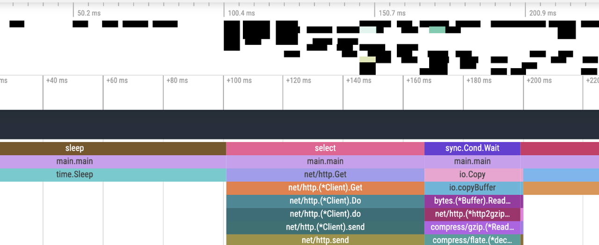

# Go语言爱好者周刊：第 161 期

这里记录每周值得分享的 Go 语言相关内容，周日发布。本周刊开源（GitHub：[polaris1119/golangweekly](https://github.com/polaris1119/golangweekly)），欢迎投稿，推荐或自荐文章/软件/资源等，请[提交 issue](https://github.com/polaris1119/golangweekly/issues) 。

鉴于一些人可能没法坚持把英文文章看完，因此，周刊中会尽可能推荐优质的中文文章。优秀的英文文章，我们的 GCTT 组织会进行翻译。


题图：goroutine profiler

## 刊首语

上期的题目参与人数达到了历史新高，不过正确率缺十分堪忧，只有 14%。一起看看。

以下代码输出什么？

```go
package main

import "fmt"

type temp struct{}

func (t *temp) Add(elem int) *temp {
	fmt.Println(elem)
	return &temp{}
}

func main() {
	tt := &temp{}
	defer tt.Add(1).Add(2)
	tt.Add(3)
}
```

A：1 3 2；B：1 2 3；C：3 1 2；D：3 2 1

正确答案是 A（1 3 2）。关于解释，可以看看 「Go语言中文网」每日一题中，网友 jan-bar 的解答：<https://studygolang.com/interview/question/rhhh4hefk00> 该题的 5 楼。

本期一道关于 slice 的题目。以下代码输出什么？

```go
package main

import "fmt"

func main() {
	s := []string{"A", "B", "C"}

	t := s[:1]
	fmt.Println(&s[0] == &t[0])

	u := append(s[:1], s[2:]...)
	fmt.Println(&s[0] == &u[0])
}
```

A：false false；B：true false；C：true true；D：false true

## 资讯

1、[NATS 2.9 发布](https://nats.io/blog/nats-server-29-release/)

CNCF 孵化的云本地消息传递系统。

2、[Ginkgo 2.2 发布](https://github.com/onsi/ginkgo)

现代的测试框架。

3、[scc 3.1 发布](https://github.com/boyter/scc)

与 cloc，sloccount 和 tokei 类似的工具。用于计数许多编程语言中的代码行，空行，注释行和源代码的物理行。

4、[mo 1.5 发布](https://github.com/samber/mo)

一个为函数式编程爱好者准备的，基于泛型构建。

5、[mpb v8.1 发布](https://github.com/vbauerster/mpb)

在终端为 Go 命令行应用程序显示进度条。

## 文章

1、[超干货！彻底搞懂Golang内存管理和垃圾回收](https://mp.weixin.qq.com/s/niLk_n9Yp-iyl_RIie3Umw)

本文主要以go内存管理为切入点再到go垃圾回收，系统地讲解了go自动内存管理系统的设计和原理。

2、[Go每日一库之一个简单、易用、安全的类型转换工具](https://mp.weixin.qq.com/s/Sv2r64v66_hELLrzpQPszg)

在使用Go编码过程中，大家一定遇到过类型转换的场景。今天就给大家介绍一个简单、易用且安全的类型转换工具：cast。

3、[Go：你之前的基准测试可能是错的。](https://mp.weixin.qq.com/s/Sw5FPIszmYqeuukzkoF9Wg)

今天给大家带来一篇关于基准测试的文章。

4、[图文并茂！一文掌握Kubernetes核心内容](https://mp.weixin.qq.com/s/wh1Q4XUB1TEbejTP6YRE8w)

在云原生技术发展的浪潮之中，Kubernetes作为容器编排领域的事实标准和云原生领域的关键项目。

5、[如何像gitlab-runner那样将Go应用安装为系统服务](https://mp.weixin.qq.com/s/ayuh5xot8GpwbpIzyHuEcg)

service包让我们的程序有了将自己安装为system service的能力。

6、[Google 出品依赖注入工具Wire使用指北](https://mp.weixin.qq.com/s/yHB9BzEGIki1fyjYojdpYQ)

Wire 是一个强大的依赖注入工具。与 Inject 、Dig 等不同的是，Wire只生成代码而不是使用反射在运行时注入，不用担心会有性能损耗。

## 开源项目

1、[wunderbase](https://github.com/wundergraph/wunderbase)

建立在 Firecracker、SQLite 和 Prisma 之上的无服务器 GraphQL 数据库。

2、[Picto](https://github.com/onfe/Picto)

基于 Vue.js 和 Go 构建的聊天服务。

## 资源&&工具

1、[GopherCon UK 2022 视频](https://www.youtube.com/playlist?list=PLDWZ5uzn69exbERujDiGxOadne_nkibSo)

28 个视频。

2、[Go 的力量：tests](https://bitfieldconsulting.com/books/tests)

一本英文图书。

3、[fgtrace](https://github.com/felixge/fgtrace)

一个实验性的 goroutine Profiler/Tracer。

4、[jqp](https://github.com/noahgorstein/jqp)

一个用于试验 jq 的 TUI Playground。

5、[算法大全](https://the-algorithms.com/language/go)

Go实现。

6、[mgob](https://github.com/stefanprodan/mgob)

MongoDB 备份工具。

7、[vault](https://github.com/hashicorp/vault)

密码管理工具。

8、[tbls](https://github.com/k1LoW/tbls)

tbls 是用于记录数据库的 CI 友好工具。

## 订阅

这个周刊每周日发布，同步更新在[Go语言中文网](https://studygolang.com/go/weekly)和[微信公众号](https://weixin.sogou.com/weixin?query=Go%E8%AF%AD%E8%A8%80%E4%B8%AD%E6%96%87%E7%BD%91)。

微信搜索"Go语言中文网"或者扫描二维码，即可订阅。

