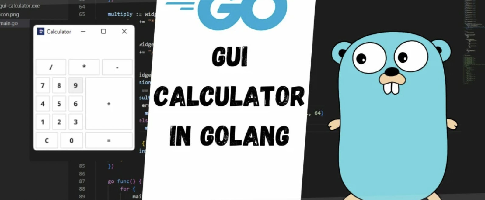

# Go语言爱好者周刊：第 165 期

这里记录每周值得分享的 Go 语言相关内容，周日发布。本周刊开源（GitHub：[polaris1119/golangweekly](https://github.com/polaris1119/golangweekly)），欢迎投稿，推荐或自荐文章/软件/资源等，请[提交 issue](https://github.com/polaris1119/golangweekly/issues) 。

鉴于一些人可能没法坚持把英文文章看完，因此，周刊中会尽可能推荐优质的中文文章。优秀的英文文章，我们的 GCTT 组织会进行翻译。



题图：基于 fyne 实现一个简单计算器 <https://dev.to/mavensingh/golang-gui-calculator-2e49>。

## 刊首语

上期题目的正确了比较高：

```go
package main

import "fmt"

func main() {
    pairs := [][2]string{
        {"a", "apple"},
        {"a", "ant"},
        {"b", "bee"},
    }

    m := map[string]string{
        pairs[0][0]: pairs[0][1],
        pairs[1][0]: pairs[1][1],
        pairs[2][0]: pairs[2][1],
    }
    fmt.Println(m["a"])
}
```

A：编译错误；B：apple；C：ant；D：panic

正确答案 C。引用网友 Akatsuki 的解答：

> 正常情况下 map 字面量如果声明相同的 key 会编译错误，但是 pairs 第一层是切片不是数组，编译器不会做编译时检查，因此会通过编译，然后字面量声明 map 会按照 key 顺序依次插入，因此最后一次对 key “a” 的写入就是最终结果，而最后一次写入是 ant，最后的结果就是 ant。

本期一道 for..range 切片的题目。以下代码输出什么？

```go
package main

import "fmt"

func main() {
    a := []int{5}
    for range a {
        a = append(a, 1)
    }
    fmt.Println(len(a))
}
```

A：2；B：编译错误；C：运行 panic

## 资讯

1、[FerretDB v0.6.0 Alpha](https://github.com/FerretDB/FerretDB)

MongoDB 的替代品。之前叫 MangoDB，容易被人理解为碰瓷。

2、[Ginkgo 2.4 发布](https://github.com/onsi/ginkgo)

现代的测试框架。

3、[vitess 15.0 发布](https://github.com/vitessio/vitess)

用于 MySQL 水平扩展的集群系统。

4、[hertz 0.4 发布](https://github.com/cloudwego/hertz)

一个 Golang 微服务 HTTP 框架。

5、[micro 3.14.0 发布](https://github.com/micro/micro)

云原生微服务开发平台。

6、[Caire 1.4.5 发布](https://github.com/esimov/caire)

内容感知图像大小调整库。

7、[SFTPGo 2.4.0 发布](https://github.com/drakkan/sftpgo)

Go 实现的功能齐全的 SFTP 服务器。

## 文章

1、[1024，我们的节日，Gopher 该干点啥？](https://mp.weixin.qq.com/s/ipbUy3GBRMFat9jUSssMMw)

推荐 Go 学习路线给大家！

2、[通过一个例子让你彻底掌握 Go 工作区模式](https://mp.weixin.qq.com/s/aIuta8Lr0govruPTgglw2w)

写代码更丝滑！

3、[Go标准库：context 详解](https://mp.weixin.qq.com/s/HzODjvg42deE4f8dTp-KZw)

本文是基于我最近对context源码学习的一些心得积累。

4、[Go的方法接收者：值接收者与指针接收者](https://mp.weixin.qq.com/s/_duDs0oHc_z_p--3OoIfVw)

最近在 review 一些代码中，发现经常某个类型定义的方法，其接收者既有值类型，又有指针类型。

5、[Go每日一库之CSRF库的使用方式和实现原理](https://mp.weixin.qq.com/s/n-kU6nwhOH6ouhufrP_1kQ)

今天给大家推荐的是web应用安全防护方面的一个包：csrf。该包为Go web应用中常见的跨站请求伪造（CSRF）攻击提供预防功能。

6、[Go：gops 如何与 runtime 交互？](https://mp.weixin.qq.com/s/sxNvANbxXCqzUJOAQemCMA)

gops 旨在帮助开发人员诊断 Go 进程并与之交互。它提供了追踪运行中的程序数秒钟，通过 pprof 获取 CPU 的 profile，甚至直接与垃圾回收器交互的能力。

## 开源项目

1、[aretext](https://github.com/aretext/aretext)

兼容 Vim 快键键的极简文本编辑器。

2、[rand](https://github.com/flyingmutant/rand)

快速、高质量的 math/rand 替代品。

3、[livekit](https://github.com/livekit/livekit)

高性能的 WebRTC。

4、[ccache](https://github.com/karlseguin/ccache)

高并发的 LRU 缓存。

## 资源&&工具

1、[vhs](https://github.com/charmbracelet/vhs)

CLI 屏幕录制工具。

2、[quill](https://github.com/anchore/quill)

任意平台的简单 Mac 二进制签名。

3、[cdebug](https://github.com/iximiuz/cdebug)

实验性的容器调试器。

4、[mpeg](https://github.com/gen2brain/mpeg)

纯 Go 实现的 mpeg 编解码器。

## 订阅

这个周刊每周日发布，同步更新在[Go语言中文网](https://studygolang.com/go/weekly)和[微信公众号](https://weixin.sogou.com/weixin?query=Go%E8%AF%AD%E8%A8%80%E4%B8%AD%E6%96%87%E7%BD%91)。

微信搜索"Go语言中文网"或者扫描二维码，即可订阅。


