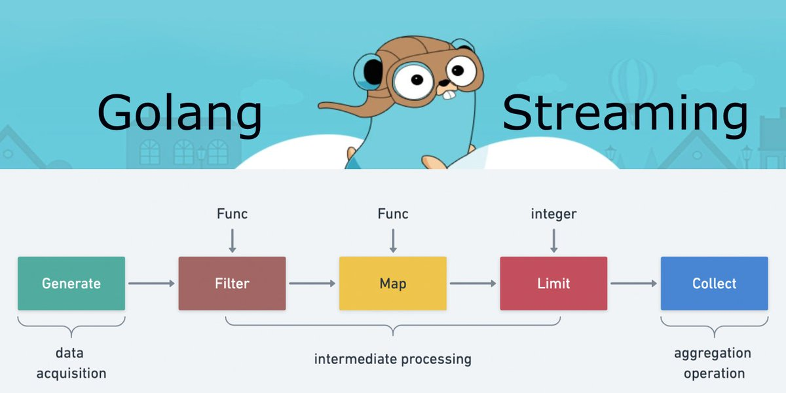

# Go语言爱好者周刊：第 166 期

这里记录每周值得分享的 Go 语言相关内容，周日发布。本周刊开源（GitHub：[polaris1119/golangweekly](https://github.com/polaris1119/golangweekly)），欢迎投稿，推荐或自荐文章/软件/资源等，请[提交 issue](https://github.com/polaris1119/golangweekly/issues) 。

鉴于一些人可能没法坚持把英文文章看完，因此，周刊中会尽可能推荐优质的中文文章。优秀的英文文章，我们的 GCTT 组织会进行翻译。



题图：Go Stream API 实现图

## 刊首语

本期不出题目了，看上期的题目。

以下代码输出什么？

```go
package main

import "fmt"

func main() {
    a := []int{5}
    for range a {
        a = append(a, 1)
    }
    fmt.Println(len(a))
}
```

A：2；B：编译错误；C：运行 panic

正确答案 A，正确率挺高的。

## 资讯

1、[Go 1.19.3 和 Go1.18.8 发布](https://mp.weixin.qq.com/s/aIS3C6n4yxkPwoQryXxTzw)

Go 官方发布了两个新的小版本：Go1.19.3 和 Go1.18.8，这是进行了安全更新。这次升级只包含了一个安全问题修复。

2、[用户自定义 iteration](https://github.com/golang/go/discussions/56413)

rsc 发起的讨论。

3、[gobgp 3.8 发布](https://github.com/osrg/gobgp)

BGP 的 Go 实现。

4、[progressbar 3.12 发布](https://github.com/schollz/progressbar)

线程安全的 process bar。

## 文章

1、[Go每日一库之调用外部命令的几种姿势](https://mp.weixin.qq.com/s/dG58Dtml2FfU_aANJCgkfQ)

go标准库中的os/exec包对调用外部程序提供了支持，本文详细介绍os/exec的使用姿势。

2、[手撸源码系列 - cache2go](https://mp.weixin.qq.com/s/qyEiEACuUd8SsyqCDLUjXA)

适合新手学习的项目。

3、[Go 源码分析：json 格式请求 grpc 服务](https://mp.weixin.qq.com/s/k4Sl0k_e3h-wo6MHJBsUKQ)

gRPC payload 的默认格式是 Protobuf，但是 gRPC-Go 的实现中也对外暴露了 Codec interface ，实际上，它支持任意的 payload 编码。

4、[slog：Go官方版结构化日志包](https://tonybai.com/2022/10/30/first-exploration-of-slog/)

在这篇文章中，我们就来简单看一下 slog 的 proposal 以及它的初始实现。

## 开源项目

1、[rueidis](https://github.com/rueian/rueidis)

一个快速的 Go Redis 客户端。

2、[permify](https://github.com/Permify/permify)

开源的授权服务。

3、[go-wiki](https://github.com/trietmn/go-wiki)

Wikipedia 的 Go  API 封装。

4、[hydra](https://github.com/ory/hydra)

OpenID 认证的 OAuth 2.0 服务器和 OpenID 连接提供程序。

5、[shardmap](https://github.com/chainbound/shardmap)

使用泛型的高性能、高并发和简单的分片 hashmap 实现。

## 资源&&工具

1、[Go 是如何保持向后兼容的？](https://www.youtube.com/watch?v=v24wrd3RwGo)

Russ Cox 在 GopherCon 2022 的演讲。

2、[wrapcheck](https://github.com/tomarrell/wrapcheck)

检查 error 是否 wrap，方便 debug。

3、[alphavet](https://github.com/skx/alphavet)

检测函数是否按照字母顺序排序。

## 订阅

这个周刊每周日发布，同步更新在[Go语言中文网](https://studygolang.com/go/weekly)和[微信公众号](https://weixin.sogou.com/weixin?query=Go%E8%AF%AD%E8%A8%80%E4%B8%AD%E6%96%87%E7%BD%91)。

微信搜索"Go语言中文网"或者扫描二维码，即可订阅。


