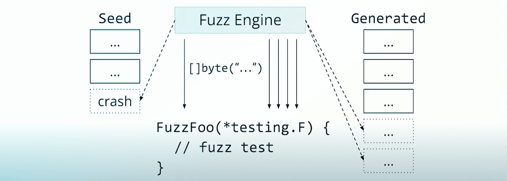

# Go语言爱好者周刊：第 169 期

这里记录每周值得分享的 Go 语言相关内容，周日发布。本周刊开源（GitHub：[polaris1119/golangweekly](https://github.com/polaris1119/golangweekly)），欢迎投稿，推荐或自荐文章/软件/资源等，请[提交 issue](https://github.com/polaris1119/golangweekly/issues) 。

鉴于一些人可能没法坚持把英文文章看完，因此，周刊中会尽可能推荐优质的中文文章。优秀的英文文章，我们的 GCTT 组织会进行翻译。



题图：模糊测试

## 刊首语

上期题目的正确率 23%，一起看看你对了吗？以下代码输出什么？

```go
package main

import "fmt"

func main() {
    a := (-3) % 2
    b := (-3) % (-2)
    fmt.Println(a, b)
}
```

A：1 1；B：-1 1；C：-1 -1；D：编译错误

正确答案：C。如果你想不明白，可以想想 x / y 的结果：

```go
a := (-3) / 2        // -1
b := (-3) / (-2)     // 1
```

如果你能想明白这个结果，上面取模的结果也就明白了。

相关的官方文档见：<https://go.dev/ref/spec#Integer_operators>。

## 资讯

1、[fq 0.1 发布](https://github.com/wader/fq)

类似 jq，但用于二进制文件。

2、[vhs 0.2 发布](https://github.com/charmbracelet/vhs)

将 CLI 活动记录到 GIF。

3、[GoReleaser 1.13 发布](https://github.com/goreleaser/goreleaser)

尽可能快速、轻松地交付 Go 二进制文件。

4、[bitset 1.4 发布](https://github.com/bits-and-blooms/bitset)

bitset 的 Go 实现。

5、[kubo 0.17 发布](https://github.com/ipfs/kubo)

IPFS 的 Go 实现。

6、[清理 map](https://utcc.utoronto.ca/~cks/space/blog/programming/GoFutureClearBuiltin)

Go 1.21 版本可能会增加 clear 预定义函数，用于清理 map。实际上，Go 1.20 可能就会有该功能：<https://github.com/golang/go/issues/56351>。

## 文章

1、[轻松上手！手把手带你掌握从Context到go设计理念](https://mp.weixin.qq.com/s/Qmh_aZLWbMSRh5k7M1Gk8A)

context包比较小，是阅读源码比较理想的一个入手，并且里面也涵盖了许多 Go 设计理念可以学习。

2、[没用过吧？！使用反射操作channel](https://mp.weixin.qq.com/s/Y4zyaz5wJwgAGFM0rk0iyA)

这里整理使用reflect操作channel，把它分享给大家。

3、[Go每日一库之一个能让http请求回放的工具](https://mp.weixin.qq.com/s/FWfQjaGASVsk1pGC2XY8zQ)

在工作中，你一定遇到过要在服务器上抓包的场景，可又苦于找不到合适的工具。今天就给大家推荐一个使用go语言编写的抓包工具goreplay。

4、[揭秘Go内存！](https://mp.weixin.qq.com/s/IlKdzH4jG004-1GS8rWOmA)

在处理内存泄露的时候，想到了一种从内存中查看哪些对象的问题，于是就对实际跑着的程序内存进行了解析，通过可视化的方式有助于理解go的内存布局和管理。

5、[Go 源码分析：http代理和https代理](https://mp.weixin.qq.com/s/mugOIRHAbBdR1w5u_XCr-w)

代码：<https://github.com/xiazemin/dns_proxy>。

6、[快收藏！最全Go语言实现设计模式（上）](https://mp.weixin.qq.com/s/MQWZOkaAc4Bw-PmYHyd9SA)

面向对象设计模式的 Go 实现。

7、[HTTP 框架 Hertz 实践入门：性能测试指南](https://mp.weixin.qq.com/s/J6ziP7VOitGk-lz8NGdDrA)

本文旨在分享开发者在压测 Hertz 时需要了解的场景和技术问题。这些建议有助于用户更好地结合真实 HTTP 场景对 Hertz 进行调优，使之更贴合业务需要、发挥最佳性能。

8、[Go 实现 SSH 端口转发](https://eli.thegreenplace.net/2022/ssh-port-forwarding-with-go/)

英文的。

## 开源项目

1、[lingua-go](https://github.com/pemistahl/lingua-go)

Go 最准确的自然语言检测库，适用于长文本和短文本。

2、[pipeline](https://github.com/caffix/pipeline)

支持并发任务的异步数据 pipeline。

## 资源&&工具

1、[模糊测试可以很简单](https://www.youtube.com/watch?v=7KWPiRq3ZYI)

Go Team 成员在 GopherCon 2022 大会上的演讲视频。

2、[使用 Go 构建一个代码搜索引擎](https://boyter.org/posts/how-i-built-my-own-index-for-searchcode/)

searchcode.com 可以了解下。

3、[finch](https://github.com/runfinch/finch)

用于容器开发的开源工具。

4、[gotty](https://github.com/yudai/gotty)

将终端作为 Web 应用程序共享。

## 订阅

这个周刊每周日发布，同步更新在[Go语言中文网](https://studygolang.com/go/weekly)和[微信公众号](https://weixin.sogou.com/weixin?query=Go%E8%AF%AD%E8%A8%80%E4%B8%AD%E6%96%87%E7%BD%91)。

微信搜索"Go语言中文网"或者扫描二维码，即可订阅。


