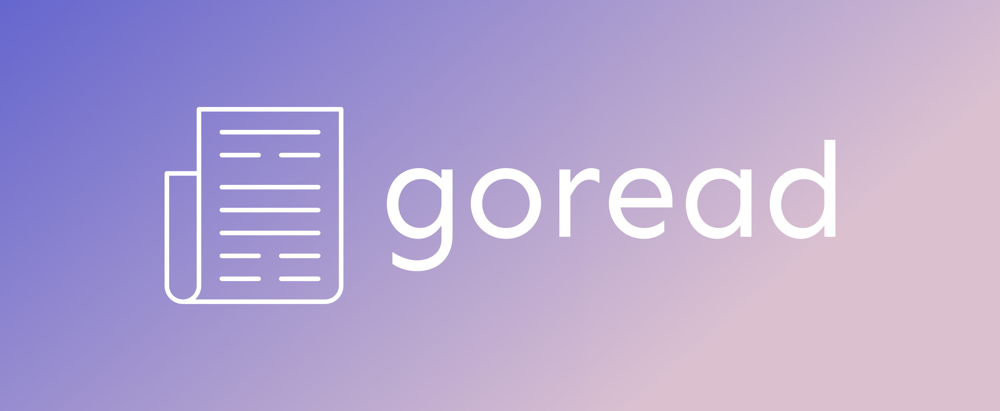

# Go语言爱好者周刊：第 174 期

这里记录每周值得分享的 Go 语言相关内容，周日发布。本周刊开源（GitHub：[polaris1119/golangweekly](https://github.com/polaris1119/golangweekly)），欢迎投稿，推荐或自荐文章/软件/资源等，请[提交 issue](https://github.com/polaris1119/golangweekly/issues) 。

鉴于一些人可能没法坚持把英文文章看完，因此，周刊中会尽可能推荐优质的中文文章。优秀的英文文章，我们的 GCTT 组织会进行翻译。

题图：goread

## 资讯

1、[gnet 2.2 发布](https://github.com/panjf2000/gnet)

一个高性能、轻量级、非阻塞的事件驱动 Go 网络框架。

2、[Excelize 2.7 发布](https://github.com/qax-os/excelize)

用于处理 Excel/XLSX 文档的库。

3、[stats 0.7 发布](https://github.com/montanaflynn/stats)

没有外部依赖，经过良好测试，可以使用平均值、总和、百分位数、标准差等概念。

4、[pie 2.3 发布](https://github.com/elliotchance/pie)

操作 slice 和 map 的方便库。

5、[Go-streams v0.9.0 发布](https://github.com/reugn/go-streams)

流处理库。提供简单明了的 DSL 以建立数据管道。

6、[FastHTTP 1.44 发布](https://github.com/valyala/fasthttp)

Go 快速的 HTTP 包。为高性能而调优。 热路径中的零内存分配。 比 net/http 快 10 倍。有兴趣可以研究为什么能做到快这么多。

7、[sarama v1.38 发布](https://github.com/Shopify/sarama)

Sarama 是 Apache Kafka 0.8 及更高版本的 Go 库。

8、[Ginkgo 2.7 发布](https://github.com/onsi/ginkgo)

现代的测试框架。

9、[clickhouse-go 2.5 发布](https://github.com/ClickHouse/clickhouse-go)

clickhouse 官方 go 客户端 API  库。

## 文章

1、[Go1.20 新特性：context 支持自定义取消原因](https://mp.weixin.qq.com/s/HbFVODpDEzEZ047kv-LYbg)

你想要的，它支持了。

2、[一文读懂 Go Http Server 原理](https://mp.weixin.qq.com/s/CGyoY_iJUyn8wZqs1Y--mQ)

俗话说万事开头难，但用 Go 实现一个 Http Server 真不难，简单到什么程度？起一个 Server，并且能响应请求，算上包名、导入的依赖，甚至空行，也就只要 15 行代码。

3、[Go 1.19.5 发布](https://mp.weixin.qq.com/s/PIgfkdXK8wwQ6WpbVDjNMQ)

Go 官方发布了 Go1.19.5，同步发布的还有 Go1.18.10，这是两个小版本。

4、[Go 与 TLS 1.3](https://mp.weixin.qq.com/s/Xt6P7ZADfjkRDsSxYX0u_w)

如何加快基于 TLS 安全通信的海量连接的建连速度？

5、[Go BIO/NIO探讨(2)：net库对socket/bind/listen/accept的封装](https://mp.weixin.qq.com/s/gh3qi-NorkPC1gQLiuNwHQ)

Go内置的 net/http中使用了Blocking IO，主要体现在两层 for 循环。但真的是这样吗？

## 开源项目

1、[enc](https://github.com/life4/enc)

GnuPG 的替代品，生成和下载密钥，加密、解密和签署文本和文件。

2、[ngrok-go](https://github.com/ngrok/ngrok-go)

库形式的 ngrok 代理，适合直接集成到 Go 应用程序中。

## 资源&&工具

1、[goread](https://github.com/TypicalAM/goread)

一个漂亮的可以在终端中阅读你的 RSS 提要！

2、[awesome-go-style](https://github.com/dgryski/awesome-go-style)

Go 风格指南集。

3、[ov](https://github.com/noborus/ov)

一个终端分页器。

4、[klotho](https://github.com/KlothoPlatform/klotho)

将普通代码转换为云端原生代码的命令行工具。

5、[doc2go](https://github.com/abhinav/doc2go)

一个命令行工具，可以从你的 Go 代码中生成静态 HTML 文档。

## 订阅

这个周刊每周日发布，同步更新在[Go语言中文网](https://studygolang.com/go/weekly)和[微信公众号](https://weixin.sogou.com/weixin?query=Go%E8%AF%AD%E8%A8%80%E4%B8%AD%E6%96%87%E7%BD%91)。

微信搜索"Go语言中文网"或者扫描二维码，即可订阅。

