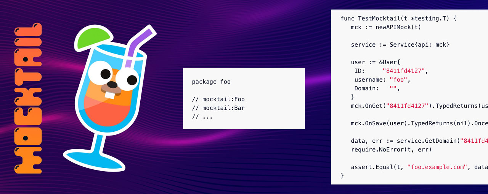

# Go语言爱好者周刊：第 176 期

这里记录每周值得分享的 Go 语言相关内容，周日发布。本周刊开源（GitHub：[polaris1119/golangweekly](https://github.com/polaris1119/golangweekly)），欢迎投稿，推荐或自荐文章/软件/资源等，请[提交 issue](https://github.com/polaris1119/golangweekly/issues) 。

鉴于一些人可能没法坚持把英文文章看完，因此，周刊中会尽可能推荐优质的中文文章。优秀的英文文章，我们的 GCTT 组织会进行翻译。



题图：生成 mock 代码。

## 刊首语

好久没出题了，本期来一道。

以下代码输出什么？

```go
package main

import "fmt"

func main() {
    a := ['9']int32{
        '0': '1',
        '1': '2',
    }
    fmt.Println(len(a))
}
```

A：2；B：9；C：10；D：57

## 资讯

1、[muffet 2.7 发布](https://github.com/raviqqe/muffet)

Go 中的快速网站链接检查器。

2、[plumber 2.0 发布](https://github.com/batchcorp/plumber)

瑞士军刀 CLI 工具，用于与 Kafka、RabbitMQ 和其他消息系统交互。

3、[tproxy 0.7 发布](https://github.com/kevwan/tproxy)

分析 TCP 连接的工具。

4、[ffuf 2.0 发布](https://github.com/ffuf/ffuf)

快速的网络模拟器。

5、[Yaegi 0.15.0 发布](https://github.com/traefik/yaegi)

一个优雅的 Go 解释器。可以用于其他应用程序中的脚本编写，交互式 shell 或快速原型制作。你可以将其用作 REPL 或将其嵌入到自己的应用中。

6、[mockery 2.19 发布](https://github.com/vektra/mockery)

提供了轻松为 Go 接口生成 mock 的功能。它删除了使用 mock 所需的样板代码。

7、[golang.org/x/exp/slices](https://github.com/golang/go/issues/57433)

在 Go 1.21 版本中将挪入标准库。

## 文章

1、[一文读懂 Go 主流 Web 框架中路由的实现原理](https://mp.weixin.qq.com/s/UJA3S8WIeC5wQXbvhE1I6g)

本文总结了3中路由的实现。路由本质上就是将请求的路径和对应的处理函数一一对应。

2、[slog：Go官方的结构化日志包开发的怎么样了？该如何使用？](https://mp.weixin.qq.com/s/wjhRDbclCUQt3h3fqKRoEA)

熟悉 Go 的同学都知道 Go 语言标准库 log 有许多痛点，比如没有日志分级、没有结构化（没有 JSON 格式）、扩展性差等，为了解决这些问题 Go 官方推出了结构化日志包 slog，目前这个库正在开发阶段。

4、[Go 1.20中值得关注的几个变化](https://tonybai.com/2023/02/08/some-changes-in-go-1-20/)

按照惯例，我们依旧首先来看看 Go 语法层面都有哪些变化，这可能也是多数 Gopher 们最为关注的变化点。

5、[基于 Wails 构建桌面应用](https://thedevelopercafe.com/articles/introduction-to-wails-build-desktop-apps-with-go-project-structure-17ee3f7fcdf7)

Wails 是一个使用 Go 编程语言开发桌面应用程序的框架。

## 开源项目

1、[goption](https://github.com/jordan-bonecutter/goption)

仿照 Rust 的可选型。

2、[radon](https://github.com/radondb/radon)

RadonDB 是一个开源的云原生 MySQL 数据库，用于构建全球可扩展的云服务。不过好久没更新了。

3、[follow](https://github.com/arp242/follow)

类似 tail -f 命令的 Go 库。

4、[mocktail](https://github.com/traefik/mocktail)

基于 testify.mock 生成 mock 代码。

## 资源&&工具

1、[5 步让你的代码更快更高效](https://docs.google.com/presentation/d/1MD_Vlb9d32aMDPu9MOlyVO796mK1Y6GrRcXOl63C7g4/edit#slide=id.p)

《Efficient Go》作者演讲 PPT。

2、[godotenv](https://github.com/joho/godotenv)

从 .env 加载环境变量。

3、[gonb](https://github.com/janpfeifer/gonb)

Go 实现的全功能的 Jupyter 笔记本内核。

4、[Go arm64 Function Call Assembly](https://blog.felixge.de/go-arm64-function-call-assembly/)

Go ARM64 相关资料。

5、[semgrep](https://github.com/returntocorp/semgrep)

多种语言的轻量级静态分析。

6、[fm](https://github.com/knipferrc/fm)

基于终端的文件管理器。

## 订阅

这个周刊每周日发布，同步更新在[Go语言中文网](https://studygolang.com/go/weekly)和[微信公众号](https://weixin.sogou.com/weixin?query=Go%E8%AF%AD%E8%A8%80%E4%B8%AD%E6%96%87%E7%BD%91)。

微信搜索"Go语言中文网"或者扫描二维码，即可订阅。


