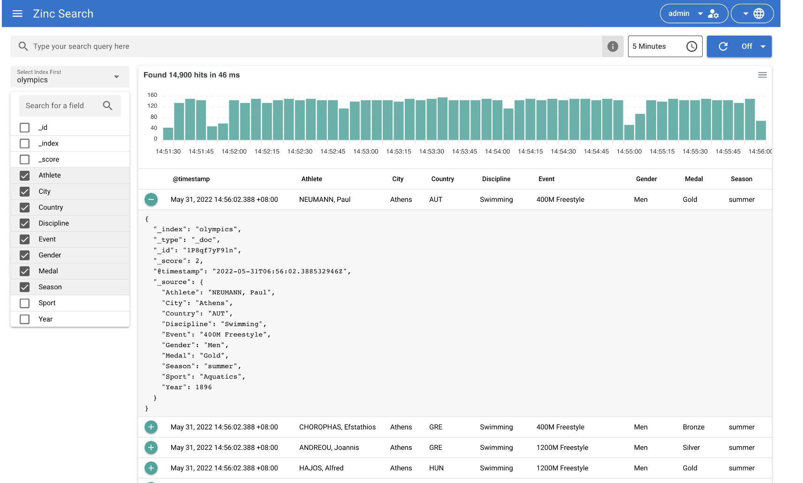

# Go语言爱好者周刊：第 176 期

这里记录每周值得分享的 Go 语言相关内容，周日发布。本周刊开源（GitHub：[polaris1119/golangweekly](https://github.com/polaris1119/golangweekly)），欢迎投稿，推荐或自荐文章/软件/资源等，请[提交 issue](https://github.com/polaris1119/golangweekly/issues) 。

鉴于一些人可能没法坚持把英文文章看完，因此，周刊中会尽可能推荐优质的中文文章。优秀的英文文章，我们的 GCTT 组织会进行翻译。

题图：ZincSearch

## 资讯

1、[Go 1.20.1 发布了](https://mp.weixin.qq.com/s/enYkz_1aYZlbASFpliBpcA)

Go 官方发布了 Go1.20.1 和 Go1.19.6，这是两个小版本，主要涉及到安全更新，一共修复了 4 个 Bug。

2、[noti 3.7 发布](https://github.com/variadico/noti)

监听进程并触发通知。

3、[ZincSearch 0.4 发布](https://github.com/prabhatsharma/zinc)

全文搜索引擎，可作为 elasticsearch 的替代品，之前叫做 Zinc。

4、[imagor v1.4.0 发布](https://github.com/cshum/imagor)

用 Go 和 libvips 编写的高性能图像处理服务器。

5、[tinygo 0.27.0 发布](https://github.com/tinygo-org/tinygo)

这是一个基于 LLVM 的、用于一些特定小场景的 Go 编译器，比如 WebAssembly、Microcontrollers 和 命令行工具等。

6、[Watermill v1.2 发布](https://threedots.tech/post/watermill-1-2/)

事件驱动应用开发框架。

7、[istio 1.17发布](https://istio.io/latest/news/releases/1.17.x/announcing-1.17/)

服务网格领头羊。

## 文章

1、[写给 Go 开发者的 gRPC 教程](https://mp.weixin.qq.com/s/Ok2j0YFLqzGRztEc1Mh70w)

一篇 Protobuf 的基础教程，以及一篇 [通信模式](https://mp.weixin.qq.com/s/kKCP4y-JDjSMi2dbV9Gj9Q) 的文章。

2、[net 库的非阻塞支持](https://mp.weixin.qq.com/s/gV4m9tNsgJkeXKnV1upOIw)

在涉及到 Accept/Read/Write 之类的操作时，Go net 库默认使用了非阻塞的方式去实现，这样提高了性能，但给编程增加了额外的复杂度。

3、[使用 Go 和 Sqlite 建立一个短网址服务](https://blog.pratimbhosale.com/building-a-url-shortener-using-go-and-sqlite)

一篇介绍性文章。

4、[DDD 在 Go 中的落地 | 如何在业务中使用领域事件？](https://mp.weixin.qq.com/s/tTor7j3MNO3Fph67rF_xLA)

在实际的建模中，一般会通过事件风暴的形式，来发现、提取领域事件。

## 开源项目

1、[purego](https://github.com/ebitengine/purego)

非 CGO 方式调用 C 函数。

2、[sonnet](https://github.com/sugawarayuuta/sonnet)

另一款以速度见长的 JSON 解析器。

3、[entrefine](https://github.com/diazoxide/entrefine)

Entgo 的扩展，用于生成带有 CRUD 操作的简化管理仪表板，所有这些都基于你的模式定义。

## 资源&&工具

1、[go-pretty](https://github.com/jedib0t/go-pretty)

在终端上漂亮地打印表格、列表和文本。

2、[gofumpt](https://github.com/mvdan/gofumpt)

更严格的 gofmt。

3、[q](https://github.com/natesales/q)

一个微型命令行 DNS 客户端，支持 UDP、TCP、DoT、DoH、DoQ 和 ODoH。

4、[tinyglobo](https://github.com/hybridgroup/tinyglobo)

一个小气球飘进了伟大的大世界，拖着一个用 TinyGo 编程的 RP2040。

5、[algia](https://github.com/mattn/algia)

nostr 协议的 CLI 客户端。

6、[gofs](https://github.com/no-src/gofs)

一个开箱即用的基于 Go 的跨平台文件同步工具。

## 订阅

这个周刊每周日发布，同步更新在[Go语言中文网](https://studygolang.com/go/weekly)和[微信公众号](https://weixin.sogou.com/weixin?query=Go%E8%AF%AD%E8%A8%80%E4%B8%AD%E6%96%87%E7%BD%91)。

微信搜索"Go语言中文网"或者扫描二维码，即可订阅。

