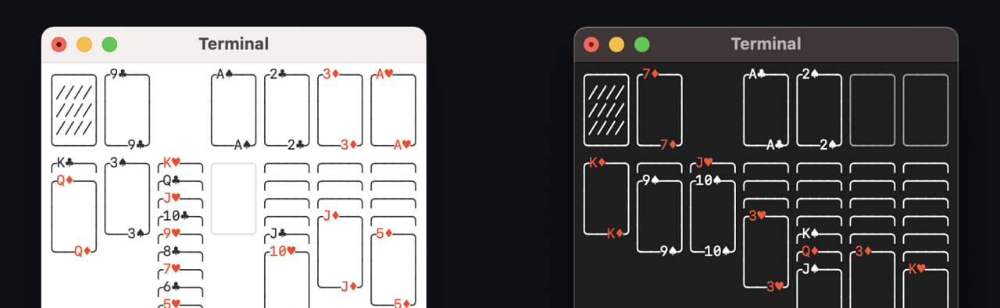

# Go语言爱好者周刊：第 178 期

这里记录每周值得分享的 Go 语言相关内容，周日发布。本周刊开源（GitHub：[polaris1119/golangweekly](https://github.com/polaris1119/golangweekly)），欢迎投稿，推荐或自荐文章/软件/资源等，请[提交 issue](https://github.com/polaris1119/golangweekly/issues) 。

鉴于一些人可能没法坚持把英文文章看完，因此，周刊中会尽可能推荐优质的中文文章。优秀的英文文章，我们的 GCTT 组织会进行翻译。

题图：Go 实现的纸牌游戏：<https://github.com/brianstrauch/solitaire-tui>。

## 资讯

1、[Gin 1.9 发布](https://github.com/gin-gonic/gin/releases/tag/v1.9.0)

一个 Go HTTP 框架。

2、[mpb v8.2 发布](https://github.com/vbauerster/mpb)

在终端为 Go 命令行应用程序显示进度条。

3、[imagor v1.4.1 发布](https://github.com/cshum/imagor)

用 Go 和 libvips 编写的高性能图像处理服务器。

4、[pie 2.4 发布](https://github.com/elliotchance/pie)

操作 slice 和 map 的方便库。

5、[新提案：类型推断的一个通用方案](https://github.com/golang/go/issues/58650)

泛型中的类型推断。

## 文章

1、[10 秒改 struct 性能直接提升 15%，产品姐姐都夸我好棒](https://mp.weixin.qq.com/s/QBD11TUQFdZ-11hJ2FiJJw)

内存对齐。

2、[「Go框架」深入理解iris中的mvc之原理篇](https://mp.weixin.qq.com/s/-UULL4IiBiiXOu5PtskPzQ)

MVC，古老的架构，但一直流行着。

3、[选择“网红语言”值不值？使用Go和Rust的数据库公司七年经验总结](https://mp.weixin.qq.com/s/S5Z3whsnbthcz2VESqc17w)

PingCAP CTO 谈当初选择 Go 与 Rust 的得失。

4、[深入探究 Go 中的 array 与 slice](https://mp.weixin.qq.com/s/p7CxNIk0YI_cS3pebUWAOg)

这篇文章我们将讨论 Go 语言中数组与切片(slice)，深入探究它们的内部结构以及为什么它们表现不一样，即使它们能做类似的事情。

5、[一文告诉你如何判断Go接口变量是否相等](https://mp.weixin.qq.com/s/2Pw8fsnjvu9-uTzf4Imojg)

来自读者的一个问题。

## 开源项目

1、[log](https://github.com/charmbracelet/log)

一个小巧、色彩丰富的 Go 日志库。

2、[pgweb](https://github.com/sosedoff/pgweb)

PostgreSQL 跨平台 Go 客户端。

3、[solitaire-tui](https://github.com/brianstrauch/solitaire-tui)

终端的克朗代克纸牌游戏，Go 实现。

4、[sponge](https://github.com/zhufuyi/sponge)

支持快速生成网络和微服务代码的微服务框架。

## 资源&&工具

1、[opossum](https://github.com/psilva261/opossum)

Go 实现的浏览器。真丑。。。

2、[soft-serve](https://github.com/charmbracelet/soft-serve)

一个可自我托管的命令行 Git 服务器。

3、[vhs](https://github.com/charmbracelet/vhs)

你的 CLI 家庭录像机。

4、[hoverfly](https://github.com/SpectoLabs/hoverfly)

面向开发人员和测试人员的轻量级服务虚拟化/API 模拟工具。

5、[define](https://github.com/Rican7/define)

一个命令行字典（词库）应用程序，可以访问多个源。

6、[efthook](https://github.com/evilmartians/lefthook)

适用于任何类型项目的快速而强大的 Git Hook 管理器。

## 订阅

这个周刊每周日发布，同步更新在[Go语言中文网](https://studygolang.com/go/weekly)和[微信公众号](https://weixin.sogou.com/weixin?query=Go%E8%AF%AD%E8%A8%80%E4%B8%AD%E6%96%87%E7%BD%91)。

微信搜索"Go语言中文网"或者扫描二维码，即可订阅。

