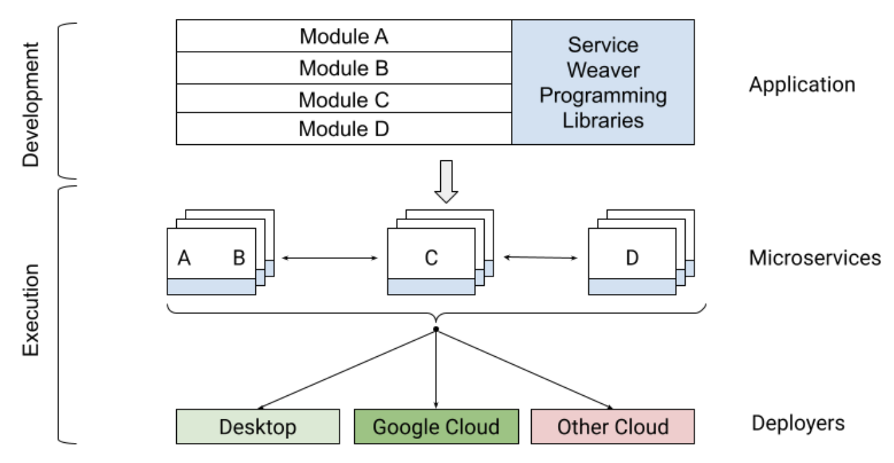

# Go语言爱好者周刊：第 179 期

这里记录每周值得分享的 Go 语言相关内容，周日发布。本周刊开源（GitHub：[polaris1119/golangweekly](https://github.com/polaris1119/golangweekly)），欢迎投稿，推荐或自荐文章/软件/资源等，请[提交 issue](https://github.com/polaris1119/golangweekly/issues) 。

鉴于一些人可能没法坚持把英文文章看完，因此，周刊中会尽可能推荐优质的中文文章。优秀的英文文章，我们的 GCTT 组织会进行翻译。

题图：Google 出品的分布式应用 Go 框架 weaver。

## 资讯

1、[pdfcpu v0.4 发布](https://github.com/pdfcpu/pdfcpu)

Go 语言 PDF 处理器。

2、[conc v0.3 发布](https://github.com/sourcegraph/conc)

结构更佳的 Go 并发库。

3、[render 1.6 发布](https://github.com/unrolled/render)

轻松 Render JSON，XML，二进制数据和 HTML 模板响应。

4、[miller 6.7 发布](https://github.com/johnkerl/miller)

文本数据处理的瑞士军刀，Go 实现。

5、[buf 1.15 发布](https://github.com/bufbuild/buf)

一种新的 Protobuf 处理库。

6、[Russ Cox 妥协](https://research.swtch.com/telemetry-opt-in)

透明遥测加入Go工具链后默认是关闭的。

## 文章

1、[Redis 官方 Go 客户端来了！！！](https://mp.weixin.qq.com/s/HoyK9I1gbCM_umzSczZj-w)

你用的是哪个呢？

2、[Hello Word: 一款用Go开发的学习英语单词工具](https://mp.weixin.qq.com/s/Uuj28VWosfcG9Kxqpa4Hcg)

背单词工具。

3、[如何用go实现一个ORM](https://mp.weixin.qq.com/s/_ryLiStjLwguHgmpdcURbw)

好用的生产工具常常能够对生产力产生飞跃式的提升。

4、[2023 年的 Rust 与 Go](https://mp.weixin.qq.com/s/75qJIfG0lGnohWegDAeqxA)

本文译自《Rust vs Go in 2023》

5、[5 分钟之内跑起来一个完整的 Go Gin 项目](https://mp.weixin.qq.com/s/xX9AK9rEREpBdfhJWCramg)

一个 Go 开源项目，构建后台管理系统。

6、[Go BIO/NIO探讨(6)：IO多路复用之select](https://mp.weixin.qq.com/s/IzwdHve2YsDshzTtg_in0g)

深入探索 Go 网络编程。

## 开源项目

1、[weaver](https://github.com/ServiceWeaver/weaver)

编写分布式应用程序的 Go 框架，Google 出品。

2、[gnark](https://github.com/ConsenSys/gnark)

一个快速的 zk-SNARK 库，提供高级 API 来设计电路。

3、[pngr](https://github.com/karlkeefer/pngr)

一个 Web APP 较完整的例子。

4、[graph](https://github.com/dominikbraun/graph)

图数据结构的 Go 实现。

5、[gluon](https://github.com/ProtonMail/gluon)

Go IMAP server 库。这里有一篇介绍文章：<https://proton.me/blog/gluon-imap-library>。

6、[mox](https://github.com/mjl-/mox)

一个现代的、全功能的开源安全邮件服务器，低维护、自托管。

7、[macaron](https://github.com/go-macaron/macaron)

模块化的 Web 框架。

8、[openai-go](https://github.com/rakyll/openai-go)

OpenAI 的 Go 客户端库。

9、[authz](https://github.com/eko/authz)

一个授权后端项目，支持RBAC和ABAC权限设置，带有用户界面。

## 资源&&工具

1、[stdlib](https://tinygo.org/docs/reference/lang-support/stdlib/)

被 TinyGo 支持的标准库。

2、[database](https://build-your-own.org/database/)

构建你自己的数据库。

3、[algnhsa](https://github.com/akrylysov/algnhsa)

AWS Lambda net/http 适配服务。

4、[warthog](https://github.com/Forest33/warthog)

跨平台的 gPRC GUI 客户端。

## 订阅

这个周刊每周日发布，同步更新在[Go语言中文网](https://studygolang.com/go/weekly)和[微信公众号](https://weixin.sogou.com/weixin?query=Go%E8%AF%AD%E8%A8%80%E4%B8%AD%E6%96%87%E7%BD%91)。

微信搜索"Go语言中文网"或者扫描二维码，即可订阅。

