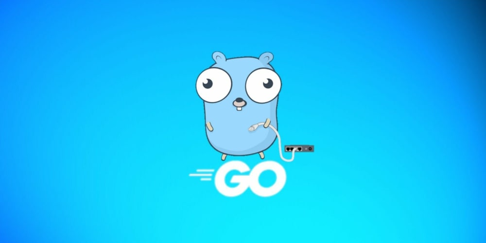

# Go语言爱好者周刊：第 180 期

这里记录每周值得分享的 Go 语言相关内容，周日发布。本周刊开源（GitHub：[polaris1119/golangweekly](https://github.com/polaris1119/golangweekly)），欢迎投稿，推荐或自荐文章/软件/资源等，请[提交 issue](https://github.com/polaris1119/golangweekly/issues) 。

鉴于一些人可能没法坚持把英文文章看完，因此，周刊中会尽可能推荐优质的中文文章。优秀的英文文章，我们的 GCTT 组织会进行翻译。

题图：Gopher

## 资讯

1、[Go 1.20.2 发布了~](https://mp.weixin.qq.com/s/43xceloGQUS1-RehqR2nnQ)

Go 官方发布了两个小版本：Go1.20.2 和 Go1.19.7，主要是因为有一个安全问题。

2、[GopherCon UK 2023](https://sessionize.com/gophercon-uk-2023)

将在伦敦举行，时间是 8 月 16 日到 18 日。

3、[glog 包发布 1.1.0](https://github.com/golang/glog)

这是类似谷歌 C++ 的 glog 包，支持 level 的纯 Go 实现。

4、[wails 2.4 发布](https://github.com/wailsapp/wails)

使用 Go 和 Web 技术创建桌面应用程序。

5、[rqlite v7.14.0 发布](https://github.com/rqlite/rqlite/releases/tag/v7.14.0)

轻量的、分布式关系数据库。

6、[goose v3.10 发布](https://github.com/pressly/goose)

数据库迁移工具。

7、[Ginkgo 2.9 发布](https://github.com/onsi/ginkgo)

现代的测试框架。

8、[fq 0.4 发布](https://github.com/wader/fq)

类似 jq，但用于二进制文件。

9、[clickhouse-go 2.7 发布](https://github.com/ClickHouse/clickhouse-go)

clickhouse 官方 go 客户端 API  库。

## 文章

1、[Go/Rust 挑战 Java/Python 地位](https://mp.weixin.qq.com/s/isf_jtTNSFVEih-FPvnyaw)

在线学习平台 O'Reilly 最新发布了 2023 年度技术趋势报告，基于该平台  280 万 的用户数据，以 了解开发人员的兴趣所在。

2、[冲冲冲！Go 冲进排行榜前 10 了~](https://mp.weixin.qq.com/s/APY4gUCWq2OJu0AKdstA8w)

TIOBE 公布了 2023 年 3 月的编程语言排行榜。

3、[Go 语言中结构体嵌入结构体？](https://mp.weixin.qq.com/s/sCmnDOQ12Rr-UYiITh2eyQ)

Go 语言并不支持传统意义上的继承，相反，它提倡通过组合来扩展类型的功能，但有时想要类似继承的功能，这通过嵌入实现。

## 开源项目

1、[valgo](https://github.com/cohesivestack/valgo)

基于泛型的校验库，跟其他不同的是，通过写函数实现，而不是 tag。

2、[gool](https://github.com/txaty/gool)

通用 goroutine 池：提交、映射、异步。

3、[golang-set](https://github.com/deckarep/golang-set)

Go 语言的简单通用集合（Set）类型。

4、[go-selfupdate](https://github.com/sanbornm/go-selfupdate)

Go 应用自更新。

5、[ishell](https://github.com/abiosoft/ishell)

创建交互式 cli 的应用。

6、[melody](https://github.com/olahol/melody)

Go 的极简 Websocket 框架，基于 gorilla/websocket 创建。

## 资源&&工具

1、[go-ssaviz](https://github.com/SilverRainZ/go-ssaviz)

通过 Graphviz 可视化 Go SSA 函数。

2、[viterbi](https://github.com/8ff/viterbi)

Go 的卷积编码器和维特比（Viterbi）解码器。

3、[kopia](https://github.com/kopia/kopia)

跨平台的备份工具。

4、[cds](https://github.com/zeromicro/cds)

为 ClickHouse 准备的数据同步工具。

5、[ElasticView](https://github.com/1340691923/ElasticView)

这是一个简单好用的ElasticSearch可视化客户端，支持连接6，7，8版本的ES，不妨一试。

## 订阅

这个周刊每周日发布，同步更新在[Go语言中文网](https://studygolang.com/go/weekly)和[微信公众号](https://weixin.sogou.com/weixin?query=Go%E8%AF%AD%E8%A8%80%E4%B8%AD%E6%96%87%E7%BD%91)。

微信搜索"Go语言中文网"或者扫描二维码，即可订阅。

