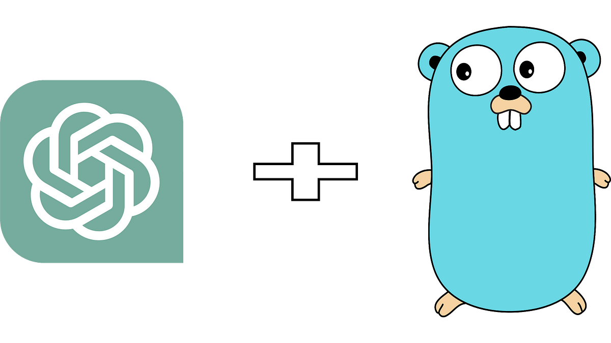

# Go语言爱好者周刊：第 181 期

这里记录每周值得分享的 Go 语言相关内容，周日发布。本周刊开源（GitHub：[polaris1119/golangweekly](https://github.com/polaris1119/golangweekly)），欢迎投稿，推荐或自荐文章/软件/资源等，请[提交 issue](https://github.com/polaris1119/golangweekly/issues) 。

鉴于一些人可能没法坚持把英文文章看完，因此，周刊中会尽可能推荐优质的中文文章。优秀的英文文章，我们的 GCTT 组织会进行翻译。

题图：ChatGPT + Golang

## 资讯

1、[slog](https://github.com/golang/go/issues/56345#issuecomment-1470506816)

结构化日志库将要进入标准库了。结构化日志指南：<https://betterstack.com/community/guides/logging/logging-in-go/>。

2、[task v3.22.0 发布](https://github.com/go-task/task/releases/tag/v3.22.0)

一个任务运行/构建工具，旨在比 GNU Make 更简单，更易于使用。

3、[revive v1.3 发布](https://github.com/mgechev/revive)

一个旨在提供更多结构和可配置性的 Golint 的替代品。它的速度据说有数倍提升。

4、[chromedp 0.9 发布](https://github.com/chromedp/chromedp)

驱动浏览器的 Go 语言库，支持 Chrome DevTools 协议。抓取动态网页利器。

5、[oto 2.4 发布](https://github.com/hajimehoshi/oto)

支持多平台的播放声音的低级库。

6、[iris 12.2 发布](https://github.com/kataras/iris)

一个社区驱动的 Go 语言 Web 框架。

7、[color 1.15 发布](https://github.com/fatih/color)

颜色文本输出包。

8、[golang-lru 2.0.2 发布](https://github.com/hashicorp/golang-lru)

LRU 算法的实现。

9、[FerretDB v0.9.3](https://github.com/FerretDB/FerretDB)

MongoDB 的替代品。

10、[golang-set 2.3 发布](https://github.com/deckarep/golang-set)

Go 语言的简单通用集合（Set）类型。

## 文章

1、[Go 语言中接口嵌入接口](https://mp.weixin.qq.com/s/6yE_yNTJjsOBB2r2mhZiAA)

在一个接口里面嵌入另一个接口，是 Go 语言里最简单的一种嵌入方式，因为接口只定义了抽象能力，并没有为类型定义新的数据和行为。

2、[踩坑记：gRPC 异常响应](https://mp.weixin.qq.com/s/ana40LV9CEqkLzMnwTn8rA)

前些天接到一个 Oncall，来自 Lark 的胡同学反馈，用 gRPC 官方的 python 客户端请求 Kitex gRPC Server，有时收到的 response 为 None。

3、[Go每日一库之使用 Singleflight 优化你的代码](https://mp.weixin.qq.com/s/9iiWzbPm_P0WzL7jlbQ2lQ)

有很多方法可以优化代码以达到提高程序运行效率，减少进程数就是其中之一。

4、[一文搞懂Go subtest](https://tonybai.com/2023/03/15/an-intro-of-go-subtest/)

在本文中，我将结合日常开发中了解到的关于subtest的认知、理解和使用的问题，和大家一起聊聊 subtest。

## 开源项目

1、[markdown](https://github.com/gomarkdown/markdown)

Markdown 解析器和 HTML 显示器。

2、[scale](https://github.com/loopholelabs/scale)

高性能 WebAssembly 函数运行时。

3、[dynamodbav](https://github.com/ryanc414/dynamodbav)

DynamoDB 的 Marshal/Unmarshal 实用程序。

4、[sonic](https://github.com/go-sonic/sonic)

Go 博客平台。

5、[watcher](https://github.com/radovskyb/watcher)

一个 Go 包，用于在不使用文件系统事件的情况下监控文件或目录更改。

6、[flipt](https://github.com/flipt-io/flipt)

一个开源的、自托管的功能标志解决方案。

## 资源&&工具

1、[traceutils](https://github.com/felixge/traceutils)

用于解码和编码 runtime/trace 文件的代码以及有用的功能。

2、[ko](https://github.com/ko-build/ko)

构建和部署 Go 应用。

## 订阅

这个周刊每周日发布，同步更新在[Go语言中文网](https://studygolang.com/go/weekly)和[微信公众号](https://weixin.sogou.com/weixin?query=Go%E8%AF%AD%E8%A8%80%E4%B8%AD%E6%96%87%E7%BD%91)。

微信搜索"Go语言中文网"或者扫描二维码，即可订阅。

