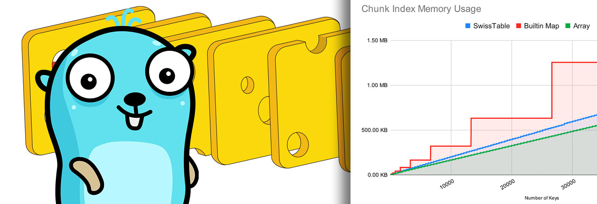

# Go语言爱好者周刊：第 183 期

这里记录每周值得分享的 Go 语言相关内容，周日发布。本周刊开源（GitHub：[polaris1119/golangweekly](https://github.com/polaris1119/golangweekly)），欢迎投稿，推荐或自荐文章/软件/资源等，请[提交 issue](https://github.com/polaris1119/golangweekly/issues) 。

鉴于一些人可能没法坚持把英文文章看完，因此，周刊中会尽可能推荐优质的中文文章。优秀的英文文章，我们的 GCTT 组织会进行翻译。

题图：swiss

## 资讯

1、[wazero 1.0.1 发布](https://github.com/tetratelabs/wazero)

零依赖的 WebAssembly 运行时库。

2、[TiDB 7.0 发布](https://docs.pingcap.com/tidb/v7.0/release-7.0.0)

Go 实现的分布式数据库。

3、[d2 v0.3.0 发布](https://github.com/terrastruct/d2)

使用 Go 实现的图表脚本语言，可以将文本转换为图表。

4、[ferret 0.18发布](https://github.com/MontFerret/ferret)

一个声明式的 Web 爬虫系统，既可以单独使用，也可以嵌入其他 Go 项目使用。

5、[fiber 2.43.0 发布](https://github.com/gofiber/fiber/releases/tag/v2.43.0)

一种 Express 风格的、基于 fasthttp 的 HTTP web 框架。

6、[hertz 0.6.1 发布](https://github.com/cloudwego/hertz)

一个 Golang 微服务 HTTP 框架。

7、[ElasticSearch Go 8.7 发布](https://github.com/elastic/go-elasticsearch)

ElasticSearch Go 8.7 官方客户端发布。

## 文章

1、[为什么 Go 不支持 []T 转换为 []interface](https://mp.weixin.qq.com/s/lG-sswO8i6w_6sMztvyOjw)

在 Go 中，如果 interface{} 作为函数参数的话，是可以传任意参数的，然后通过类型断言来转换。

2、[Golang反射学习：手写一个RPC](https://mp.weixin.qq.com/s/PzfiMXiYjfGQFHW_0hTS4A)

本文主要为了在对golang反射学习后做一个小练习，使用100行代码实现一个通用的RPC服务。

3、[如何用 Go 进行正确的性能剖析？](https://blog.pickme.lk/how-to-get-profiling-right-with-go-813ff89d4757)

这是一篇英文文章。

4、[gRPC 监控对高性能系统的重要性](https://www.groundcover.com/blog/grpc-monitoring)

你的 gRPC 有监控吗？

5、[gin框架中Context的Get、Query、Param函数都是从哪里获取数据的？](https://mp.weixin.qq.com/s/BHrxHQrMKZrhb34hR3La5w)

在使用gin框架处理一次请求的过程中，可以通过Context结构体提供的方法获取或设置一个指定key的值。

6、[Go Mutex：保护并发访问共享资源的利器](https://mp.weixin.qq.com/s/y6lppalSRwLhCjS9yQYuUQ)

本文将着重介绍 Go 的 Mutex 并发原语，它是一种锁类型，用于实现共享资源互斥访问。

## 开源项目

1、[swiss](https://github.com/dolthub/swiss)

HashTable 实现。

2、[gocodewalker](https://github.com/boyter/gocodewalker)

遍历目录的方便库。

3、[tint](https://github.com/lmittmann/tint)

写不同颜色的日志。

4、[pathfind](https://github.com/fzipp/pathfind)

在二维多边形地图上寻找路径。

5、[nats.go](https://github.com/nats-io/nats.go)

NATS 的 Golang 客户端，云原生消息系统。

6、[zeropool](https://github.com/colega/zeropool)

Go 的零分配类型安全池，sync.Pool 的替代品。

7、[Coze](https://github.com/Cyphrme/Coze)

加密的 JSON 信息传递规范，为人类可读性而设计。

## 资源&&工具

1、[gotraceui](https://github.com/dominikh/gotraceui)

Go 执行跟踪（execution trace）前端。

2、[gkit](https://github.com/songzhibin97/gkit)

致力于提供微服务以及单体服务的可用性基础组件工具集合。

## 订阅

这个周刊每周日发布，同步更新在[Go语言中文网](https://studygolang.com/go/weekly)和[微信公众号](https://weixin.sogou.com/weixin?query=Go%E8%AF%AD%E8%A8%80%E4%B8%AD%E6%96%87%E7%BD%91)。

微信搜索"Go语言中文网"或者扫描二维码，即可订阅。

