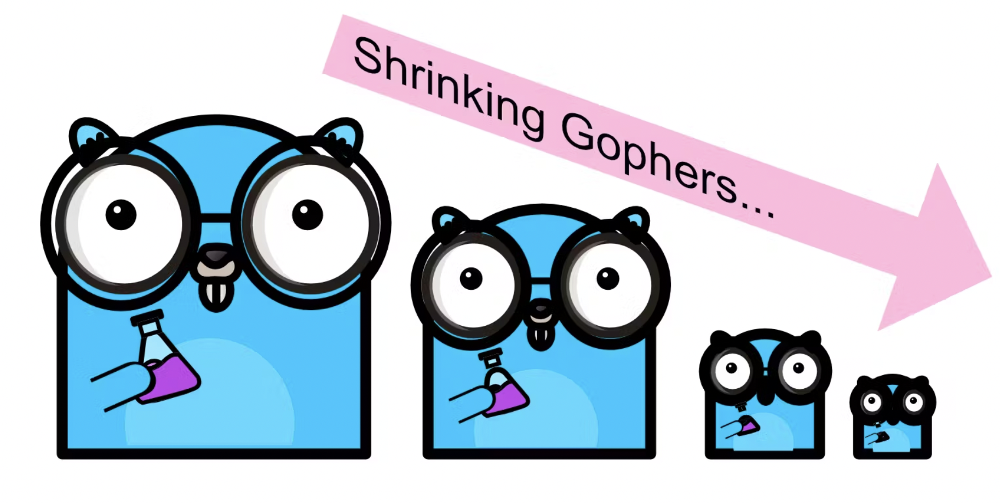

# Go语言爱好者周刊：第 184 期

这里记录每周值得分享的 Go 语言相关内容，周日发布。本周刊开源（GitHub：[polaris1119/golangweekly](https://github.com/polaris1119/golangweekly)），欢迎投稿，推荐或自荐文章/软件/资源等，请[提交 issue](https://github.com/polaris1119/golangweekly/issues) 。

鉴于一些人可能没法坚持把英文文章看完，因此，周刊中会尽可能推荐优质的中文文章。优秀的英文文章，我们的 GCTT 组织会进行翻译。



题图：最小的 Go 二进制（5KB），文章链接：<https://totallygamerjet.hashnode.dev/the-smallest-go-binary-5kb>

## 刊首语

好久没有出题目了，上次有人问起，那本周就出一道题目。

以下代码输出什么？

```go
package main

func main() {
	var x = []int{0, 5: 1, 2}
	println(len(x))
}
```

A：3；B：6；C：7；D：8

## 资讯

1、[GoReleaser v1.17 发布](https://carlosbecker.com/posts/goreleaser-v1.17)

尽可能快速、轻松地交付 Go 二进制文件。

2、[FerretDB 1.0 发布](https://blog.ferretdb.io/ferretdb-1-0-ga-opensource-mongodb-alternative/)

MongoDB 的替代品，1.0 正式发布。

3、[go-openai 1.7 发布](https://github.com/sashabaranov/go-openai)

OpenAI 的 Golang SDK，包括 ChatGPT、GPT-3、GPT-4 等。

4、[GoToSocial 0.8 发布](https://github.com/superseriousbusiness/gotosocial)

一个用 Golang 编写的 ActivityPub 社交网络服务器。

5、[ws 1.2 发布](https://github.com/gobwas/ws)

小型的 WebSocket 库。

6、[gofumpt 0.5 发布](https://github.com/mvdan/gofumpt)

一个严格的 gofmt 工具。

7、[SFTPGo 2.4.5 发布](https://github.com/drakkan/sftpgo)

Go 实现的功能齐全的 SFTP 服务器。

## 文章

1、[Go1.20.3 发布了](https://mp.weixin.qq.com/s/FL2MKlfLe59qC5rfSIOoqw)

Go 官方发布了 Go 1.20.3 和 Go 1.19.8，这是两个小版本，主要涉及 4 个安全更新。

2、[Go 开发命令行程序指南](https://mp.weixin.qq.com/s/Qyp35Q6UjtZHfwkDUWbEog)

在这篇文章中，整理出一份使用 Go 语言编写 CLI 程序的指南，供大家参考。

3、[GoLand 2023.1 正式发布，看有哪些新功能](https://mp.weixin.qq.com/s/SVMj-PvI1l-oSlxI4zaNcw)

GoLand 2023 的第一个版本 GoLand 2023.1 正式发布，新版本引入了漏洞检查器和更好的 gRPC 代码导航，并使重命名重构可用于接收器。

4、[如何用一个端口同时暴露 HTTP1/2、gRPC 协议？](https://mp.weixin.qq.com/s/e-QNv5-Ip2EcDp-S6CuXEg)

本文我们将介绍 Apache Dubbo 灵活的多协议设计原则，基于这一设计，在 Dubbo 框架底层可灵活的选用 HTTP/2、HTTP/REST、TCP、gRPC、JsonRPC、Hessian2 等任一 RPC 通信协议，同时享用统一的 API 与对等的服务治理能力。

5、[Go 测试综合指南](https://blog.jetbrains.com/zh-hans/go/2023/01/03/comprehensive-guide-to-testing-in-go/)

本文将涵盖关于 Go 测试的所有须知事项。 我们将从一个简单的测试函数开始，通过更多工具和策略帮助您掌握 Go 中的测试。

## 开源项目

1、[env](https://github.com/caarlos0/env)

一个简单的零依赖库，用于将环境变量解析为结构体。

2、[opengist](https://github.com/thomiceli/opengist)

由 Git 驱动的自我托管的 Pastebin，GitHub Gist 开源替代方案。

3、[llama.go](https://github.com/gotzmann/llama.go)

llama.go 就像纯 Go 版本的 llama.cpp，LLaMA 的 Go 实现。

4、[imcache](https://github.com/erni27/imcache)

基于泛型的内存 cache。

## 资源&&工具

1、[tokenizer](https://github.com/tiktoken-go/tokenizer)

这是 OpenAI 分词器的纯 Go 实现。

2、[bearclaw](https://github.com/donuts-are-good/bearclaw)

快速、简单的网站生成器。

3、[Go 播客第 272 期](https://changelog.com/gotime/272)

GPT-4 人生中最大的一次工作面试。

4、[pprof.me](https://pprof.me/)

在线 pprof 文件性能瓶颈分析。

5、[goquick](https://goquick.dev/)

Go 项目模板生成器。

6、[chatgptui](https://github.com/dwisiswant0/chatgptui)

用 Go 语言编写的 ChatGPT 文本用户界面（TUI）模式。

## 订阅

这个周刊每周日发布，同步更新在[Go语言中文网](https://studygolang.com/go/weekly)和[微信公众号](https://weixin.sogou.com/weixin?query=Go%E8%AF%AD%E8%A8%80%E4%B8%AD%E6%96%87%E7%BD%91)。

微信搜索"Go语言中文网"或者扫描二维码，即可订阅。


