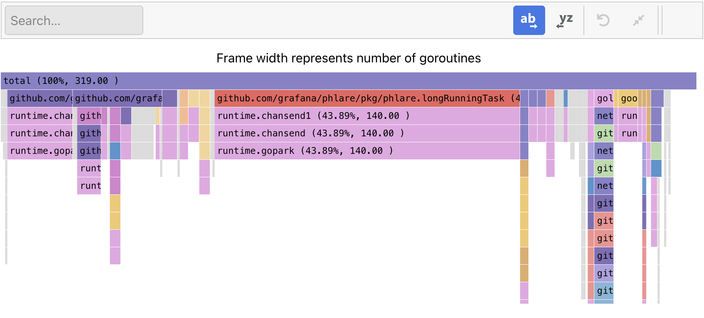

# Go语言爱好者周刊：第 185 期

这里记录每周值得分享的 Go 语言相关内容，周日发布。本周刊开源（GitHub：[polaris1119/golangweekly](https://github.com/polaris1119/golangweekly)），欢迎投稿，推荐或自荐文章/软件/资源等，请[提交 issue](https://github.com/polaris1119/golangweekly/issues) 。

鉴于一些人可能没法坚持把英文文章看完，因此，周刊中会尽可能推荐优质的中文文章。优秀的英文文章，我们的 GCTT 组织会进行翻译。

题图：Grafana Pyroscope 解决 Go 内存泄露 <https://grafana.com/blog/2023/04/19/how-to-troubleshoot-memory-leaks-in-go-with-grafana-pyroscope/>。

## 刊首语

5.1 假期各种调休，打断了工作节奏，周刊也停更了好几期，现在回来了。

## 资讯

1、[wazero 1.1 发布](https://github.com/tetratelabs/wazero)

零依赖的 WebAssembly 运行时库。

2、[rqlite v7.15.0 发布](https://github.com/rqlite/rqlite/releases/tag/v7.15.0)

轻量的、分布式关系数据库。

3、[graph v0.20 发布](https://github.com/dominikbraun/graph)

图数据结构的 Go 实现。

4、[sqlc v1.18.0 发布](https://github.com/kyleconroy/sqlc/releases/tag/v1.18.0)

从 SQL 生成类型安全 Go 代码。

5、[pREST v1.3](https://github.com/prest/prest)

低代码，简化和加速开发即时，实时，高性能的任何 Postgres 应用程序。

6、[testfixtures v3.9 发布](https://github.com/go-testfixtures/testfixtures)

类似于 Ruby-on Rails 用于 Go 的测试，针对真实数据库编写测试。

7、[go-openai 1.9.1 发布](https://github.com/sashabaranov/go-openai)

OpenAI 的 Golang SDK，包括 ChatGPT、GPT-3、GPT-4 等。

8、[gocryptfs v2.3.2 发布](https://github.com/rfjakob/gocryptfs)

Go 编写的加密 overlay 文件系统。官方网站：https://nuetzlich.net/gocryptfs

## 文章

1、[惊！Go文件后缀新提案：.go 可变成 .ʕ◔ϖ◔ʔ](https://mp.weixin.qq.com/s/x90GxeUdHLMTr17pgDMNBA)

玩笑下？

2、[为什么 defer 的执行顺序和注册顺序不同？](https://mp.weixin.qq.com/s/xpjNOwn1kNICQE4TmjpQZg)

defer 语句的执行顺序是 后进先出，和数据结构中的 Stack (栈) 一样。

3、[Go 语言中没有枚举类型，但是我们可以这样做](https://mp.weixin.qq.com/s/QFr_Pgt9GzOG3zlgcXEVwQ)

你怎么做的？

4、[Go 1.20.4 发布](https://mp.weixin.qq.com/s/jcpjBGNGD09cXRO9zYgtag)

劳动节期间，Go 又发新版了。

5、[Go 单元测测时尽量用 fake object](https://mp.weixin.qq.com/s/yycu10nLvpC0XiRemSy3lA)

单元测试是软件开发的一个重要部分，它有助于在开发周期的早期发现错误，帮助开发人员增加对生产代码正常工作的信心，同时也有助于改善代码设计。

## 开源项目

1、[queue](https://github.com/adrianbrad/queue)

线程安全、泛型的多队列实现（堵塞队列、优先队列、环形队列）。

2、[go-mask](https://github.com/showa-93/go-mask)

一个简单的、可定制的 Go 库，用于屏蔽敏感信息。

3、[go-udiff](https://github.com/aymanbagabas/go-udiff)

一个微型 Go diff 库。

4、[rueidis](https://github.com/redis/rueidis)

一个快速的 Redis 客户端。

5、[ntfy](https://github.com/binwiederhier/ntfy)

使用 PUT/POST 将推送通知发送到你的手机或 PC。

## 资源&&工具

1、[Go Time 第 273 期](https://changelog.com/gotime/273)

Go 中使用领域驱动设计。

2、[ooze](https://github.com/gtramontina/ooze)

Go 变异测试工具。

3、[强大的装饰器模式](https://www.youtube.com/watch?v=GipAZwKFgoA)

在线编码视频教程（英文）。

4、[jet](https://github.com/go-jet/jet)

具有代码生成和自动查询结果数据映射的类型安全 SQL 构建器。

5、[hermes](https://github.com/hashicorp-forge/hermes)

文档管理系统。

6、[go2rtc](https://github.com/AlexxIT/go2rtc)

支持各种协议的流媒体应用程序。

## 订阅

这个周刊每周日发布，同步更新在[Go语言中文网](https://studygolang.com/go/weekly)和[微信公众号](https://weixin.sogou.com/weixin?query=Go%E8%AF%AD%E8%A8%80%E4%B8%AD%E6%96%87%E7%BD%91)。

微信搜索"Go语言中文网"或者扫描二维码，即可订阅。

