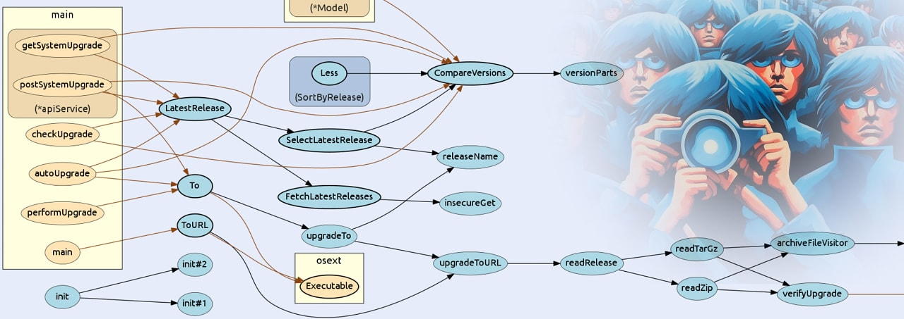

# Go语言爱好者周刊：第 186 期

这里记录每周值得分享的 Go 语言相关内容，周日发布。本周刊开源（GitHub：[polaris1119/golangweekly](https://github.com/polaris1119/golangweekly)），欢迎投稿，推荐或自荐文章/软件/资源等，请[提交 issue](https://github.com/polaris1119/golangweekly/issues) 。

鉴于一些人可能没法坚持把英文文章看完，因此，周刊中会尽可能推荐优质的中文文章。优秀的英文文章，我们的 GCTT 组织会进行翻译。

题图：可视化 Go 的程序调用 <https://github.com/ofabry/go-callvis>。

## 资讯

1、[permify v0.4 发布](https://github.com/Permify/permify)

开源的授权服务。

2、[hermes v0.1 发布](https://github.com/hashicorp-forge/hermes)

文档管理系统。

3、[SFTPGo 2.5 发布](https://github.com/drakkan/sftpgo)

Go 实现的功能齐全的 SFTP 服务器。

4、[bubbletea 0.24.0 发布](https://github.com/charmbracelet/bubbletea)

强大 TUI 框架。

5、[rqlite v7.16.0 发布](https://github.com/rqlite/rqlite/releases/tag/v7.15.0)

轻量的、分布式关系数据库。更新很频繁呀。

6、[dig v1.17 发布](https://github.com/uber-go/dig)

基于反射的依赖注入工具包，Uber 出品。

、[Excelize 发布 2.7.1](https://xuri.me/excelize/zh-hans/releases/v2.7.1.html)

Go 语言编写的用于操作 Office Excel 文档基础库。

## 文章

1、[Go testing 里的巧妙设计](https://mp.weixin.qq.com/s/AEsNXL27xUbDvNo_L2WxAQ)

换个角度来学习一下`testing`领域巧妙的设计，开阔眼界是为了举一反三。

2、[Go 高性能 - 无锁编程](https://mp.weixin.qq.com/s/kWpQSJNWoOqV64Ol1sIeow)

一种并发编程技术，主要用于消除多线程编程中锁操作带来的性能损耗。

3、[TIOBE 5 月榜单：Go 前十没守住](https://mp.weixin.qq.com/s/gLuHJRtCVX4KLgY8AV1C6Q)

排第 12 名。

## 开源项目

1、[mimetype](https://github.com/gabriel-vasile/mimetype)

基于 magic 数的用于媒体类型和文件扩展名检测的快速的 Go 库，支持 170+ 格式。

2、[milvus](https://github.com/milvus-io/milvus)

Go 实现的向量数据库。

3、[spago](https://github.com/nlpodyssey/spago)

纯 Go 的机器学习库。

4、[pitaya](https://github.com/topfreegames/pitaya)

可扩展的游戏服务器框架。

5、[quark-go](https://github.com/quarkcms/quark-go)

兼容 Gin、Hertz、Fiber、Zero、Echo 等框架的管理后台脚手架。

6、[uRouter](https://github.com/lxzan/uRouter)

一个由 Go 编写的通用的、高度可定制化的 web router 抽象。

7、[go-array](https://github.com/deatil/go-array)

go-array 是一个 go 数组数据获取库，简单易用。

## 资源&&工具

1、[go-gui-projects](https://github.com/go-graphics/go-gui-projects)

Go GUI 相关项目。

2、[dolt](https://github.com/dolthub/dolt)

用于数据的 Git。

3、[goploy](https://github.com/zhenorzz/goploy)

一个 Web 部署系统工具。

4、[quickly-picture-bed](https://github.com/ischenliang/quickly-picture-bed)

基于 Koa2 + Vue3.x + Vite3.x + typescript 开发的轻量级快捷图片管理系统、图床系统。

5、[chatgpt-for-chatbot-feishu](https://github.com/go-zoox/chatgpt-for-chatbot-feishu)

快速将 ChatGPT 接入飞书，作为私人工作助理或者企业员工助理。

6、[trzsz-go](https://github.com/trzsz/trzsz-go)

兼容 tmux 的 rz / sz，有进度条，支持目录传输，支持拖动上传。

7、[gonacli](https://github.com/wenlng/gonacli)

一个快速使用 Go 语言编写 NodeJS Addon 扩展的开发工具。

8、[mobile-memory-clean](https://github.com/mqy527/mobile-memory-clean)

一个针对Android手机的内存/进程清理程序。

## 订阅

这个周刊每周日发布，同步更新在[Go语言中文网](https://studygolang.com/go/weekly)和[微信公众号](https://weixin.sogou.com/weixin?query=Go%E8%AF%AD%E8%A8%80%E4%B8%AD%E6%96%87%E7%BD%91)。

微信搜索"Go语言中文网"或者扫描二维码，即可订阅。

