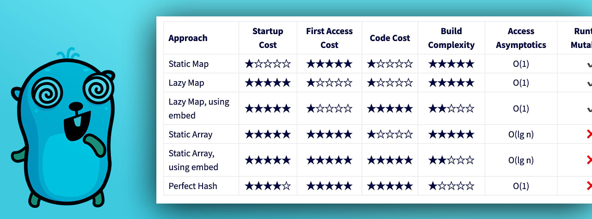

# Go语言爱好者周刊：第 192 期

这里记录每周值得分享的 Go 语言相关内容，周日发布。本周刊开源（GitHub：[polaris1119/golangweekly](https://github.com/polaris1119/golangweekly)），欢迎投稿，推荐或自荐文章/软件/资源等，请[提交 issue](https://github.com/polaris1119/golangweekly/issues) 。

鉴于一些人可能没法坚持把英文文章看完，因此，周刊中会尽可能推荐优质的中文文章。优秀的英文文章，我们的 GCTT 组织会进行翻译。

题图：初始化大 map 的性能  <https://www.dolthub.com/blog/2023-06-16-static-map-initialization-in-go/>

## 资讯

1、[pie v2.7 发布](https://github.com/elliotchance/pie)

操作 slice 和 map 的方便库。

2、[FerretDB v1.4.0 发布](https://github.com/FerretDB/FerretDB)

MongoDB 的替代品。

3、[goxygen v0.5 发布](https://github.com/Shpota/goxygen)

分分钟生成一个全栈 Web 项目（Go，Angular/React/Vue）。

4、[sh v3.7 发布](https://github.com/mvdan/sh)

一个支持 Bash 的 Shell 解析器、格式化器。

5、[dolt v1.5 发布](https://github.com/dolthub/dolt)

用于数据的 Git。

6、[hertz v0.6.1 发布](https://github.com/cloudwego/hertz)

一个 Golang 微服务 HTTP 框架。

7、[Ginkgo v2.11 发布](https://github.com/onsi/ginkgo)

现代的测试框架。

## 文章

1、[mimetype：一文读懂 Go 文件类型检测库的原理和用法](https://mp.weixin.qq.com/s/qntZV3IsFekj0QVW_sd68Q)

一个快速的 Golang 库，用于根据 magic number 来检测媒体类型和文件扩展名。

2、[Go：pprof新增的火焰图实现](https://mp.weixin.qq.com/s/b50n3nqdmo8OHdPoal89AA)

新增了一个选项。

3、[用 Go 语言讲解死锁、活锁、饥饿、自旋锁](https://mp.weixin.qq.com/s/TX8LZZcuF1J7DNJtb_4sKg)

图文讲解。

4、[一个泛型的有序 Go Map 实现](https://colobu.com/2023/06/18/a-generic-sortedmap-in-go/)

Go 内建的 map类 型对于插入的元素并没有保持它们的插入顺序，遍历的时候也故意设置成随机的。因此，如果我们想让map保持元素的插入顺序，需要借助第三方的库才行，今天就给大家介绍一个这样的库 OrderedMap。

## 开源项目

1、[pgfs](https://github.com/mohamedattahri/pgfs)

一个 Go 库，它在 Postgres 上使用大对象实现 fs.FS 接口。

2、[mergo](https://github.com/imdario/mergo)

一个帮助合并 Go 结构体和 map 的库，自 2013 年以来一直在使用。

3、[rosedb](https://github.com/rosedblabs/rosedb)

一个基于 [Bitcask](https://riak.com/assets/bitcask-intro.pdf) 存储模型，轻量、快速、可靠的 KV 存储引擎。

## 资源&&工具

1、[awl](https://github.com/anywherelan/awl)

一个网状 VPN 项目，它可以让你轻松地连接到你的任何设备（在 IP 协议层面），无论它们在哪里。

2、[pgrok](https://github.com/pgrok/pgrok)

穷人的 ngrok - 通过 SSH 远程端口转发的多租户 HTTP/TCP 反向隧道解决方案。

3、[trufflehog](https://github.com/trufflesecurity/trufflehog)

一个用于发现和验证凭证的工具，它可以扫描git仓库、GitHub 组织或者其他源，寻找可能泄露的敏感信息，如 AWS 密钥、密码、令牌等。

## 订阅

这个周刊每周日发布，同步更新在[Go语言中文网](https://studygolang.com/go/weekly)和[微信公众号](https://weixin.sogou.com/weixin?query=Go%E8%AF%AD%E8%A8%80%E4%B8%AD%E6%96%87%E7%BD%91)。

微信搜索"Go语言中文网"或者扫描二维码，即可订阅。

