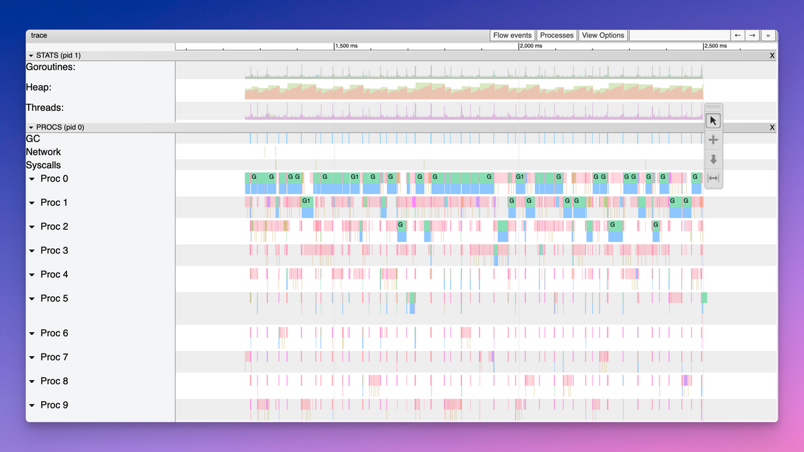

# Go语言爱好者周刊：第 194 期

这里记录每周值得分享的 Go 语言相关内容，周日发布。本周刊开源（GitHub：[polaris1119/golangweekly](https://github.com/polaris1119/golangweekly)），欢迎投稿，推荐或自荐文章/软件/资源等，请[提交 issue](https://github.com/polaris1119/golangweekly/issues) 。

鉴于一些人可能没法坚持把英文文章看完，因此，周刊中会尽可能推荐优质的中文文章。优秀的英文文章，我们的 GCTT 组织会进行翻译。

题图：Go 1.21 execution tracing

## 资讯

1、[chroma v2.8 发布](https://github.com/alecthomas/chroma)

纯 Go 实现的通用语法高亮库。

2、[GoReleaser v1.19 发布](https://github.com/goreleaser/goreleaser)

尽可能快速、轻松地交付 Go 二进制文件。

3、[Watermill v1.3.1 发布](https://github.com/ThreeDotsLabs/watermill)

一个可有效处理消息流的 Go 库。

4、[Centrifugo v5 发布](https://github.com/centrifugal/centrifugo)

可扩展的实时消息服务器。

5、[TiDB v7.2.0 发布](https://docs.pingcap.com/tidb/v7.2/release-7.2.0)

兼容 MySQL 的分布式 HTAP 数据库。

6、[FerretDB v1.5.0 发布](https://github.com/FerretDB/FerretDB)

MongoDB 的替代品，这个版本底层提供了对 SQLite 的实验性支持。

7、[env v9.0 发布](https://github.com/caarlos0/env)

简单的 lib 可以将环境变量解析为结构体。

8、[goxygen v0.5 发布](https://github.com/Shpota/goxygen)

分分钟生成一个全栈 Web 项目（Go，Angular/React/Vue），现在支持 Go1.20。

9、[column v0.4 发布](https://github.com/kelindar/column)

Go 实现的具有位图索引的高性能、列式、内存存储库。

## 文章

1、[C++/Go 调用约定的原理](https://mp.weixin.qq.com/s/xYnzVz2FDX-rNCgfKwOgAQ)

在计算机科学中，调用约定是一种定义子过程从调用处接受参数以及返回结果的方法的约定。

2、[Go 1.21 execution tracing开销从20%下降到不到1%](https://blog.felixge.de/waiting-for-go1-21-execution-tracing-with-less-than-one-percent-overhead/)

发生了什么？

3、[Go实现的观察者模式](https://itnext.io/observer-pattern-in-go-483dd8c077de)

英文版。

4、[Go 语言 iota 的神奇力量](https://mp.weixin.qq.com/s/7kFkeRJygydnNoBRtiaSkw)

当你深入研究官网库、开源库或者任何一个 `Go` 项目时，你都会发现 `iota` 这个神奇的标识符无处不在。

5、[Go 每日一库之一个快速构建应用程序的脚手架](https://mp.weixin.qq.com/s/BBDFQLjQGVAs5WbzhONj2Q)

该工具的最大功能就是能够通过一个命令来创建项目。包括目录结构、快速创建mvc层的各个文件等。不用开发者再一一的建立对应文件，极大的提高了研发效率。

6、[Go 每日一库之 fastcache 高性能设计与实现](https://mp.weixin.qq.com/s/oldNARBchfUbXZmrRFu6BQ)

fastcache 是一个线程安全并且支持大量数据存储的高性能缓存组件库。

## 开源项目

1、[mock](https://github.com/uber/mock)

之前是 golang 组织下的，不维护了，建议使用 Uber fork 的。

2、[zygomys](https://github.com/glycerine/zygomys)

Lisp 解析器。

3、[typ](https://github.com/gurukami/typ)

空类型、安全原始类型转换和取值。

## 资源&&工具

1、[GopherCon](https://www.gophercon.com/agenda)

日程已经敲定，GopherCon India 也要来了。

2、[mailpit](https://github.com/axllent/mailpit)

为开发人员提供带有 API 的电子邮件和 SMTP 测试工具。

3、[我在GopherConEU 2023大会上的见闻](https://betterprogramming.pub/what-i-learned-at-gopherconeu-2aae6bed50f4)

一文了解 GopherConEU 2023。

4、[Go 开发者播客大全](https://preslav.me/2023/06/28/podcasts-for-golang-developers/)

可惜没有中文的。

5、[Timecraft](https://github.com/stealthrocket/timecraft)

执行 WebAssembly 模块的软件运行时，具有沙盒、任务编排和时间机器的能力。

6、[Go 陷阱大全](https://go-traps.appspot.com/)

各种代码示例。

## 订阅

这个周刊每周日发布，同步更新在[Go语言中文网](https://studygolang.com/go/weekly)和[微信公众号](https://weixin.sogou.com/weixin?query=Go%E8%AF%AD%E8%A8%80%E4%B8%AD%E6%96%87%E7%BD%91)。

微信搜索"Go语言中文网"或者扫描二维码，即可订阅。

