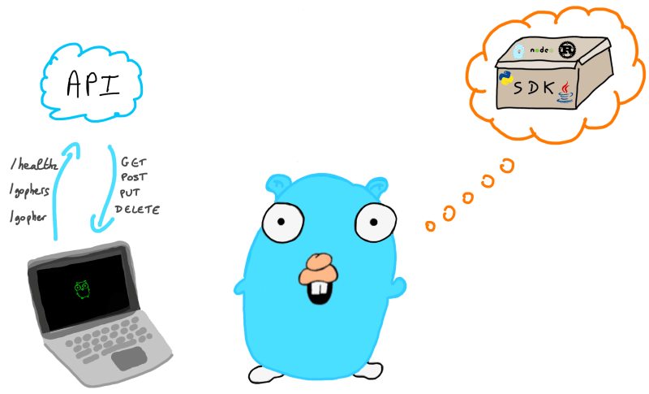

# Go语言爱好者周刊：第 196 期

这里记录每周值得分享的 Go 语言相关内容，周日发布。本周刊开源（GitHub：[polaris1119/golangweekly](https://github.com/polaris1119/golangweekly)），欢迎投稿，推荐或自荐文章/软件/资源等，请[提交 issue](https://github.com/polaris1119/golangweekly/issues) 。

鉴于一些人可能没法坚持把英文文章看完，因此，周刊中会尽可能推荐优质的中文文章。优秀的英文文章，我们的 GCTT 组织会进行翻译。

题图：生成 SDK

## 资讯

1、[Go 1.21 RC3 发布](https://tip.golang.org/doc/go1.21)

8 月份就要正式发布 Go1.21 了。

2、[ntp v1.2 发布](https://github.com/beevik/ntp)

用于查询你选择的网络时间协议服务器的当前时间。

[sarama v1.40 发布](https://github.com/IBM/sarama)

Sarama 是 Apache Kafka 0.8 及更高版本的 Go 库。最初由 Shopify 创建，现在 IBM 似乎已经接管了控制权，因为 Shopify 希望将来与 librdkafka 绑定。

4、[Rate Limiter v0.3 发布](https://github.com/uber-go/ratelimit)

该实现基于请求之间经过的时间来重新填充桶，而不是要求间隔时钟离散地填充桶。Uber 出品。

5、[cmd/compile: overhaul inliner](cmd/compile: overhaul inliner)

Go 内联计划大修。

## 文章

1、[配图清新的Protobuf 编码&避坑指南](https://mp.weixin.qq.com/s/YJp2jxuBwwbPBaMWlDZG9g)

Protobuf 是一个强大而高效的数据序列化工具。

2、[GoLang闭包，注意！这里有蹊跷](https://mp.weixin.qq.com/s/AnrV7aDW3uDZc2VZqPGvnA)

某业务因为一行闭包错误使用的代码，引起了一次“血案”。

3、[Russ cox 打算在 goroutine 的基础上增加 coroutine 包](https://research.swtch.com/coro)

这篇文章是一个关于协程（coroutines）的深入探讨，它从历史和理论的角度，分析了协程的本质和实现方式。

4、[Go PDF库指南： 如何选择正确的PDF库？](https://unidoc.io/post/golang-pdf-library-guide/)

这篇文章是一个关于使用Go语言处理PDF文件的指南，它介绍了 unidoc 这个开源的 Go PDF 库，以及它的主要特性和功能。

5、[Go 系列教程](https://dev.to/aurelievache/learning-go-by-examples-introduction-448n)

通过例子学习 Go，英文的。

6、[go channel应用系列之控制协程数量](https://mp.weixin.qq.com/s/xDjUsdkceox5bn3QNkgfGg)

给大家介绍一下如何利用 Go 中的缓冲 channel 来控制协程的数量。

7、[jsonparser 为什么比 encoding/json 快 10 倍 ?](https://mp.weixin.qq.com/s/Vy0c1l6LB-nrqK1CS5pR5A)

jsonparser 是一个开源 JSON 包，号称比标准库 JSON 包性能高 10 倍 (具体情况取决于具体的负载大小和数据情况)，内存分配优化到 0。 

## 开源项目

1、[memberlist](https://github.com/hashicorp/memberlist)

一个用于实现分布式系统中的成员管理和故障检测的库。

2、[mongofunc](https://github.com/func25/mongofunc)

为 MongoDB 提供一个更强大和灵活的功能，扩展其查询和操作能力。

3、[tableflow](https://github.com/tableflowhq/tableflow)

用于在 Go 中处理表格数据的库，它可以让用户使用流式的 API，对表格数据进行各种转换，过滤，聚合，排序，分组等操作。

## 资源&&工具

1、[pop](https://github.com/charmbracelet/pop)

通过终端发送邮件。

2、[g](https://github.com/stefanmaric/g)

简单地 Go 多版本管理。

3、[goshare](https://github.com/wizsk/goshare)

一个用于共享文件的小型 cli 工具，具有漂亮的界面。

4、[scaffolder](https://github.com/cemister/scaffolder)

一个用于生成Go代码的工具，它可以根据用户提供的模板和配置文件，自动创建一些常用的代码结构，如接口，结构体，方法，测试等。

## 订阅

这个周刊每周日发布，同步更新在[Go语言中文网](https://studygolang.com/go/weekly)和[微信公众号](https://weixin.sogou.com/weixin?query=Go%E8%AF%AD%E8%A8%80%E4%B8%AD%E6%96%87%E7%BD%91)。

微信搜索"Go语言中文网"或者扫描二维码，即可订阅。

