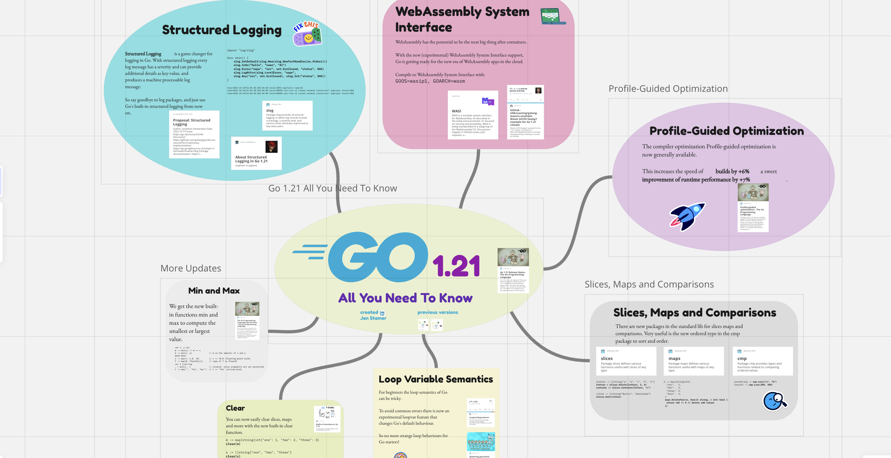

# Go语言爱好者周刊：第 199 期

这里记录每周值得分享的 Go 语言相关内容，周日发布。本周刊开源（GitHub：[polaris1119/golangweekly](https://github.com/polaris1119/golangweekly)），欢迎投稿，推荐或自荐文章/软件/资源等，请[提交 issue](https://github.com/polaris1119/golangweekly/issues) 。

鉴于一些人可能没法坚持把英文文章看完，因此，周刊中会尽可能推荐优质的中文文章。优秀的英文文章，我们的 GCTT 组织会进行翻译。

题图：一图掌握 Go1.21 的新特性

## 资讯

1、[新提案：新包 iter](https://github.com/golang/go/issues/61897)

迭代用，rsc 提出的。

2、[tinygo 0.29.0 发布](https://github.com/tinygo-org/tinygo/releases/tag/v0.29.0)

支持 Go1.21。

3、[Excelize 2.8 发布](https://github.com/qax-os/excelize)

用于处理 Excel/XLSX 文档的库。

4、[wazero v1.5.0 发布](https://github.com/tetratelabs/wazero)

零依赖的 WebAssembly 运行时库。

5、[toxiproxy v2.6.0 发布](https://github.com/Shopify/toxiproxy)

模拟混乱网络条件的 TCP 代理。

6、[FerretDB v1.9.0 发布](https://github.com/FerretDB/FerretDB)

MongoDB 的替代品。

7、[pdfcpu v0.5 发布](https://github.com/pdfcpu/pdfcpu)

Go 语言 PDF 处理器。

## 文章

1、[Go 日志包：前 8 个库的比较](https://betterstack.com/community/guides/logging/best-golang-logging-libraries/)

zap、zerolog、slog 等。

2、[Go设计模式之责任链模式](https://mp.weixin.qq.com/s/BW8buklwMCi_0M6AK0H0iA)

设计模式掌握下。

3、[Go：异或运算的妙用](https://mp.weixin.qq.com/s/2Lx1XsgpDskZrxpdW7Ki1Q)

通过对两个相同长度的二进制数进行逐位比较，若对应位的值不同，结果为 1, 否则结果为 0。

4、[编译Go应用的黑盒挑战：无源码只有.a文件，你能搞定吗？](https://tonybai.com/2023/08/30/how-to-build-with-only-archive-in-go/)

本文就来从技术角度来探讨一下这些hack方法，但并不推荐使用！

5、[slog正式版来了：Go日志记录新选择！](https://tonybai.com/2023/09/01/slog-a-new-choice-for-logging-in-go/)

Go 1.21 正式版包含的。

## 开源项目

1、[sqledge](https://github.com/zknill/sqledge)

将 postgres 复制到 SQLite。

2、[fp-go](https://github.com/IBM/fp-go)

Go 函数式编程库。

3、[jacobin](https://github.com/platypusguy/jacobin)

一个不仅仅是用 Go 编写的最小JVM，能够运行 Java 17 个类。

4、[xreflect](https://github.com/morrisxyang/xreflect)（作者自荐）

简单易用的反射工具库，支持设置嵌套结构体字段，函数调用等。

5、[go-moda](https://github.com/webws/go-moda)

一个基于 Go 语言的通用 http grpc 开发框架。

## 资源&&工具

1、[Go1.21 可视化指南](https://miro.com/app/board/uXjVMBkmPPQ=/)

思维导图掌握 Go1.21 新特性，还有 Go1.18 ~ Go1.20 的。

2、[arkade](https://github.com/alexellis/arkade)

面向开发人员工具的开源市场。

3、[compose](https://github.com/docker/compose)

使用 Docker 定义和运行多容器应用程序。

## 订阅

这个周刊每周日发布，同步更新在[Go语言中文网](https://studygolang.com/go/weekly)和[微信公众号](https://weixin.sogou.com/weixin?query=Go%E8%AF%AD%E8%A8%80%E4%B8%AD%E6%96%87%E7%BD%91)。

微信搜索"Go语言中文网"或者扫描二维码，即可订阅。

