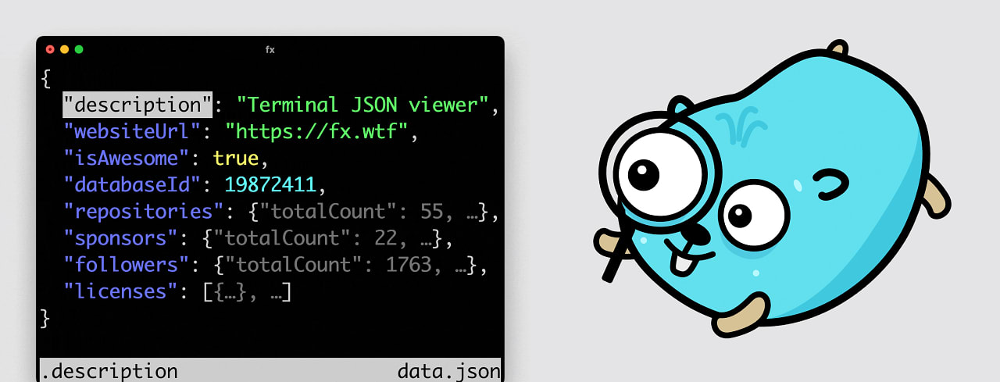

# Go语言爱好者周刊：第 201 期

这里记录每周值得分享的 Go 语言相关内容，周日发布。本周刊开源（GitHub：[polaris1119/golangweekly](https://github.com/polaris1119/golangweekly)），欢迎投稿，推荐或自荐文章/软件/资源等，请[提交 issue](https://github.com/polaris1119/golangweekly/issues) 。

鉴于一些人可能没法坚持把英文文章看完，因此，周刊中会尽可能推荐优质的中文文章。优秀的英文文章，我们的 GCTT 组织会进行翻译。

题图：终端的 JSON 查看器 <https://fx.wtf/>

## 资讯

1、[Wails v2.6 发布](https://wails.io/zh-Hans/)

构建跨平台的桌面应用。

2、[goxygen v0.7 发布](https://github.com/Shpota/goxygen)

分分钟生成一个全栈 Web 项目（Go，Angular/React/Vue），现在支持 Go1.21。

3、[participle v2.1 发布](https://github.com/alecthomas/participle)

Go 的解析器（Parser）。

4、[lipgloss v0.8 发布](https://github.com/charmbracelet/lipgloss)

漂亮的终端布局的风格定义。

5、[enmime v1.0 发布](https://github.com/jhillyerd/enmime)

enmime 是 Go 的 MIME 编码和解码库，专注于生成和解析 MIME 编码的电子邮件。

6、[lingua-go v1.3 发布](https://github.com/pemistahl/lingua-go)

最准确的Go自然语言检测库，长短文本均适用。

7、[Fx v30.0 发布](https://github.com/antonmedv/fx)

终端 JSON 查看器。

8、[Resty v2.8 发布](https://github.com/go-resty/resty)

Go 的简单 HTTP 和 REST 客户端库。

## 文章

1、[Golang高性能编程实践](https://mp.weixin.qq.com/s/VMzhyySny60zABnxlzlVjQ)

Go 中高性能编程是一个经久不衰的话题，本文尝试从实践及源码层面对 Go 的高性能编程进行解析。

2、[使用Go和WebRTC data channel实现端到端实时通信](https://tonybai.com/2023/09/23/p2p-rtc-implementation-with-go-and-webrtc-data-channel/)

近期，一项目恰用到了RTC技术，我就顺便翻阅了一些资料，并用Go建立了一个端到端数据通信的小demo，这里给大家分享一下。

3、[聊聊Go语言的向前兼容性和toolchain规则](https://tonybai.com/2023/09/10/understand-go-forward-compatibility-and-toolchain-rule/)

本文就和大家详细聊聊Go语言的向前兼容性以及Go 1.21中新引入的toolchain的使用规则。

4、[关于nil的事情：更多的陷阱](https://www.dolthub.com/blog/2023-09-08-much-ado-about-nil-things/)

之前，我写了一篇关于困扰Go新手的陷阱的文章。这些都是我在使用go-mysql-server时个人学到的每一课，go-mysql-server是完全用Go编写的MySQL的直接替代品。

## 开源项目

1、[spotify](https://github.com/zmb3/spotify)

Spotify Web API 的 Go 封装。

2、[httpurr](https://github.com/rednafi/httpurr)

在终端快速查看 HTTP 状态码信息。

3、[u](https://github.com/leaanthony/u)

将 “unset” 状态添加到 Go 的类型。

4、[skipper](https://github.com/zalando/skipper)

一个用于服务组合的 HTTP 路由器和反向代理。

## 资源&&工具

1、[awesome-slog](https://github.com/go-slog/awesome-slog)

slog 包相关的文章。

2、[static-server](https://github.com/eliben/static-server)

用于提供静态文件的简单、零配置 HTTP 服务器 CLI。

3、[maroto](https://github.com/johnfercher/maroto)

一种创建 PDF 的 maroto 方式。Maroto 受到 Bootstrap 的启发，使用 gofpdf。快速简单。

## 订阅

这个周刊每周日发布，同步更新在[Go语言中文网](https://studygolang.com/go/weekly)和[微信公众号](https://weixin.sogou.com/weixin?query=Go%E8%AF%AD%E8%A8%80%E4%B8%AD%E6%96%87%E7%BD%91)。

微信搜索"Go语言中文网"或者扫描二维码，即可订阅。

