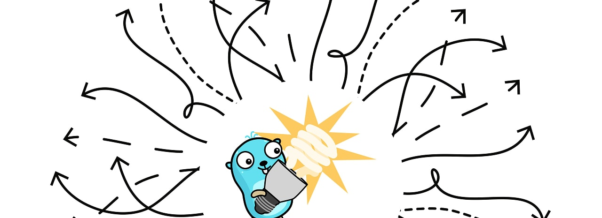

# Go语言爱好者周刊：第 202 期

这里记录每周值得分享的 Go 语言相关内容，周日发布。本周刊开源（GitHub：[polaris1119/golangweekly](https://github.com/polaris1119/golangweekly)），欢迎投稿，推荐或自荐文章/软件/资源等，请[提交 issue](https://github.com/polaris1119/golangweekly/issues) 。

鉴于一些人可能没法坚持把英文文章看完，因此，周刊中会尽可能推荐优质的中文文章。优秀的英文文章，我们的 GCTT 组织会进行翻译。

题图：

## 资讯

1、[air v1.47.0 发布](https://github.com/cosmtrek/air)

Go 应用程序的实时重新加载。

[mockery v2.36 发布](https://github.com/vektra/mockery)

提供了轻松为 Go 接口生成 mock 的功能。它删除了使用 mock 所需的样板代码。

3、[viper v1.17 发布](https://github.com/spf13/viper)

一个功能强大且灵活的 Go 应用程序配置解决方案。v1.17 需要 Go 1.19 并添加了log/slog支持。

[go-openai v1.16.0 发布](https://github.com/sashabaranov/go-openai)

OpenAI 的 Golang SDK，包括 ChatGPT、GPT-3、GPT-4 等，增加了一些示例：<https://github.com/sashabaranov/go-openai#other-examples>。

5、[mods v1.0 发布](https://github.com/charmbracelet/mods)

命令行中的 AI。

6、[requests v0.23.5](https://github.com/carlmjohnson/requests)

HTTP 客户端库，还带有用于构建自定义 http 传输的工具，包括用于测试的请求记录器和重放器。

## 文章

1、[Go项目目录该怎么组织？官方终于出指南了！](https://mp.weixin.qq.com/s/zbV2UwHYvgsuwnXR2Vr04Q)

在这篇文章中，我们就来看看这份官方指南，看看官方推荐的Go项目目录布局是什么样子的。

2、[怎么回事？Go 又发布版本更新了：Go1.21.3](https://mp.weixin.qq.com/s/edD9VBH5UcR23GdLruisfg)

Go 官方发布了 Go1.21.3 和 Go 1.20.10，上一版本发布才几天，可见又是安全更新。

3、[编译Go应用的黑盒挑战：无源码只有.a文件，你能搞定吗？](https://mp.weixin.qq.com/s/4h0wT9Z9QsoMmWGQGJw0XA)

本文就来从技术角度来探讨一下这些 hack 方法，但并不推荐使用！

4、[Go和C++通用性能优化黑魔法——PGO！](https://mp.weixin.qq.com/s/9HRnjKZxCkAoOe1rnihPBA)

本文会介绍 PGO 的原理，以及 Go/C++ 语言进行 PGO 的实践。

5、[为 Go 构建的 Windows 可执行文件添加图标](https://hjr265.me/blog/adding-icons-for-go-built-windows-executable/)

开发 Windows 程序的可以看看，基于 <https://github.com/akavel/rsrc> 库。

## 开源项目

1、[gokrazy](https://github.com/gokrazy/gokrazy)

将 Go 程序转成可在 Raspberry Pi 3、Pi 4、Pi Zero 2 W 或 amd64 PC 设备上运行。

2、[slogor](https://gitlab.com/greyxor/slogor)

一个色彩丰富的 slog 处理程序。

3、[Dynamite](https://github.com/DynamiteMC/Dynamite)

用 Go 编写的 Minecraft 服务器软件。

4、[templ](https://github.com/a-h/templ)

一种用于在 Go 中编写超文本标记语言用户界面的语言。

5、[sqinn-go](https://github.com/cvilsmeier/sqinn-go)

SQLite 驱动，纯 Go 实现。

## 资源&&工具

1、[pgroll](https://github.com/xataio/pgroll)

PostgreSQL 零停机迁移变得容易。

2、[Go Tour](https://tour.ardanlabs.com/tour/eng/list)

终极 Go 教程，英文版。

3、[aidea-server](https://github.com/mylxsw/aidea-server)

一款集成了主流大语言模型以及绘图模型的 APP，采用 Flutter + Golang 开发。

4、[embedding-knowledge-base](https://github.com/webws/embedding-knowledge-base)

一个 基于 golang 和 chatgpt qdrant 实现的 AI 知识库 cli。

## 订阅

这个周刊每周日发布，同步更新在[Go语言中文网](https://studygolang.com/go/weekly)和[微信公众号](https://weixin.sogou.com/weixin?query=Go%E8%AF%AD%E8%A8%80%E4%B8%AD%E6%96%87%E7%BD%91)。

微信搜索"Go语言中文网"或者扫描二维码，即可订阅。

