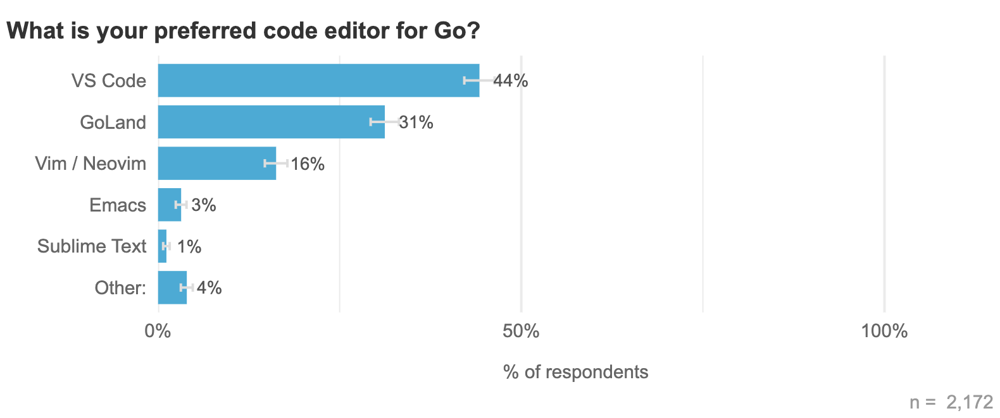

# Go语言爱好者周刊：第 205 期

这里记录每周值得分享的 Go 语言相关内容，周日发布。本周刊开源（GitHub：[polaris1119/golangweekly](https://github.com/polaris1119/golangweekly)），欢迎投稿，推荐或自荐文章/软件/资源等，请[提交 issue](https://github.com/polaris1119/golangweekly/issues) 。

鉴于一些人可能没法坚持把英文文章看完，因此，周刊中会尽可能推荐优质的中文文章。优秀的英文文章，我们的 GCTT 组织会进行翻译。

题图：Go 代码编辑器排行

## 资讯

1、[frankenphp v1.0 发布](https://github.com/dunglas/frankenphp)

一个现代的 PHP app server，Go 语言实现。

2、[py v0.2.0 发布](https://gitlab.com/pygolo/py)

使用 Go 扩展 Python，反之亦然。

3、[pdfcpu v0.6 发布](https://github.com/pdfcpu/pdfcpu)

Go 语言 PDF 处理器。

4、[openfga v1.3 发布](https://github.com/openfga/openfga)

一个高性能和灵活的授权/权限引擎。

5、[vale v2.30 发布](https://github.com/errata-ai/vale)

这是一个语法感知的文本校对工具，它可以用于检查文本的拼写、风格和语法错误，并提供了快速和可扩展的特性。

6、[grpc-go 1.40.0](https://github.com/grpc/grpc-go/releases/tag/v1.40.0)

gRPC Go 的实现。

7、[scc v3.2 发布](https://github.com/boyter/scc)

与 cloc，sloccount 和 tokei 类似的工具。用于计数许多编程语言中的代码行，空行，注释行和源代码的物理行。

## 文章

1、[Golang 的 websocket 使用和实现代码分析](https://mp.weixin.qq.com/s/0Ez3TYRgupB6Ko_JpKfHJw)

websocket 实操，分享它使用和底层实现！

2、[TIOBE 2023 年 12 月编程语言榜单：年度编程语言预测](https://mp.weixin.qq.com/s/I2UmqcwEJnef9NIJvPRrCg)

Go 排第几了？

3、[一文搞懂Go gRPC服务Handler单元测试](https://mp.weixin.qq.com/s/zXDvOoNLJDRR9Bu5CeZc7Q)

在云原生时代和微服务架构背景下，HTTP和RPC协议成为服务间通信和与客户端交互的两种主要方式。

4、[grpc-go 从使用到实现原理全解析！](https://mp.weixin.qq.com/s/Y6r6EWZtP_Lbz6OOCMgswQ)

本期将从rpc背景知识开始了解，如何安装进行开发前的环境准备，protobuf文件格式了解，客户端服务端案例分享等，逐渐深入了解如何使用grpc-go框架进行实践开发。

5、[在Go中使用GitHub登录](https://eli.thegreenplace.net/2023/sign-in-with-github-in-go/)

这篇文章主要讨论了如何在Go语言的Web应用程序中集成GitHub登录功能。

## 开源项目

1、[go-sqlite](https://github.com/zombiezen/go-sqlite)

纯 Go 的实现，不过没有实现 database/sql 接口，而是另外一套 API。

2、[redsync](https://github.com/go-redsync/redsync)

基于 Redis 的分布式互斥锁。

3、[gocron](https://github.com/go-co-op/gocron)

简单流畅的 Go cron 调度。

4、[errtrace](https://github.com/bracesdev/errtrace)

Go 错误的堆栈跟踪替代方案。

5、[goiabada](https://github.com/leodip/goiabada)

Goiabada 是一个用 Go 编写的 OAuth2/OpenID Connect 服务器。

## 资源&&工具

1、[wave](https://github.com/ubavic/wave)

一个非常简单的合成器。

2、[tcell](https://github.com/gdamore/tcell)

Tcell 是一个替代的终端包，在某些方面类似于 termbox，但在其他方面更好。

3、[osv.dev](https://github.com/google/osv.dev)

开源漏洞数据库和分类服务，谷歌出品。

## 订阅

这个周刊每周日发布，同步更新在[Go语言中文网](https://studygolang.com/go/weekly)和[微信公众号](https://weixin.sogou.com/weixin?query=Go%E8%AF%AD%E8%A8%80%E4%B8%AD%E6%96%87%E7%BD%91)。

微信搜索"Go语言中文网"或者扫描二维码，即可订阅。

